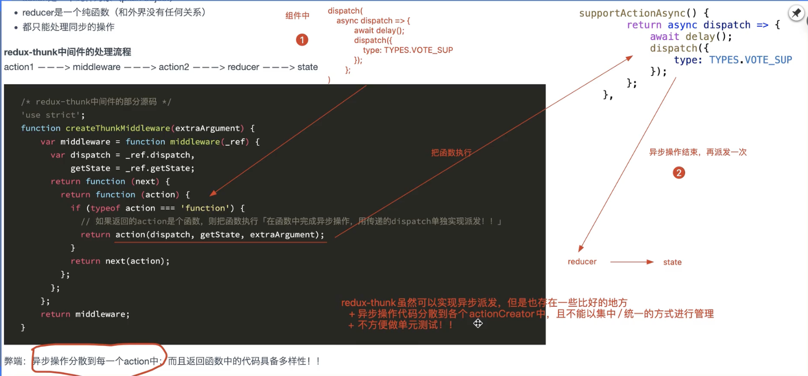
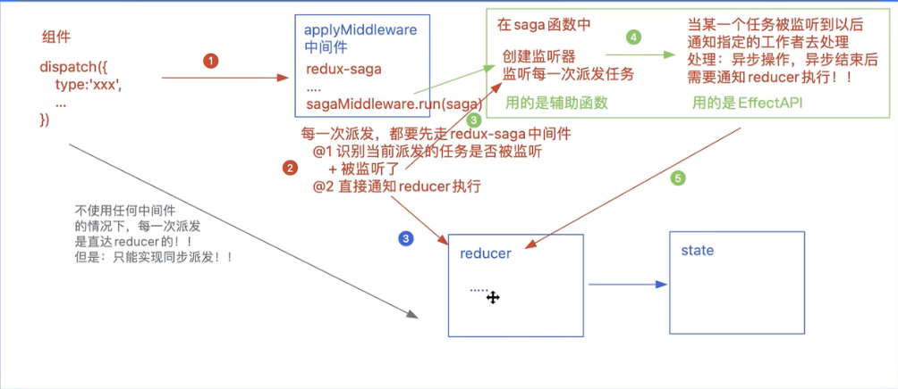
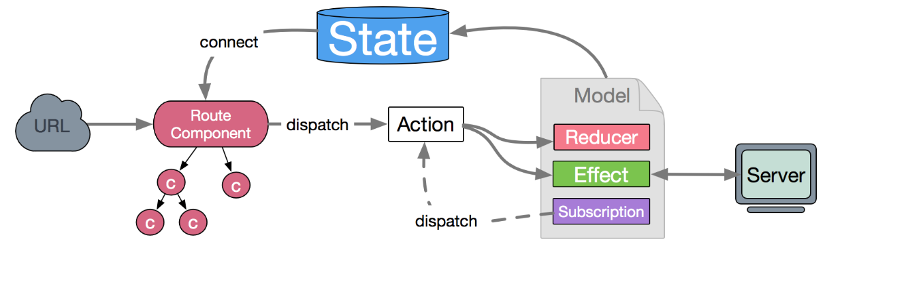
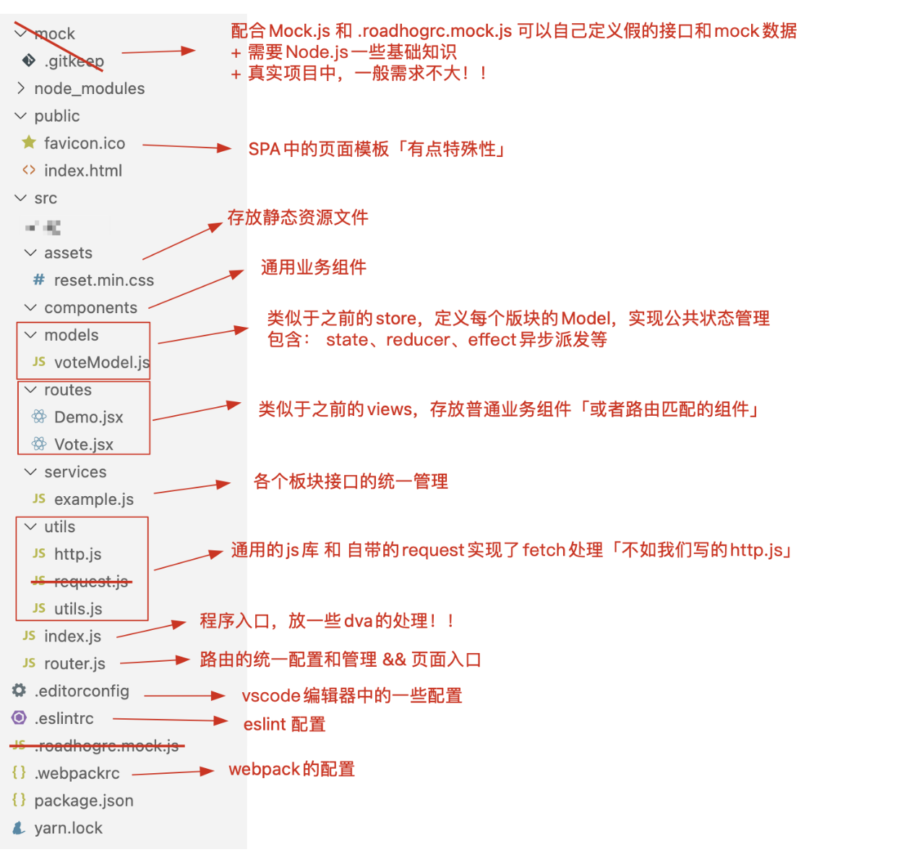

### 1. 淘系解决方案

```jsx
1.如果想使用ant-pro,umi等淘系解决方案必须会dva，dva的前提是会redux-saga，redux-saga的前提是iterator和generator
```

### 2. iterator（迭代器）

#### 2.1.什么是iterator

```jsx
/*
 * 遍历器(迭代器)（Iterator）是一种机制(接口)：为各种不同的数据结构提供统一的访问机制，任何数据结构只要部署Iterator接口，就可以完成遍历操作「for of循环」，依次处理该数据结构的所有成员
 *   + 拥有next方法用于依次遍历数据结构的成员
 *   + 每一次遍历返回的结果是一个对象 {done:false,value:xxx}
 *     + done:记录是否遍历完成
 *     + value:当前遍历的结果
 */
// 如果是类数组对象，可直接继承数组的Symbol.iterator「JQ也是如此」
let obj = {
    0: 10,
    1: 20,
    2: 30,
    length: 3
};
obj[Symbol.iterator] = Array.prototype[Symbol.iterator];
for (let value of obj) {
    console.log(value);
}
```

#### 2.2. 创建符合迭代器规范的对象

```jsx
// 有next方法和返回{value,done}的对象，并且可以被forof遍历[symbol]
class Iterator {
    constructor(assemble) {
        let self = this;
        self.assemble = assemble;
        self.index = 0;
    }
    next() {
        let self = this,
            assemble = self.assemble;
        if (self.index > assemble.length - 1) {
            return {
                done: true,
                value: undefined
            };
        }
        return {
            done: false,
            value: assemble[self.index++]
        };
    }
}
let itor = new Iterator([10, 20, 30, 40]);
console.log(itor.next()); //->{value:10,done:false}
console.log(itor.next()); //->{value:20,done:false}
console.log(itor.next()); //->{value:30,done:false}
console.log(itor.next()); //->{value:40,done:false}
console.log(itor.next()); //->{value:undefined,done:true}


```

#### 2.3. symbol.iterator

```jsx
/*
 * 拥有Symbol.iterator属性的数据结构(值)，被称为可被遍历的，可以基于for of循环处理
  + 数组  Array.prototype[Symbol(Symbol.iterator)]=function...
   + 部分类数组
     + arguments[Symbol(Symbol.iterator)]
     + NodeList.prototype[Symbol(Symbol.iterator)]
     + HTMLCollection.prototype[Symbol(Symbol.iterator)]
     + ...
   + 字符串 String.prototype[Symbol(Symbol.iterator)]
   + Set/Map
   + ...
 * 
 * 对象默认不具备Symbol.iterator，属于不可被遍历的数据结构
 */

1.让对象也具备迭代器规范
  Object.prototype[Symbol.iterator] = function () {
      let assemble = this,
          keys = Object.keys(assemble)
              .concat(Object.getOwnPropertySymbols(assemble)),// 拿取所有的属性Reflct.ownKeys()
          index = 0;
      return {
          next() {
              if (index > keys.length - 1) {
                  return {
                      done: true,
                      value: undefined
                  };
              }
              return {
                  done: false,
                  value: assemble[keys[index++]]
              };
          }
      };
  };
  let obj = {
      name: 'zhufeng',
      age: 12,
      teacher: 'team'
  };
  for (let value of obj) {
      console.log(value);
  }

```

#### 2.4 . forof的执行原理

```jsx

原理：
  1.迭代执行，先执行数组的Symbol.iterator这个方法，获取一个具备迭代器规范的对象->itor
  2.开始迭代：每一次迭代都是把 itor.next 方法执行
    + 把获取对象中的value属性值，赋值给val这个变量
    + 再看对象中done这个属性的值，如果是false，则继续迭代；如果是true，则结束迭代！！

// for/of循环主要用于获取数据结构中每一项的“值”
  let arr = [10, 20, 30, 40];
  arr[Symbol.iterator] = function () {
      console.log('FOR/OF START');
      let self = this, //this->arr
          index = -1;
      // 返回具备迭代器规范的对象 -> itor
      return {
          next() {
              index += 2;
              if (index >= self.length) {
                  return {
                      done: true,
                      value: undefined
                  };
              }
              return {
                  done: false,
                  value: self[index]
              };
          }
      };
  };

for (let val of arr) {
    console.log(val); // 20 40
} 


// 类数组也可以使用迭代器
let obj = {
    0: 10,
    1: 20,
    2: 30,
    length: 3
};
obj[Symbol.iterator] = Array.prototype[Symbol.iterator];
```

2.5，数组循环方法的对比

```jsx
// 数组迭代的方式：for、while、forEach/map、for/in、for/of...

// for和while的效率是最高的（命令式编程），for/in的效率是最低的[一般不建议使用这个方法]（可枚举的都要去寻找），map和forEach的效率是中等的（声明式编程、函数式编程）
    let arr = new Array(9999999).fill(null);
    console.time('FOR');
    for (let i = 0; i < arr.length; i++) {
        // ...
    }
    console.timeEnd('FOR');

    console.time('WHILE');
    let i = 0;
    while (i < arr.length) {
        // ...
        i++;
    }
    console.timeEnd('WHILE');

    console.time('FOR-EACH');
    arr.forEach(item => {
        // ...
    });
    console.timeEnd('FOR-EACH');

    console.time('FOR-OF');
    for (let val of arr) {
        // ...
    }
    console.timeEnd('FOR-OF');

    console.time('FOR-IN');
    for (let key in arr) {
        // ...
    }
    console.timeEnd('FOR-IN');
```

### 3. generator（生成器）和await

#### 3.1. 什么是生成器函数

```jsx
/*
 如何创建一个Generator生成器函数？
   + 把创建函数的“function”后面加一个“*”即可
   + 箭头函数是无法变为生成器函数的

 每一个生成器函数，都是GeneratorFunction这个类的实例
   fn.__proto__ -> GeneratorFunction.prototype -> Function.prototype
   多了这样的一个私有属性 [[IsGenerator]]:true
 普通函数的原型链
   fn.__proto__ -> Function.prototype

 当生成器函数执行：
   + 首先并不会立即把函数体中的代码执行
   + 而是返回一个具备迭代器规范的对象「itor」
     itor.__proto__
     + next
     + throw
     + return
     + Symbol(Symbol.iterator) : function...
     + ...
   + 当进行itor.next()执行的时候
     + 把函数体中的代码开始执行
     + 返回一个对象
       + done:记录代码是否执行完毕
       + value:记录本次处理的结果
 */
    const fn = function* fn() {
        console.log("代码运行中:", 10);
        return 100;
    };
    let itor = fn();
    console.log(itor.next()); //-> {done:true,value:100}
    console.log(itor.next()); //-> {done:true,value:undefined}


  // 对于ES6快捷赋值的语法，我们在方法名前面设置*，就可以创建生成器函数了
  let obj = {
      // sum:function(){}
      *sum() {

      }
  };
  console.log(obj.sum());
```

#### 3.2. 生成器的作用(yield, throw,return)

```jsx
//=====================
/*
 Generator生成器函数的作用：
   可以基于返回的itor（迭代器对象），基于其next方法，控制函数体中的代码，一步步的去执行！！
   + 每一次执行next，控制函数体中的代码开始执行「或者从上一次暂停的位置继续执行」，遇到yield则暂停！！
     done:false
     value:yield后面的值
   + 当遇到函数体中的return，或者已经执行到函数最末尾的位置了
     done:true
     value:函数的返回值或者undefined
 */

// yield
  const fn = function* fn() {
      console.log('A');
      yield 100;
      console.log('B');
      yield 200;
      console.log('C');
      yield 300;
      console.log('D');
      return 400;
  };
  let itor = fn();
  console.log(itor.next()); //->{done:false,value:100}
  console.log(itor.next()); //->{done:false,value:200}
  console.log(itor.next()); //->{done:false,value:300}
  console.log(itor.next()); //->{done:true,value:400} 

// return和throw
  const fn = function* fn() {
      console.log('A');
      yield 100;
      console.log('B');
      yield 200;
      console.log('C');
      yield 300;
      console.log('D');
      return 400;
  };
  let itor = fn();
  /*
  console.log(itor.next()); //->{done:false, value:100}
  console.log(itor.return('哈哈哈')); //->{value:'哈哈哈', done:true} 相当于在函数体中执行遇到了return，结束整个函数的继续执行「done:true」，传递的值相当于return的值！！
  console.log(itor.next()); //->{value:undefined, done:true}
  */

  console.log(itor.throw('哈哈哈')); //手动抛出异常「控制台报红」；生成器函数中的代码，都不会再执行了！！
  console.log(itor.next()); //抛出异常后，它下面的代码也不会执行了
  console.log('我是的外边的');
```

#### 3.3. generator的传值处理

```jsx
/* 
 params：生成器函数接收的实参值，它是生成器函数执行时传递的值
   fn(10,20,30)
   params:[10,20,30]

 itor.next(N)：每一次执行next方法，传递的值会作为上一个yield的返回值「所以第一次执行next方法，传递的值是没有用的，因为在它之前没有yield」
 */
const fn = function* fn(...params) {
  	console.log（param) // [10,20,30]
    let x = yield 100; // 第一次执行完next，将yield的值返回出去，，第二次执行next，将参数返回给x，执行到第二个yiled，将200返回出去
    console.log(x); //'second:222'
    let y = yield 200;
    console.log(y); //'three:333'
};
let itor = fn(10, 20, 30);
console.log(itor.next('first:111')); //-> {value: 100, done: false}
console.log(itor.next('second:222')); //-> {value: 200, done: false}
console.log(itor.next('three:333')); //-> {value: undefined, done: true} 


// 生成器函数的嵌套问题
const sum = function* sum() {
    yield 300;
    yield 400;
};
const fn = function* fn() {
    yield 100;
    yield* sum(); // yield*：支持让我们进入另外一个生成器函数中去一步步的执行 
    yield 200;
};
let itor = fn();
console.log(itor.next()); //-> {value: 100, done: false}
console.log(itor.next()); //-> {value: 300, done: false}
console.log(itor.next()); //-> {value: 400, done: false}
console.log(itor.next()); //-> {value: 200, done: false}
console.log(itor.next()); //-> {value: undefined, done: true} */
```

#### 3.4. 用generator实现async...await...

```jsx

const delay = (interval = 1000) => {
    return new Promise(resolve => {
        setTimeout(() => {
            resolve(`@@${interval}`);
        }, interval);
    });
};

// 需求：串行请求，有三个请求「请求需要的时间分别是 1000/2000/3000」?

1. promise
    delay(1000)
        .then(value => {
            console.log('第一个请求成功：', value);
            return delay(2000);
        })
        .then(value => {
            console.log('第二个请求成功：', value);
            return delay(3000);
        })
        .then(value => {
            console.log('第三个请求成功：', value);
        })
        .catch(reason => {
            console.log('任何请求失败，都执行这里：', reason);
        });

2. await
    (async () => {
        try {
            let value = await delay(1000);
            console.log('第一个请求成功：', value);

            value = await delay(2000);
            console.log('第二个请求成功：', value);

            value = await delay(3000);
            console.log('第三个请求成功：', value);
        } catch (reason) {
            console.log('任何请求失败，都执行这里：', reason);
        }
    })();

3.基于Generator函数，模拟Await的语法，实现请求的串行
      const handle = function* handle() {
          let value = yield delay(1000);
          console.log('第一个请求成功：', value);

          value = yield delay(2000);
          console.log('第二个请求成功：', value);

          value = yield delay(3000);
          console.log('第三个请求成功：', value);
      };

      value.then(x => { //  x为请求成功的值
          let { done, value } = itor.next(x); // x作为上一个yield的返回值
          value.then(x => {
              let { done, value } = itor.next(x);
              value.then(x => {
                  let { done, value } = itor.next(x);
              });
          });
      });

/* 
编写通知Generator中代码逐一执行的方法 
ES8(ECMAScript2017)中，提供了async/await语法：用来简化promise的操作
   它是 Promise + Generator 的语法糖
   我们自己上边实现的AsyncFunction和Generator函数就是async/await的原理!!
*/
const AsyncFunction = function AsyncFunction(generator, ...params) {
    let itor = generator(...params);
    // 基于递归的方法，通知Generator函数中的代码逐一执行
    const next = x => {
        let { done, value } = itor.next(x);
        if (done) return;
        if (!(value instanceof Promise)) value = Promise.resolve(value);
        value.then(next);
    };
    next();
};

// AsyncFunction(handle);
AsyncFunction(function* (x, y) {
    let total = x + y;
    let value = yield total;
    console.log('@1-->', value);

    yield delay(2000);
    console.log('@2-->', '哈哈哈');
}, 10, 20);

/* (async (x, y) => {
    let total = x + y;
    let value = await total;
    console.log('@1-->', value);

    await delay(2000);
    console.log('@2-->', '哈哈哈');
})(10, 20); */
```

### 4. redux-sage（day1230查看demo）

#### 4.1.什么是redux-saga

```jsx
redux-saga 是一个用于管理 /*异步获取数据*/(/*副作用*/) 的redux中间件；它的目标是让副作用管理更容易，执行更高效，测试更简单，处理故障时更容易…

学习 redux-saga 之前，需要先掌握 ES6 中的 Iterator迭代器 和 Generator生成器 ！！
```

#### 4.2. redux-sage和redux-thunk的区别

```jsx
1. redux中的数据流
	+ action ———> reducer ———> state
	+ action是一个纯粹对象（plain object）
	+ reducer是一个纯函数（和外界没有任何关系）[纯函数不会使用外界的任何参数，他和外界没有任何关系，比如克隆state对象]
	+ 都只能处理同步的操作

2. redux-thunk中间件的处理流程
	+ action1 ———> middleware（thunk中间件） ———> action2 ———> reducer ———> state

3. redux-saga中间件的工作流程
	+ redux-saga中提供了一系列的api，可以去监听纯粹对象格式的action，方便单元测试！！
	+ action1 ———> redux-saga监听 ———> 执行提供的API方法 ———> 返回描述对象 ———> 执行异步操作 ———> action2 ———> reducer ———> state
```

<div style="color:cyan">redux-thunk的工作流程和弊端</div>




#### 4.3. react-saga的使用

<div style="color:cyan">saga中间件的原理</div>



上面的3的意思是，进行派发的时候，如果type值和reducer一致，会先通知reducer执行，然后如果saga中也有这个type值，也会执行一次

<div style="color:yellow">同步和异步派发需要注意的细节</div>

```jsx
0. 需要注意的点
// 假如是同步派发：组件的派发dispatch的type值要和reducer中的type值一样，并且saga不要对type值做监听，
// 假如是异步派发：组件的派发dispatch的type值不要和reducer中的type值一样，要和saga的type值保持一致，最后由saga取进行reducer派发

原因:

	 // 假如type值在reducer和这里的take中的type值一样，用户执行派发，会执行一次reducer，如何再通知saga执行一次reducer，使用saga中的监听函数的type值不能和reducer中一致

// saga.js
    yield take(TYPES.DEMO_COUNT)   // 监听到type倍派发
    yield put({ // 通知reducer执行
      type: TYPES.DEMO_COUNT,
      payload: 3
    })

// 组件中派发
点击一次，先通知reducer执行一次，被saga监听到执行一次
		<Button type="primary"
            onClick={() => { // 通知reducer执行
                dispatch({
                    type: TYPES.DEMO_COUNT,
                    payload: 5
                });
            }}>
            按钮
        </Button>

// reducer
	export default function demoReducer(state = initial, action) {
    state = _.clone(state);
    let { payload = 1 } = action; //payload:记录每一次累加的数字
    switch (action.type) {
        case TYPES.DEMO_COUNT:
            state.num += payload;
            break;
        default:
    }
    return state;
};
```


<div style="color:cyan">如何使用saga中间件</div>

```jsx
1. 使用saga中间件
      import { createStore, applyMiddleware } from 'redux';
      import reducer from './reducer';
      import createSagaMiddleware from 'redux-saga';
      import saga from './saga'; // 监听函数
      const sagaMiddleware = createSagaMiddleware();

      const store = createStore(
          reducer,
          applyMiddleware(sagaMiddleware)
      );
      sagaMiddleware.run(saga);  // 启动saga监听器【generator函数】
      export default store;

2. 创建监听函数文件./saga.js
    /**
     * 创建监听器函数的方法
     *      take（一般不用）, takeLatest,takeEvery, throttle, debounce,
     * 获取数据的方法：
     *      call, apply, fork, delay(延迟函数)，select
     * 通知reducer的执行
     *     put
     */
    import {
    take, put, delay
    } from 'redux-saga/effects'; // 引入effects
    import * as TYPES from './action-types';

    /* 工作区域 */
    const workingCount = function* workingCount(action) { // action是组件派发过来的行为对象
        yield delay(2000); // 延迟函数，延迟多久执行
        yield put({  // 派发到reducer
            type: TYPES.DEMO_COUNT,
            payload: action.payload
        });
    };
    export default const saga = function* saga() {
      yield takeLatest(`${TYPES.DEMO_COUNT}@SAGA@`, workingCount);
    };

3. 组件派发
  const Demo = function Demo() {
      const dispatch = useDispatch(),
          { num } = useSelector(state => state.demo);

      return <DemoBox>
          <span className="num">{num}</span>
          <Button type="primary"
              onClick={() => { // 同步派发直接走reducer
                  dispatch({
                      type: TYPES.DEMO_COUNT,
                      payload: 5
                  });
              }}>
              按钮
          </Button>

          <Button type="primary" danger
              onClick={() => {
                  dispatch({ // 异步派发走saga
                      type: TYPES.DEMO_COUNT + '@SAGA@',
                      payload: 10
                  });
              }}>
              异步按钮
          </Button>
      </DemoBox>
  };
```

```jsx
// saga中的监听行为派发的函数

1.take这样只会执行一次   一般不用
  yield take(`${TYPES.DEMO_COUNT}@SAGA@`); 
  yield workingCount() // 监听到type，走workingCount(yield不用加*，saga自己进行处理了)
    
2. while加take可以实现无线次监听 一般不用
  while(true){
    yield take(`${TYPES.DEMO_COUNT}@SAGA@`); 
    yield workingCount() 
  }
    
3. takeEvery监听到就执行后面的函数代替while+take
	yield takeEvery(`${TYPES.DEMO_COUNT}@SAGA@`, workingCount)
 //  takeEvery点击多次，会进行多次派发（takeLatest,debounce,throttle）

 4.yield takeLatest(异步标识,working)【使用最多】
   + 和takeEvery一样，每一次异步派发都会被监测到，都会把working执行
   + 只不过，在执行working之前，会把正在运行的操作都结束掉，只保留当前最新的「也就是最后一次」
   + 对异步派发任务的防抖处理「结束边界」

5.yield throttle(ms, 异步标识, working);
   + 对异步派发进行节流处理：组件中频繁进行派发操作，我们控制一定的触发频率「依然会触发多次，只不过做了降频」
   + 它不是对执行的方法做节流，而是对异步任务的监测做节流：第一次异步任务被监测到派发后，下一次监测到，需要过“ms”这么长时间！！

6.yield debounce(ms, 异步标识, working);
   + 和takeLatest一样，也是做防抖处理「只识别一次」
   + 但是原理和takeLatest是不一样的，和throttle类似：它是对异步任务的监测做防抖处理，在指定的“ms”时间内，我们触发多次，任务也只能被监测到一次「监测最后一次」，把working执行一次！！

7. fork 将两个异步请求变成并行（拿不到值（可以开启多进程）

	// takeLatest不允许多个任务并行处理，如果接收到saga任务，就会取消前一个任务的执行，所以可以使用fork来进行处理

 // 使用fork：当监听到TYPES.DEMO_COUNT可以去执行多个方法（并行）

    while (true) {
          let action = yield take(`${TYPES.DEMO_COUNT}@SAGA@`);
          yield fork(workingCount, action);
          yield fork(workingSupport, action);
          yield fork(workingOppose, action);
     } 

  
  
// working工作区中的函数

1. delay
	yield delay(ms) 延迟函数，用于模拟向服务器发起请求，只有延迟时间到达后，后面的函数才会执行

2. put
	yield put(action) 派发任务等同于dispatch
  
3. select
	let xxx = yield select(state=>state)；  获取公共状态类似于mapStateToProps

4. call，apply
	let result = yield call(方法, 实参1, 实参2, ...)
     + 基于call方法，可以把指定的函数执行，把实参一项项的传递给方法
     + 真实项目中，我们一般基于call方法，实现从服务器获取数据
     + result就是异步调取接口成功，从服务器获取的信息
     + ...
   let result = yield apply(this, 方法, [实参1, 实参2, ...]);


5. all，将两个异步请求变成并行效果（可以拿到值），等到所有结果成功，再向下执行
    let { home, banner } = yield all({
        home: call(api.queryData, 100, '珠峰培训'),
        banner: call(api.queryBanner)
      })
              
/* 模拟了两个接口 */
const api = {
    queryData(id, name) {
        return new Promise(resolve => {
            setTimeout(() => {
                let result = {
                    code: 0,
                    data: [10, 20, 30, 40]
                };
                resolve(result);
            }, 2000);
        });
    },
    queryBanner() {
        return new Promise(resolve => {
            setTimeout(() => {
                let result = {
                    code: 0,
                    data: '轮播图数据'
                };
                resolve(result);
            }, 1000);
        });
    }
};

// 基于yield call处理，实现的是标准的串行效果：上一个请求成功，才会发送下一个请求

    let { data } = yield call(api.queryData, 100, '珠峰培训');
    console.log('第一个请求成功:', data);
    let { data: data2 } = yield call(api.queryBanner);
    console.log('第二个请求成功:', data2); 


// 基于fork处理并行,非阻塞的方式处理函数（拿不到值）
 let { data } = yield fork(api.queryData, 100, '珠峰培训');
 let { data: data2 } = yield call(api.queryBanner);
 console.log('第一个请求成功:', data); // undefined
 console.log('第二个请求成功:', data2); // undefined


// 如果想实现并行效果，则基于yield all处理：等待所有请求都成功，再向下继续执行
let { home, banner } = yield all({
  home: call(api.queryData, 100, '珠峰培训'),
  banner: call(api.queryBanner)
});
console.log(home, banner); //分别获取了两个请求成功的结果 

```

### 5. dva

```jsx
/ dva 首先是一个基于 redux 和 redux-saga 的数据流方案，然后为了简化开发体验，dva 还额外内置了 react-router 和 fetch，所以也可以理解为一个轻量级的应用框架。
```

#### 5.1.在create-react-app中使用dva（day1231create-react-app目录存在demo）

##### dva核心知识与实战运用

> dva 首先是一个基于 redux 和 redux-saga 的数据流方案，然后为了简化开发体验，dva 还额外内置了 react-router 和 fetch，所以也可以理解为一个轻量级的应用框架!
>
> https://dvajs.com/guide/
>
> - 易学易用，仅有 6 个 api，对 redux 用户尤其友好，配合 umi 使用后更是降低为 0 API
> - elm 概念，通过 reducers, effects 和 subscriptions 组织 model
> - 插件机制，比如 dva-loading 可以自动处理 loading 状态，不用一遍遍地写 showLoading 和 hideLoading
> - 支持 HMR，基于 babel-plugin-dva-hmr 实现 components、routes 和 models 的 HMR



#####  如何使用dva？

- ```
  1.1 在create-react-app的基础上使用dva
  在create-react-app脚手架的基础上，额外安装的内容：
  
  - 无需手动进行antd按需导入
  - 无需安装：redux及redux-saga、react-redux、react-router-dom等，dva把这些东西都集成好了，安装一个dva就相当于安装了这些全部东西！！
    - react-router-dom使用的是v4版本「4.3.1」
    - redux使用的是 v3.7.2「我们之前使用的都是v4.0」
    - 集成的配套插件版本有点低
    - 在React18的脚手架中使用dva会有警告错误！！
  - history 是控制路由模式的
  - 其余的按照之前讲的配置方案去配置webpack，包括：less、跨域代理、兼容、响应式布局等
  ```

  

```json
{

    "dependencies": {

        "antd": "^5.0.0",

        "antd-icons": "^0.1.0-alpha.1",

        "dva": "^2.4.1",

        "http-proxy-middleware": "^2.0.6",

        "less": "^4.1.3",

        "less-loader": "^8.1.1",

        "prop-types": "^15.8.1",

        "styled-components": "^5.3.6",

        "history": "4.10.1",

        ......

    }

}
```

项目的结构目录，可以依然沿用之前的命名风格：

- api 接口管理和请求封装
- assets 静态资源文件
- router 路由统一配置
- store redux公共状态管理
- views 普通业务组件
- components 公共业务组件
- index.jsx 入口
- setupProxy.js 跨域代理
- …

但是有很多文件的编写方式和之前是不一样的！！
`index.js`

```javascript
import dva from 'dva';

import createHistory from 'history/createHashHistory';

import RouterConfig from './router';

import voteModel from './store/voteModel';


// 初始化配置

const app = dva({

  // 设置路由模式{默认HASH路由}

  history: createHistory()

});

// 使用插件

app.use({});

// redux公共状态管理

app.model(voteModel);

// 路由配置

app.router(RouterConfig);

// 启动dva

app.start('#root');
```

`router/index.js` 配置页面入口和路由

```javascript
import React from 'react';

import { Router, Route, Switch, Redirect } from 'dva/router';

import Vote from '../views/Vote';

import Demo from '../views/Demo';

/* ANTD */

import { ConfigProvider } from 'antd';

import zhCN from 'antd/locale/zh_CN';

import '../assets/reset.min.css';


function RouterConfig({ history }) {

    return (

        <ConfigProvider locale={zhCN}>

            <Router history={history}>

                <Switch>

                    <Route path="/" exact component={Vote} />

                    <Route path="/demo" component={Demo} />

                    <Redirect to="/" />

                </Switch>

            </Router>

        </ConfigProvider>

    );

}

export default RouterConfig;
```

`store/voteModel.js` 配置每个模块的Model，包含：状态、reducer、异步派发的方法等

```javascript
import _ from '../assets/utils';

const delay = (interval = 1000) => {

    return new Promise(resolve => {

        setTimeout(() => {

            resolve();

        }, interval);

    });

};

export default {

    namespace: 'vote',

    state: {

        supNum: 10,

        oppNum: 5

    },

    reducers: {

        support(state, action) {

            state = _.clone(true, state);

            let { payload = 1 } = action;

            state.supNum += payload;

            return state;

        },

        oppose(state, action) {

            state = _.clone(true, state);

            let { payload = 1 } = action;

            state.oppNum += payload;

            return state;

        }

    },

    effects: {

        supportAsync: [

            function* ({ payload }, { call, put }) {

                yield call(delay, 2000);

                yield put({

                    type: 'support',

                    payload

                });

            },

            { type: 'takeLatest' }

        ],

        *opposeAsync({ payload }, { call, put }) {

            yield call(delay, 2000);

            yield put({

                type: 'oppose',

                payload

            });

        }

    }

};
```

在组件中如何使用呢？

```javascript
import React from "react";

import styled from "styled-components";

import { Button } from 'antd';

import { connect } from 'dva';


// 样式处理

const VoteBox = styled.div`

    ...

`;


const Vote = function Vote(props) {

    let { supNum, oppNum, dispatch } = props;

    return <VoteBox>

        <div className="header">

            <h2 className="title">React是很棒的前端框架</h2>

            <span className="num">{supNum + oppNum}</span>

        </div>

        <div className="main">

            <p>支持人数：{supNum}人</p>

            <p>反对人数：{oppNum}人</p>

        </div>

        <div className="footer">

            <Button type="primary"

                onClick={() => {

                    dispatch({

                        type: 'vote/supportAsync',

                        payload: 10

                    });

                }}>

                支持

            </Button>

            <Button type="primary" danger

                onClick={() => {

                    dispatch({

                        type: 'vote/opposeAsync'

                    });

                }}>

                反对

            </Button>

        </div>

    </VoteBox>;

};

export default connect(state => state.vote)(Vote);
```


#### 5.2. 直接创建dva文件（直接查看day12.31demo）

```jsx
dva脚手架创建的项目是基于roadhog /rəʊd hog/进行webpack的配置！！
roadhog是一个cli工具，提供server、 build和test三个命令，分别用于本地调试和构建，并且提供了特别易用的mock功能。命令行体验和create-react-app一致，配置略有不同，比如默认开启 css modules，然后还提供了JSON格式的配置方式！
$ npm install dva-cli -g
$ dva -v
$ dva new my-project

+ dva只支持antd第四代版本（不支持按需导入，需要自己手动实现按需导入babel-plugin-import ^1.3.5）

dva的核心包括roadhog脚手架，路由，和models数据管理s(详细看文档介绍)

```

<div style="color:cyan">dva的目录文件</div>



### 6 .umi


```jsx
一个框架核心主要看配置，路由，redux数据

1. 结构目录 
2. webpack配置
3. 运行时的配置：
4. 路由 
5.数据流查看umi/max 或者在umi文档中查看运行时的配置（如何开启dva数据流）

```


### 7. 不同的工程化的区别


<div style="color:cyan">总结：这些框架主要是对webpack、路由、redux等工程化的项目实行的封装，让工作者更加注重业务逻辑</div>

如果做后台管理项目，使用umi，如果做c端项目，使用create-react-app原生的来做
