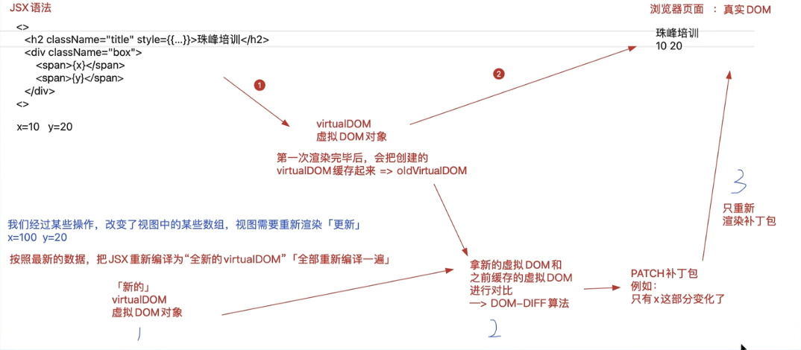
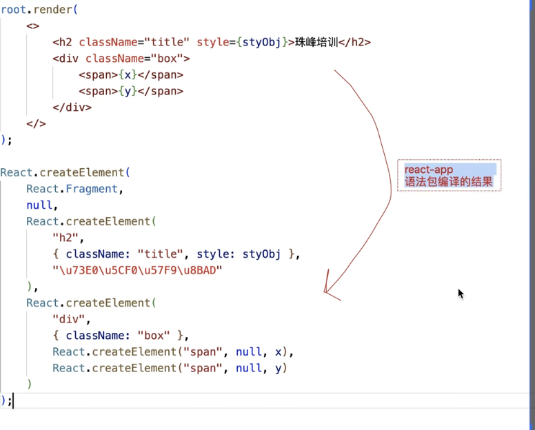
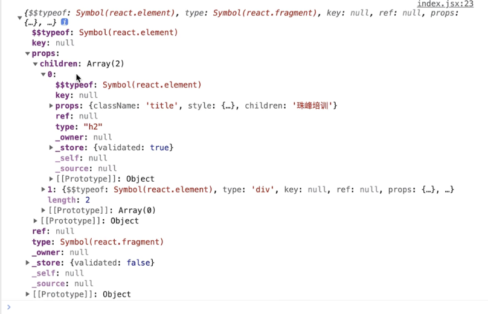
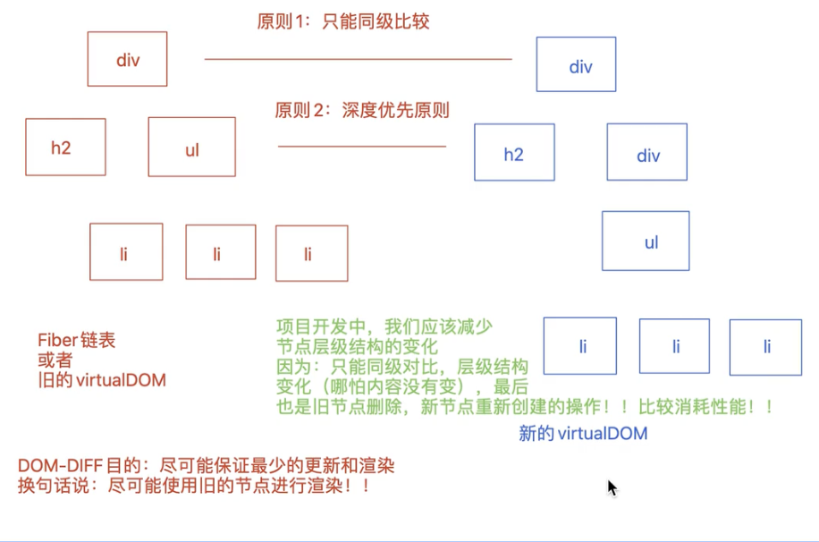
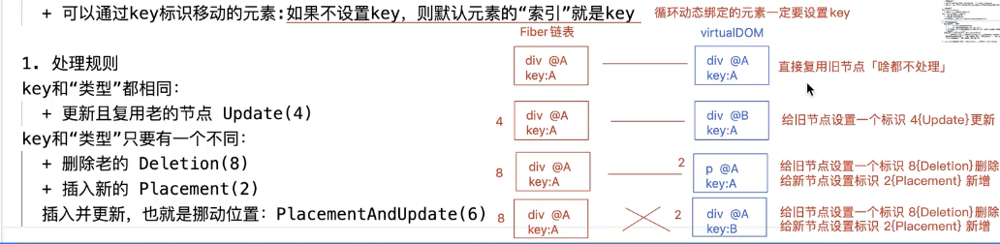
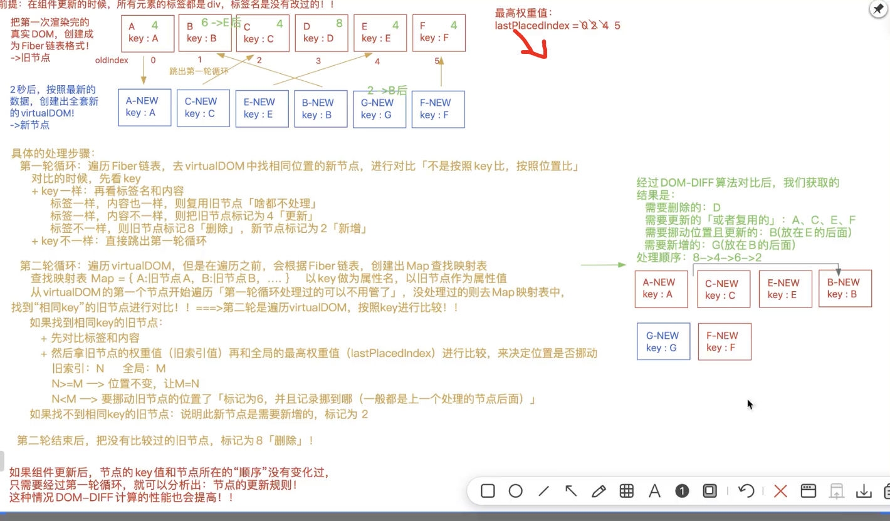
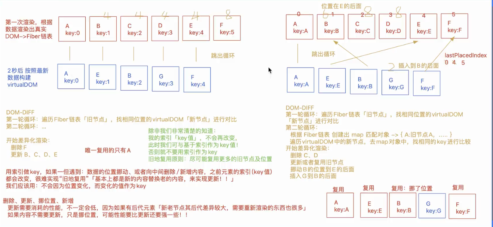

1. jsx底层处理机制

```jsx
1. 第一步将编写的jsx语法编译成虚拟dom
   @1 通过bael-preset-react-app将jsx编译为React.createElement()这种的格式
   @2 将createElement执行创建为虚拟dom
   @3 React.createElement(元素名｜组件名, 元素的属性 | null, 当前元素的子节点 ｜ ‘’)
2. 将渲染的虚拟dom渲染为真实dom
（ps:第一次渲染页面是直接将虚拟dom转换为真实dom，但是后期渲染的时候，通过diff算法将结果进行对比（patch）,将差异的部分（patch）进行渲染）


```

react底层处理的步骤



bael-preset-react-app编译后的结果



React.createElement()编译后的虚拟dom对象[jsx对象：$$typeof:symbol(react.element))]



```jsx
// 创建自己的createElement函数
export function createElement(el,prop,...children){
    let virtualDom = {
        $$type: Symbol('react.element'),
        type: null,
        ref: null,
        props: null
    }
    virtualDom.type = el;
    virtualDom.props =prop ? {...prop} : {};
    if(children.length > 0){
        virtualDom.props.children = children.length === 1 ? children[0] : children;
    }
    return virtualDom;
}

// 调用
createElement(
    'div', 
    null, 
    createElement('h1', { className: 'title' }, 'hello world'),
    createElement('p', { className: 'content' }, 'react')
)
```

```jsx
// 在代码中使用virtual dom 因为代码中也会将节点渲染为这种形式
root.render(
  <>
    <div>1212</div>
    {React.createElement("button",{className:"btn"},'按钮')}
  </>
);
```

### 2.将虚拟dom对象转换为真实dom对象

```jsx
1. 基于ReactDom中的render方法处理的
   // v16版本
    ReactDOM.render(<><>,document.getElementById("root")))
   // v18版本
    let root = ReactDOM.createRoot(document.getElementById("root"))
    root.render(<><>)
```

```jsx
1.获取对象的属性
	/**
 * 封装一个对象迭代方法:拿取当前的对象的所有私有对象
 * 1. 传统的for-- in循环性能差，即可以迭代私有的，也可以迭代公有的（property）；只能迭代可枚举的，非symbol类型的
 * 2. 获取对象所有的私有属性【不论类型是否可以枚举】 Object.getOwnPropertyNames(obj) + Object.getOwnPropertySymbols(obj)
 * let key = Object.getOwnPropertyNames(obj).concat(Object.getOwnPropertySymbols(obj)); -->keys可以拿到所有的属性
 * 3. 获取对象的所有的私有属性：Reflect.ownKeys(obj) --> 但是这个方法不兼容ie
 */
function Each(obj,callback){
    if(obj === null || typeof obj !== 'object'){
        throw new TypeError('obj is not object');
    }
    if(typeof callback !== 'function'){
        throw new TypeError('callback is not function');
    }
    let keys = Object.getOwnPropertyNames(obj).concat(Object.getOwnPropertySymbols(obj));
    keys.forEach(key => {
        callback(key,obj[key]);
    })
}
```

```jsx
1.将虚拟dom对象转换为真实dom对象
export function createDom(virtualDom,container){
    // 获取虚拟dom对象的type属性和props属性
    let {type,props} = virtualDom;
    // 如果type是字符串，那么就是一个原生的标签，如果是函数，那么就是一个组件
    if(typeof type === 'string'){
        // 创建一个真实的dom节点
        let ele = document.createElement(type); // 递归赋值，作用域链（ele）
        // 将props属性中的属性添加到真实的dom节点上
        Each(props,(key,value) => {
            // 判断特殊情况className、style、children
            if(key === 'className'){
                 ele.setAttribute('class',value);
                 return;
            }else if(key === 'style'){
                Each(value,(styleKey,styleValue) => {
                    ele.style[styleKey] = styleValue;
                })
                return;
            }else if(key === 'children'){
                // 如果是children属性，那么就是子节点，如果是一个字符串，那么就是一个文本节点，如果是一个数组，那么就是一个元素节点
                let children = value
                if(!Array.isArray(children)){
                    children = [children];
                }
                children.forEach(child => {
                    if(typeof child === 'string'){ // 子节点为文本节点直接插入
                        ele.appendChild(document.createTextNode(child));
                    }else{
                        createDom(child,ele);
                    }
                }
                )
                return;
            }
            // 其他情况直接添加到元素上
            ele.setAttribute(key,value);
        })
        // 将创建的表情添加到容器中
        container.appendChild(ele);
    }
}
```

```jsx
1.替换index.js(create-react-app入口文件)

import React from 'react';
import ReactDOM from 'react-dom/client'; // 构建html(webapp的核心)
import { createElement, createDom} from "./jsxHandle"

import "@/index.less";
// const root = ReactDOM.createRoot(document.getElementById('root'));
// // render渲染编写的视图

// root.render(
//   <>
//     <div id="div1"></div>
//   </>
// );
let text = "react"
let vitualdom = createElement(
  'div', 
  null, 
  createElement('h1', { className: 'title' }, 'hello world'),
  createElement('p', { className: 'content' }, text)
)
// render渲染视图
createDom(vitualdom, document.getElementById('root'))
```

### 3. dom-diff算法的原理（fiber）

```jsx
1.会根据最新的数据，重新把”整个jsx“编译为新的 virtualDOM 「不论有的地方的数据是否发生改变，virtualDOM都是从头编译到尾的」
   + 但是不会把整个virtualDOM全部编译为真实的DOM，它需要经过一个 DOM-DIFF 的对比，把virtualDOM中差异的部分获取到，接下来只把差异的部分渲染为真实的DOM，交给浏览器渲染！！

DOM-DIFF 主要就是在组件更新的时候，可以实现差异化的更新，而不是整体全部更新，以此来优化组件渲染的速度！提高性能！！

2.React DOM-DIFF 算法
  在ReactV16及以前：新老虚拟DOM对比
  在ReactV17及以后：老的DOM会构建出Fiber链表，拿最新创建的虚拟DOM和Fiber链表做对比
  
 3.优化原则 
    + 深度优先原则
    + 同级对比 //ps:尽可能不要去删除增加节点，而是通过样式去隐藏显示
    + 不同类型的元素,会产出不同的结构:销毁老结构,创建新结构
    + 可以通过key标识移动的元素:如果不设置key，则默认元素的“索引”就是key
  
```

<div style="color:cyan">同级比较和深度优先的特点</div>



```jsx
 4.处理规则
  key和“类型”都相同：
    + 更新且复用老的节点 Update(4)
  key和“类型”只要有一个不同：
    + 删除老的 Deletion(8)
    + 插入新的 Placement(2)
    插入并更新，也就是挪动位置：PlacementAndUpdate(6) 
```

<div style="color:cyan">循环元素为什么要使用key标识</div>



<div style="color:cyan">demo1:dom更新的流程</div>

```jsx
const Test = function Test() {
    n++;
    let [state, setState] = useState(['A', 'B', 'C', 'D', 'E', 'F']);
    useEffect(() => {
        setTimeout(() => {
            setState(['A', 'C', 'E', 'B', 'G', 'F']);
        }, 2000);
    }, []);

    return <TestBox>
        {state.map(item => {
            return <div key={item}>
        {/* n用来表示是否是第一次更新 */}
                {n > 1 ? `${item}-NEW` : item} 
            </div>;
        })}
    </TestBox>;
};
```




ps:最高权重值是上一个处理的旧节点的最大索引值，如果找不到相同的key，就插入到上一个节点的后面

### 4.为什么不能使用索引作为key

```jsx
1. 元素很难实现复用，都是老的内容替换新的（如果只是元素移动位子），如果子节点过多，性能消耗过大
ps:除非保证元素索引和key值不会改变
```

```jsx
为什么不能使用索引作为key，而是要用一个尽量不会改变的值作为key【id唯一值】
const Test = function Test() {
    let [state, setState] = useState(['A', 'B', 'C', 'D', 'E', 'F']);
    useEffect(() => {
        setTimeout(() => {
            setState(['A', 'E', 'B', 'G', 'F']);
        }, 2000);
    }, []);

    return <TestBox>
        {state.map((item, index) => {
            return <div key={index}>
                {item}
            </div>;
        })}
    </TestBox>;
};
```

<div style='color:cyan'>原因</div>


