### 1.函数组件

```jsx
1. 一个函数返回一个jsx对象就是一个函数组件
const DemoOne = (props) => {
    console.log(props)
    return <div>函数组件</div>
}
export default DemoOne;
```

```jsx
2.使用函数组件
import DemoOne from './views/DemoOne';
 <>
    {<DemoOne  title='12' data={[12,12]}/>}
  </>
```

```jsx
3.组件的命名一般使用大驼峰命名
```

```jsx

4.给组件传递属性值
 <>
    {<DemoOne title="123" data={[1,2,34,5]}  />}
  </>

// 非字符串的值和number的值要加{}进行传递
// 组件的React.createEelement的type为function，不是像元素一样的字符串值，


```

```jsx
5.函数组件的渲染机制(单闭合)

@1 基于babel-preset-react-app吧调用的组件转换为createElement形式
	React.createElement(DemoOne,{
	    title:'',
	    data:[10,20],
	   
	})
@2 将createElement的的方法执行，创建一个virtualDOM对象
{
	$$typeof: Symbol(react.element),
	key: null,
	props: {title: 12, data: Array(2)},// 如果有子节点	[双闭合调用<demo />]，则也包含children
	ref: null,
	type: () => {…}
}
@3.root.render把virtualdom转换为真实的dom
	type不为一个字符串，而是一个函数
	将函数执行 --> demoOne()
	将virtualdemo的props传递给函数 demoone(props)[父传子]
	接受函数返回的结果，就是一个virtualdom对象
	最后render把vdom转换为真实dom，然后插入到容器中

```

```jsx
6.单闭合和双闭合的区别(单闭合拿不到children，双闭合可以拿到children属性)
	双闭合可以传递子节点
	 {
		<DemoOne title='123' data={[1,2,3,4]}>
        		<div>welcome</div>
     		 </DemoOne>
      	  }
@1 通过babel-preset-env-react-app将jsx转换为js		   
		React.createElement(DemoOne, {
  			title: "123",
  			data: [1, 2, 3, 4]
		}, 
			React.createElement("div", null, "welcome") // demo下面多了一个div
		);
@2 执行createElement转换为一个vdom
	{
  	children: {$$typeof: Symbol(react.element), type: 'div', key: null, ref: null, props: {…}, …}
  	data: [1, 2, 3, 4]
  	title: "123"
	}
@3 render

```

### 2. props

```js
对象冻结: Object.freeze(obj) --> 检测对象是否被冻结Object.isFrozen --> 被冻结的对象不能修改，新增修改，不能被对象做劫持（Object.defineProperty）

对象被密封：Object.seal(obj) --> 检测对象被密封 Object.isSealed() --> 被密封的对象可以修改，不能新增，不能删除，也不能做劫持

对象扩展：Object.preventExtensions(obj) 设置不可扩展 --> Object.isExtensible() 检测是否可扩展 --> 不能新增，其余都可以
```

```jsx
1.props传递过来的属性是只读的[对象被冻结了],只能获取不能修改
   // Object.isFrozn(props) --> true
    const DemoOne = (props) => {
      let className = props.className
      let title = props.title
      return <div className={className}>{title}</div>
     }

```

```jsx
2.props规则校验
@1. 设置默认值(设置函数静态的私有属性方法))
	DemoOne.defaultProps = {
    		className: 'demo-one',
    		title: 'demo-one'
	}
@2. 设置数据格式，是否必传（依赖于官方插件prop-types[默认脚手架中不存在]）[传递过来的值首先经过Prop校验，校验不管是否成功都会给props，但是控制台会出现警告错误]
	import  PropTypes from "prop-types";
	DemoOne.propTypes = {
		className: PropTypes.string.isRequired,
    		title: PropTypes.oneOfType([
        		PropTypes.string,
        		PropTypes.number
    		]).isRequired
	}


```

```jsx
3.通过解构的方法修改props(这样就不会影响到props对象的值了)
	const DemoOne = (props) => {
    		let {className, title} = props;
    		className =  '123'
    		title = '123'
    		return <div className={className}>{title}</div>
	}
```

### 3. 插槽

```jsx
1.插槽的使用
const DemoOne = (props) => {
    let {className, title, children} = props;

    return <div className={className}>
        {title}
        {children} // 将children[demo中的子节点]进行渲染[插槽]
    </div>
}
```

```jsx
1.具名插槽 （React.Children.toArray()）
父组件
<>
    {
      <DemoOne >
        <b>234</b>
        <b>123</b>
        <div slot="footer">我是页尾</div>
        <div slot="header"> 我是页头 </div>
      </DemoOne>
      }
  </>
子组件
const DemoOne = (props) => {
    let {className, title, children} = props;
    // 判断children是否是数组,传递一个子节点可能不为数组
    // children = Array.isArray(children) ? children : [children];-->替换为children = React.Children.toArray(children)
    children = React.Children.toArray(children)
    // 基于React.Children对children进行处理
    // 好处：方法的内部、已经对children的各种情况做出了处理
    let header = children.find((item)=>{
        return item.props.slot=='header'
    })
    let footer = children.find((item)=>{
        return item.props.slot=='footer'
    })
    let defaultSlot = children.filter((item)=>{
        return !item.props.slot
    })
    return <div className={className}>
        <div className='header'> {header} </div>
        {title}
         <div className='footer'> {footer} </div>
         <div>{defaultSlot}</div>
    </div>
}
```

### 4.练习：封装一个dialog的组件

```jsx
root.render(
  <>
    {
      <Dialog title="第一个dialog" content="第一个">
        <button slot="comfirm">comfirm</button>
        <button slot = "cancel">cancel</button>
      </Dialog>
    }
    {
      <Dialog title="第二个dialog" content="第二个" />
    }
     {
      <Dialog title="第三个dialog" content="第三个">
        <button slot="comfirm">comfirm</button>
      </Dialog>
    }
  </>
);
import PropTypes from "prop-types";
import React from "react";
const Dialog = (props) => {
    let { title, content ,children} = props;
    children = React.Children.toArray(children);
    let slotComfirm = children.find(item => item.props.slot === "comfirm");
    let slotCancel = children.find(item => item.props.slot === "cancel");
    return (
        <>
            <div className="dialog">
                <h1>{title}</h1>
                <div className="content">{content}</div>
                {children.length>0 ? <div className="footer" >
                   {slotComfirm? <span>{slotComfirm}</span> : '' }
                    {slotCancel?<span>{slotCancel}</span>:''}
                </div> : ''}
            </div>
        </>
    )
    console.log("props")

}
Dialog.defaultProps = {
    title: "标题",
    content: "内容"
}
Dialog.propTypes = {
    title:PropTypes.string.isRequired, 
    content:PropTypes.string.isRequired
}
export default Dialog;


```

### 5. 静态组件和动态组件

#### 5.1.静态组件（函数组件）

```jsx
 1、基本概念：渲染一次后，后面的组件就不会渲染了(除非父组件触发子组件去更新 或者 使用hooks组件 、动态组件)，只具备属性这个特点

 2、 静态组件的渲染步骤
 
    2.1 第一次渲染
  
         + 产生一个上下文
         + 将props[children]传入函数中
         + 将函数的返回值（vdom）渲染到页面中

    2.2  第二次渲染，点击按钮的时候
  
         + 修改上下文的值
         + 私有变量发生变化但是视图未改变
   
  3、优点： 对比于类组件：内部机制简单，渲染速度更快
```

<div style="color:red">静态组件无法改变值：代码</div>

```jsx
// 静态组件渲染后无法通过改变值来更新视图 （代码）
const Vite = (props)=>{
    const {title} = props;
    let opnum = 0;
    let agnum = 0;
    return (<>
        <div>
            <h2>{title}</h2>
            <div>总人数{opnum + agnum}</div>
        </div>
        <div>
            <p>反对人数：{agnum}</p>
            <p>支持人数:{opnum}</p>
        </div>
        <div>
            <button onClick={
                ()=>{
                    opnum++;
                    console.log(opnum);
                }
            }>反对🙅</button>
            <button onClick = {
                ()=>{
                    agnum++; // 静态组件：num值不会更新
                    console.log(agnum);
                }
            }>支持</button>
        </div>
    </>)
}
```

#### 5.2 、动态组件（类组件）

```jsx
基本概念：除了父组件更新触发更新以外，还能在组件内部通过setstate改变组件的状态进行更新，还具备状态、属性、生命周期函数和ref等特点，基本上一个组件有的都具备

1. 解决问题：

		 + 动态组件(类组件)解决函数组件第一次渲染后无法更新视图的问题（hooks组件也可以解决这个问题：在函数组件中使用hooks函数）

2. 基本使用

		 + 创建一个类，必须继承React.Component/React.PureComponent

		 + 在类中，必须提供一个render函数，需要在原型上

		 + 在render方法中返回一个需要渲染的视图
3. 优点：功能强大
```

### 6.  class基本原理

```jsx
class Point {
    #self = 0  // 私有属性，在类的外部使用就会报错，在内部使用this.#self --> 可以使用in来判断私有属性(只能在类的内部判断#self in Point)
    static #region  = "city"  // 静态的私有属性
    #sum(){ //私有方法

    }
    get #g(){ // 私有属性的get和set

    }
    z = 100 // 定义在实例对象的上面，而不是原型上面
    constructor(x, y) { // 挂载在原型上了 Point.prototype.constructor
      this.x = x;       // 没有constructor方法，类会自动补充一个constructor(){}
      this.y = y;
  
    }
  
    toString() { // 挂载在原型上了 Point.prototype.toString
        console.log('私有',this.#self in  this)
      return '(' + this.x + ', ' + this.y + ')';
    }
    a = ()=>{
   
        console.log(1)
    }
    get b(){ // 存在属性descriptor对象上 -->获取 Object.getOwnPropertyDescriptor
        return this.#self // 实列也可以获得私有属性
    }
    set b(value){
        this.x= value
    }
    static v(){ // 静态方法，Point.v()调用,也可以被继承，继承后可以通过super.v()调用
        console.log("this",this ) //-->this为Point
    }
    static h = 100 // 静态属性
  }
  Point.h = 100 // 静态属性

  let point = new Point(1,2)
  console.log("point",point)
  console.log(point.toString())
  console.log("Point",Point.h)
  console.log(typeof Point, Point === Point.prototype.constructor) // 类本身就指向构造函数
  console.log(point.constructor === Point.prototype.constructor) // true
 //  类内部的方法不可枚举
  console.log(Object.keys(Point.prototype)) // []
  console.log(Object.getOwnPropertyNames(Point.prototype)) // ['constructor', 'toString']

  console.log(Object.getOwnPropertyDescriptor(Point.prototype,'b')
```

```jsx

2. new 类组件的时候发生的的变化
/**

动态组件可以在创建完成后，通过内部的状态或者属性，修改视图


如何继承：

	1.基于call继承，React.Component.call(this) // this->parent类的实例

		function Component(props,context,updater){

				this.props = props

				this.context = context

				this.refs = refs

				this.updater = updater || ReactNoopUpdateQueue;

		}

	2.给创建的实例添加了四个私有属性：props/context/refs/updater

	3.基于原型继承，Vote.prototype.proto == React.Component.prototype == Object.prototype

所以实例可以使用Parent原型上面的方法也可以使用ReactComponent.prototype上的方法 isReactComponent,setStaet,forceUpdate

 */
import React from 'react';
class Vote extends React.Component{
  /*
        constructor(){
            super(10) // 等同于执行React.Componet.call(this)
            // this.props = 10, this.context = undefined ,this.refs = undefined
        }
        */
   constructor(props){
        super(props)
        // this.props = props
   }
    render(){
        return (<>
            ...
        	</>)
    }
}
export default Vote;
```

### 7. 类组件第一次渲染的底层逻辑

#### 7.1、第一次渲染的流程

```jsx

1. 调用类组件
	+ render函数渲染的时候，如果type为：

		   - render函数渲染的时候，如果type⬆️：
 				  (1) 字符串：创建一个标签
 				  (2) 普通函数：将函数执行，将props传入函数
				  (3) 构造函数： 将构造函数用new执行【创建一个类的实例】，也会将解析的props传递过去

			 

2.  调用类组件开始，类组件内部的变化
  
      2.1 校验规则 && 初始化属性（getSateProps）
         调用类组件的时候，先进行props的类型校验 ，然后通过super(props)将props挂载到this实例上(@1)，然后进行render渲染
   
         	@1的三个步骤
					(1). 基于call继承，React.Component.call(this) // this->parent类的实例
						/*
            function Component(props,context,updater){

                this.props = props

                this.context = context

                this.refs = refs

                this.updater = updater || ReactNoopUpdateQueue;

            }
            */

				(2). 给创建的实例添加了四个私有属性：props/context/refs/updater

				(3). 基于原型继承，Vote.prototype.proto == React.Component.prototype == Object.prototype,所以实例可以使用Parent原型上面的方法也可以使用ReactComponent.prototype上的方法 isReactComponent,setStaet,forceUpdate

        ps: 即使不使用constructor，react内部也会自动将props挂载到实例上，然后可以通过this.props获取传递的属性
  
      2.2 初始化状态(getInitalState)
          作用：后期修改可以触发视图的更新（可以将需要变化的值放入state中）
          需要手动初始化，如果我们没有去做相关的处理，就会自动在实例上挂载一个null
          修改状态：
              1. （错误）直接修改state的状态值不会引起视图更新（react不像vue一样对对象做劫持）
              2. （正确）使用继承自React.Component原型上的setState(particalState)方法进行数据更改
               @1 particalSate表示部分状态
              3. （正确） this.state.xxx = '' this.forceUpdate()强制更新视图
  
      2.3 执行周期函数componentWillMount(不安全的)
          -- 在第一次渲染前，属性初始化和状态初始化之后调用
          -- UNSAFE_componentWillMount可以不让这个函数出现警告
          -- 如果开启了React.StrictMode(react的严格模式-->检测react中的不规范语法和不建议使用的api)，使用UNSAFE_componentWillMount也会抛出红色警告
   
       2.4 执行render函数
  
       2.5 执行componentDidMount，第一次渲染完毕，（render就已经将虚拟dom转换为真实dom了）可以获取真实dom了
   


```

<div style="color:red">解决函数组件第一次渲染视图无法改变的问题</div>

```jsx
class Vote extends React.Component{
    // 属性的规则校验
    static defaultProps = {
        num:0
    }
    static propTypes = {
        title:PropTypes.string.isRequired,
        num: PropTypes.number.isRequired
    }
    state = { // 初始化状态
        opnum:0,
        agnum:0,
    }
   constructor(props){
        super(props) // 传递的属性挂在到this实例上
        console.log(this)
  
   }
    render(){
        console.log("开始渲染")
        let {title} = this.props  // ->进行props解构
        let {opnum, agnum} = this.state 
        return (<>
            <div>
                <h2>{title}</h2>
                <div>总人数{opnum + agnum}</div>
            </div>
            <div>
                <p>反对人数：{agnum}</p>
                <p>支持人数:{opnum}</p>
            </div>
            <div>
                <button onClick={
                    ()=>{
                        this.setState({
                            opnum: ++opnum
                        })
                    }
                }>反对🙅</button>
                <button onClick = {
                    ()=>{
                        // 不建议使用 ，应该使用setState进行改变状态
                        this.state.agnum++
                        this.forceUpdate()
                    }
                }>支持</button>
            </div>
        </>)
    }
    UNSAFE_componentWillMount(){
        console.log("初始化完毕")
    }
    componentDidMount(){
        console.log("第一次渲染完毕")
    }
  
}
export default Vote;
```

### 8.  组件更新的底层逻辑

```jsx
 1. 组件更新的原因：(组件内部状态改变或者父组件改变，都会触发组件更新)

 2. 更新的流程
 
  2.1.是否允许组件更新的钩子 shouldComponentUpdate(nextProps,nextState)

   2.1.1.返回true 组件更新
   2.1.2.返回false 组件不更新（不进入下一个周期函数） ,但是【state里面的值是更改了的，可以做统一渲染】
   nextProps:下一次更新的属性, nextState:下一次更新的状态,this.props,this.state,存放的是本次更新的属性和状态（状态还没有更改）
  
  2.2.UNSAFE_componentWillUpdate(nextProps,nextState)【也是不安全的】
   2.2.1. nextProps:下一次更新的属性, nextState:下一次更新的状态，this.props,this.state,存放的是本次更新的属性和状态（状态未修改）
   2.2.2 这个函数执行完成后，会修改state函数为nextState
  
  2.3. render() 重新渲染（按照最新的状态和属性编译为vdom），和第一次渲染的vdom对比，将差异部分渲染为真实dom
  
  2.4. componentDidUpdate() 组件更新完毕
  
   ps: 如果使用this.forceUpdate() 强制更新,不会调用shouldComponentUpdate,但是会调用componentWillUpdate和componentDidUpdate，这个函数不管vdom有没有变化，都会重新渲染组件

3. 组件卸载的逻辑：
 	 componentWillUnmount() 组件卸载之前的生命周期
    + 组件卸载会释放真实dom，虚拟dom，合成事件，但是不会移除自己设置的定时器，监听器，手动设置的事件，需要自己移除
   
4. 父子组件的更新顺序：（和vue差不多）
  
   4.1.父组件第一次渲染: 父组件 componentWillMount -> render[子组件componentWillMount - > 子组件render -> 子组件componentDidMount] -> componentDidMount
  
   4.2.父组件更新: 父组件 shouldComponentUpdate -> 父组件 componentWillUpdate -> render[ 子组件shouldComponentUpdate -> 子组件componentWillUpdate -> 子组件render -> 子组件componentDidUpdate] -> componentDidUpdate
  
   4.3.如果父组件传递props给子组件，父组件的props发生改变：父组件 shouldComponentUpdate -> 父组件 componentWillUpdate -> render[子组件componentWillReceiveProp --> 子组件shouldComponentUpdate -> 子组件componentWillUpdate -> 子组件render -> 子组件componentDidUpdate] -> componentDidUpdate
   UNSAFE_componentWillReceiveProp() --> 这个周期函数结束后，会将最新的props传递给子组件
  
   4.4. 父组件销毁：父组件componentWillUnmount -> 子组件componentWillUnmount -> 子组件销毁 -> 父组件销毁

```

### 9. pureComponent

#### 9.1.对象解构堆栈地址的变化

```jsx
对象解构赋值的知识点：对于解构后的值为基本类型的改变不会影响原来的对象，如果解构后的值为对象类型，解构后的值更改也会改变原来对象的值
/**
 * 对象的解构赋值的不同情况
 *  // 栈地址
 *   let a = {l:1,o:2}
     let {l,o} = a
     k=3
     o=4
     a //{l: 1, o: 2}

     // 堆地址
     let a = {l:[1,2,3,4],o:{v:0,k:1}}
     let {l,o} = a
        l.push(5)
        o.v=2
        a //{l: [1, 2, 3, 4, 5], o: {v: 2, k: 1}}
 * 
 */

// 所以对解构后的state的对象值修改，也会修改state对象的值

 state = {
        arr: [10,20,30]
    }
    render(){
        let {arr} = this.state;
        return (<>
            {
                arr.map((item,index)=>{
                    return <span key={index} style={{display:'inline-block',width:100,height:100,marginRight:10,background:'pink'}}>{item}</span>
                })
            }
            <button onClick={()=>{
                arr.push(40); // 状态更改，因为这里的解构之后用的还是一块地址
                this.setState({ // 触发视图更新
                    arr
                })
            }}>add</button>
            </>)
    }
```

#### 9.2.浅比较的方法

```jsx
// 对象浅比较的方法
const shallowEqual = (obj1,obj2)=>{
    if(obj1 === obj2){
        return true;
    }
    if(typeof obj1 !== "function" || typeof obj2 !== "function"){
        if(typeof obj1 !== 'object' || obj1 === null || typeof obj2 !== 'object' || obj2 === null){
            return false;
        }
    }
    let keys1 = Reflect.ownKeys(obj1);
    let keys2 = Reflect.ownKeys(obj2);
    if(keys1.length !== keys2.length){
        return false;
    }
    for(let key of keys1){ // Object.is判断两个值是否严格相等，就是会判断这两个值的地址是否相等，这一步是很关键的
        if(!obj2.hasOwnProperty(key) || !Object.is(obj1[key],obj2[key])){
            return false;
        }
    }
    return true;
}
let a = {a:1,b:2};
console.log(shallowEqual({b:[1,2]},{b:[1,2]})) //  false
console.log(shallowEqual(a,a)) // true


```

#### 9.3.pureComponent组件的原理

```jsx
/**
 * PureComponent和component的区别：PureComponent会自动给类组件加一个生命周期函数（shouldComponentUpdate）,自己不需要写
 * + 周期函数会对新老的属性和状态进行浅比较，如果相同（属性和状态） return false，不会重新渲染，如果不同 return true，才会重新渲染
 *  什么是浅比较：只比较对象的第一级，对于深层次的内容不会进行比较，1.比较对象数量，2.对象只比较地址，地址相同就会认为是相同的，3.其他类型比较值是否一样
 * 
 */
class Demo2 extends React.PureComponent{

    state = {
        arr: [10,20,30]
    }
    render(){
        let {arr} = this.state;
        return (<>
            {
                arr.map((item,index)=>{
                    return <span key={index} style={{display:'inline-block',width:100,height:100,marginRight:10,background:'pink'}}>{item}</span>
                })
            }
            <button onClick={()=>{
                arr.push(40); // 状态更改，这里的解构之后用的还是一块地址
                this.setState({ // (PureComponent中这里没有起作用，进行了浅比较，地址一样，componentShouldUpdate返回false，不会重新渲染)
                    arr
                })
            }}>add</button>
            </>)
	}
}
```

#### 9.4 使用component实现pureComponent组件

```jsx
class Demo2 extends React.Component{
	shouldComponentUpdate(nextProps,nextState){ // pureComponent自带的生命周期函数
    let {props, state} = this
		return !shallowEqual(props,nextProps) || !shallowEqual(state,nextState)
	}
}
```

#### 9.5. 解决9.3PureComponent状态值改变，视图无法更新的问题

```jsx
// 方法一
<button onClick={()=>{
                arr.push(40); 
                this.setState({ 
                    arr : [...arr]  // 改为一个新的数组地址，做浅比较就会痛殴
                })
            }}>add</button>

// 方法二
<button onClick={()=>{
                arr.push(40); 
                this.setState({ 
                    arr
                })
   						 this.forceUpdate() // 强制更新，这个方法会跳过shouldComponentUpdate
            }}>add</button>

```

### 10. ref获取元素和组件实例

```js
/**
  ref操作：
  
  受控组件：修改数据，让视图更新
  非受控组件：操作dom元素，让视图更新
  
  （1）ref获取dom元素
  方案一：
   1. 给需要获取的dom元素添加ref属性
   2. 在组件中通过this.refs.xxx获取dom元素
  
   注意：this.refs.xxx不推荐使用了
  
  方案二：使用函数
    1. <h2 ref={ x=> this.box2 = x }>使用函数</h2>
    2. 在组件中通过this.box2获取dom元素
  
    原因：React.createElement执行生成的虚拟dom对象，会给ref属性的标签元素添加一个属性：ref={xxx}，
     1.在render的时候，会获取vdom的ref属性，如果是字符串，就会给this.refs添加一个当前的dom元素，
     2.如果是一个函数，就会执行这个函数，并且把当前的dom元素传递给这个函数，在函数的内部，
     就把这个dom元素赋值给当前实例的某个属性
  
   方案三：使用React.createRef()
     1. 在constructor中创建一个ref对象：this.box3 = React.createRef() ==》{current: null}
     2. 在ref中指向这个对象： <h2 ref={ this.box3 }>使用React.createRef()</h2>
     3. 在组件中通过this.box3.current获取dom元素
  
  
   （2）ref如果赋值给组件是干嘛的？
  
    1. 给类组件设置ref属性，可以获取组件实例，比如可以拿到state和ref以及其子组件的方法等等
    2. 直接给函数组件设置ref属性：报错，函数组件不能设置ref属性
    3. 如何给函数组件正确设置ref：（函数组件的ref会获取函数内部的某个元素值）
         3.1 使用React.forwardRef()包裹函数组件，
         3.2 这个时候函数组件第二个参数可以获得一个传递过来的ref的值，这个值就是父组件传递过来的ref {x=> this.child1 = x}
         3.3 将这个值通过ref绑定到函数组件内部的某个元素上，就可以在父组件获取到函数组件的这个元素
    4. 获取类组件的某个元素，在类组件元素中设置ref属性，然后通过组件实例获取refs拿到元素,或者其他current等
  
   
 */
```

```jsx
// 案例
class Demo2 extends React.PureComponent{
    box3 = React.createRef()
    render(){
        return (<>
                <div>
                    <h2 className="title" ref="titleBox">title(demo2)</h2>
                    <h2 ref={ x=> this.box2 = x }>使用函数(demo2)</h2>
                    <h2 ref={ this.box3 }>使用React.createRef(demo2)</h2>
                </div>
            </>)
    }
    componentDidMount(){ // render完成，可以获取dom元素
  
        // console.log(this.refs.titleBox)
        // console.log(this.box2)
        // console.log(this.box3.current)
    }
}
const Demo1 = React.forwardRef(function Demo1(props,ref){ // ref相当于ref={x => this.child1 = x}
    console.log("函数组件",ref)
    return (<>
        demo1(函数组件)
        <h1 ref={ref}>函数组件ref</h1>
    </>)
})


export default class Demo3 extends React.PureComponent{
  
    render(){
        return (<>
            <Demo1 ref={x => this.child1 = x}></Demo1>
            <Demo2 ref={x => this.child2 = x}></Demo2>
   
        </>) 
    }
    componentDidMount(){
        console.log("函数组件",this.child1) // --> 函数组件不能直接设置ref属性
        console.log("对象组件",this.child2) // --> 类组件可以拿到组件实例

    }
}

```

### 11. setState

#### 11.1. setState的基本语法

```js

 1. this.setState(particalState, callback)) 的基本语法
 
   1.1 particalState:部分状态,是一个对象(支持部分状态的更改) 
   1.2 callback:回调函数 --> 在状态更改，（render）视图更新完毕后进行执行，
      发生在componenntDidUpdate之后，componentDidUpdate会在任何状态
      更新完毕都会执行，但是callback也可以在状态更新完毕做一些事情
    1.3 即便shouldCommponentUpdate返回false，不会执行componentDidUpdate，但是callback依然会被触发执行
    类似于vue中的$nextTick(都能确保视图更新完毕)
	   this.setState({
            x:x+1
        },()=>{
            console.log("更新完毕x")
        })

	1.4.比如你添加了数据，这个时候你操作dom，但是你不能确定dom render完毕，你就可以写在callback函数中
```

#### 11.2. setState异步更新的原理

```jsx

    2.setState异步更新
  
        2.1 this.setState修改多个状态也只会更新一次视图 this.setState({ x:x+1,y:y+1,z:z+1}
            连续调用this.setState({x:x+1}) this.setState({y:y+1}) this.setState({y:y+1})，也只会触发一次视图更新

        2.2 多次调用都只触发一次，说明setState是异步的，react会将多次调用合并成一次，减少视图更新次数，提高性能

        2.3 react中setState在任何地方执行（合成时间，周期函数，定时器）都是异步操作，基于异步操作实现批处理（react中的异步队列），好处：减少视图更新，提升性能，有效管理代码执行的逻辑顺序
        2.4 原理：利用了updator更新队列来完成的 
        		+ 在当前的相同的时间端之内，将setState放入到updator中，当所有的同步代码执行完成后，通知updator执行，合并state改变状态进行渲染
						+ 然后异步代码中的setState放入updator，按照时间顺序依次执行，时间不同可能会促发多次渲染
						+ updator不是传统意义上的宏任务
```

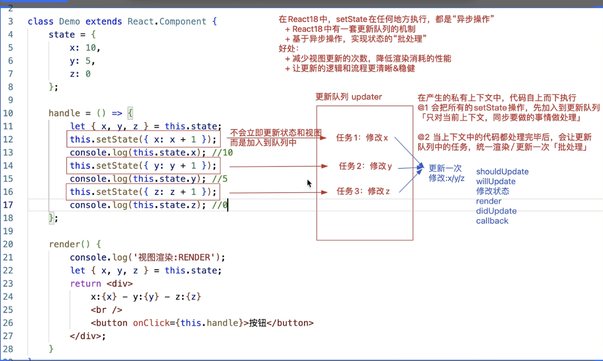

#### 11.3. 当组件中出现一个异步更新state时候setState的处理方式

```jsx
 
// 视图更新两次
handle = ()=>{ 
        let {x,y,z} = this.state;
        this.setState({x:x+1})
        this.setState({y:y+1})
        console.log(this.state) // {10,5,0}
        setTimeout(()=>{
            this.setState({z:z+1}) //执行this.render后拿到 {11,6,0}
            console.log(this.state)
        }
        ,1000)
    }
```

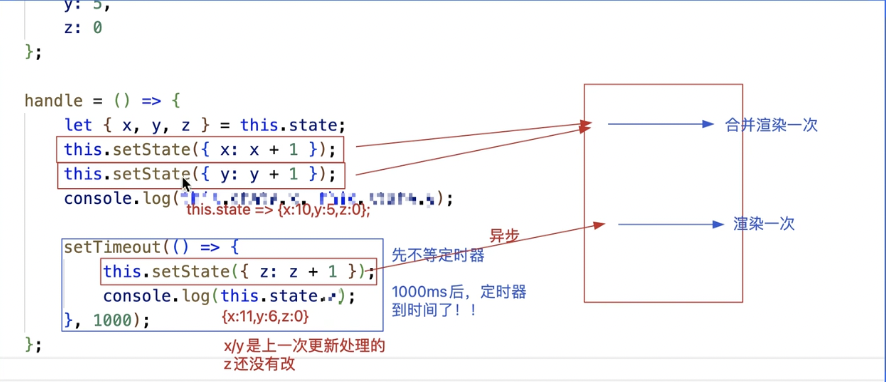

#### 11.4. 当组件中出现多个异步代码更新state时，setState的处理方式

```jsx
// 视图更新一次 同时间的state会合并更新一次（时间段相同）
setTimeout(()=>{
            this.setState({x:x+1})
            console.log(this.state)  // {10,5,0}
        }
        ,1000)
        setTimeout(()=>{
            this.setState({y:y+1})
            console.log(this.state)  // {10,5,0}
        }
        ,1000)
        setTimeout(()=>{
            this.setState({z:z+1})
            console.log(this.state)  // {10,5,0}
        }
        ,1000)


```

```jsx
// 视图更新三次(时间段不同)
setTimeout(()=>{
            this.setState({x:x+1})
            console.log(this.state)  // {10,6,0}
        }
        ,2000)
        setTimeout(()=>{
            this.setState({y:y+1})
            console.log(this.state)  // {10,5,0}
        }
        ,1000)
        setTimeout(()=>{
            this.setState({z:z+1})
            console.log(this.state)  // {11,6,0}
        }
        ,3000)
```

#### 11.5 setState react16

```jsx
1.区别：
	1.1 react18无论在什么地方执行setstate都是异步的
  1.2 react16中在合成事件和周期函数中，setState是异步的，如果setState出现在其他异步操作中（定时器，或者手动获取dom元素进行时间绑定【元素.addevent】）,他将变成同步操作【立即更新状态进行视图渲染】 一个先输出再渲染（18），一个先渲染再输出（16）
 

  

```

<div style="color:red">react16渲染机制</div>

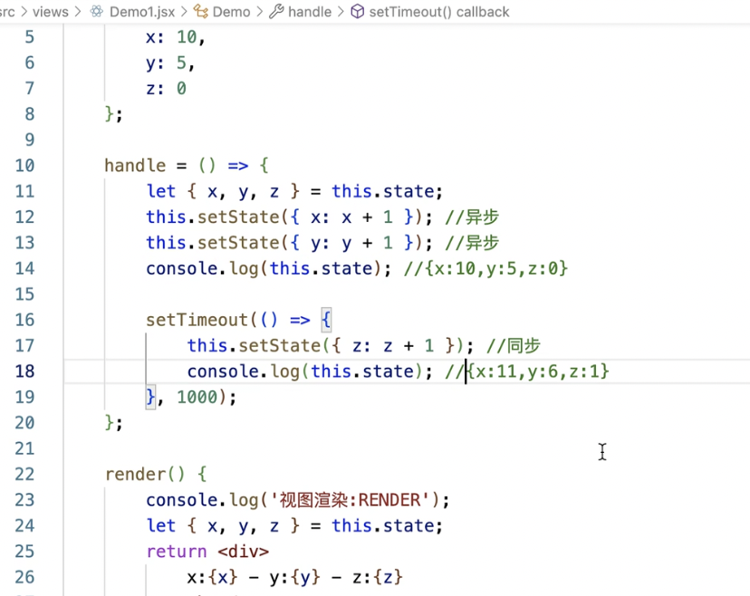

#### 11.6. flushSync

```jsx
import {flushSync} feom "react-dom" 
// 视图更新两次   
handle = ()=>{
        let {x,y,z} = this.state;
        this.setState({x:x+1})
        console.log("1",this.state) // {x: 10, y: 5, z: 0}
        flushSync(()=>{
            this.setState({y:y+1})
            console.log("2",this.state) // {x: 10, y: 5, z: 0}
        })
        console.log("3",this.state) // {x: 11, y: 6, z: 0}
        this.setState({z:z+1})
   
    }
```

```
 handle = ()=>{ // 箭头函数的this永远指向组件实例
        let {x,y,z} = this.state;
        this.setState({x:x+1})
        console.log("1",this.state) // {x: 10, y: 5, z: 0}
        flushSync(()=>{
            this.setState({y:y+1})
            console.log("2",this.state) // {x: 10, y: 5, z: 0}
        })
        console.log("3",this.state) // {x: 11, y: 6, z: 0}
        this.setState({z: this.state.x+ this.state.y})
   
    }
```

<div style="color:red">flushSync的处理逻辑，这里可以改变异步操作的批处理方式，比如这里让x和y改变后，赋值给x的需求</div>

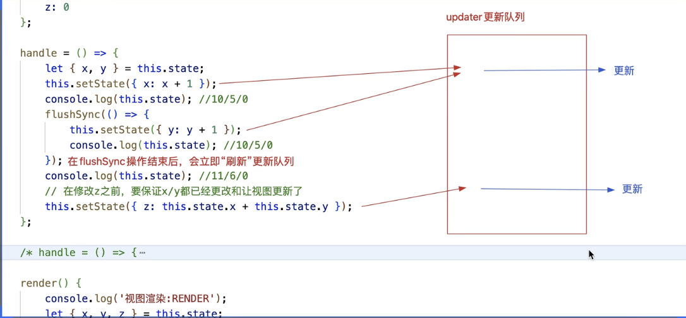

<div style="color:red">flushSync   for循环</div>

```jsx


// 视图执行一次，x结果为10

// state的状态改变是在componentwillupdate之后，因为这里合成一个去updator，只能拿到原始的state.x值
for(let i =0 ;i<20; i++){
	this.setState({
		x:this.state.x +1 // 
	})
}

// 视图执行20次，x结果为30
// 每遇到一次flushSync就会刷新一次视图
for(let i =0 ;i<20; i++){
  flushSync(()=>{
    	this.setState({
				x:this.state.x+1 
			})
  	})
}

 // x结果为30，但是视图更新只有一次（setState函数心态）
 		for(let i =0 ;i<20; i++){
                  this.setState((preState)=>{ // 上一个状态值
                        return { // 想要修改的新的状态值（支持修改部分状态）
                            x: preState.x + 1
                        }
                  })
          }
```

<div style="color:red">setState函数形态</div>

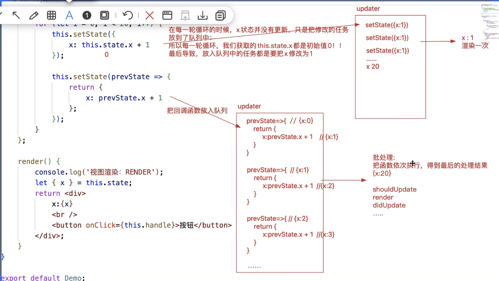

#### 11.7. setState的缺点

```
不同时间端的setstate会触发视图渲染，当两次一样的值时候，只是时间段不一样，还是会促发更新，这个时候可以使用pureComponent，会将state的值浅比较，一样的就不会更新了，但是有些时候对象里的值进行了变化了，浅比较比较不出来无法更新，这个时候可以做身比较
```

### 12. useState

#### 12.1. 为什么使用useState

```js
  + 函数组件如何在第一次渲染后，无法再次渲染
  + useState相当于类组件的state，可以通过useState来定义一个状态，改变状态的值，组件会重新渲染
   ps: 函数组件[hook]没有实例的概念，【调用组件不是创建实例，而是执行函数，产生一个私有的上下文，没有this的处理】
 
```

#### 12.2. useState的使用

```jsx
  1.useState(initalState)的使用
   + initalState:初始状态
   + 其返回值是一个数组，数组的第一项是状态，第二项是一个函数，用来改变状态
          比如：let [num,setNum] = useState(0);
   + 0是num的状态值，setNum是改变num的状态值的函数
   + 执行setNum(1)后，Num的状态值变为1，组件会重新渲染
   
    function Demo(props){
      const [num,setNum] = useState(0);
      const handle = ()=>{
          setNum(num+1);
      }
      return (<div>
          <div>num:{num}</div>
          <button onClick={handle}>demo</button>
      </div>)

  }
```

#### 12.3.  hook更新的机制：

```js
  + 每一次更新，都会重新执行函数组件（产生一个/*全新*/的私有上下文，内部的代码都会重新执行）
  + 每一次执行函数，也会把useState重新执行，但是
	+ 执行useState，只有在第一次渲染的时候设置的useState初始值会触发。第一次之后的渲染（执行），执行的useState都不是初始值，而是最新的值，useState返回的状态方法也是最新的
 /*ps:每次使用useState函数更新值，不是修改当前上下文的值，是生成一个全新的上下文，所以合成事件函数，拿不到修改后的状态值，只能拿到当前上下文的值,这个值只是当前上下文的变量，如果你使用flushSync更新你虽然拿不到上下文的变量值，但是你可以拿到最新的dom值*

```

<div style='color:red'>组件更新的大概源码</div>

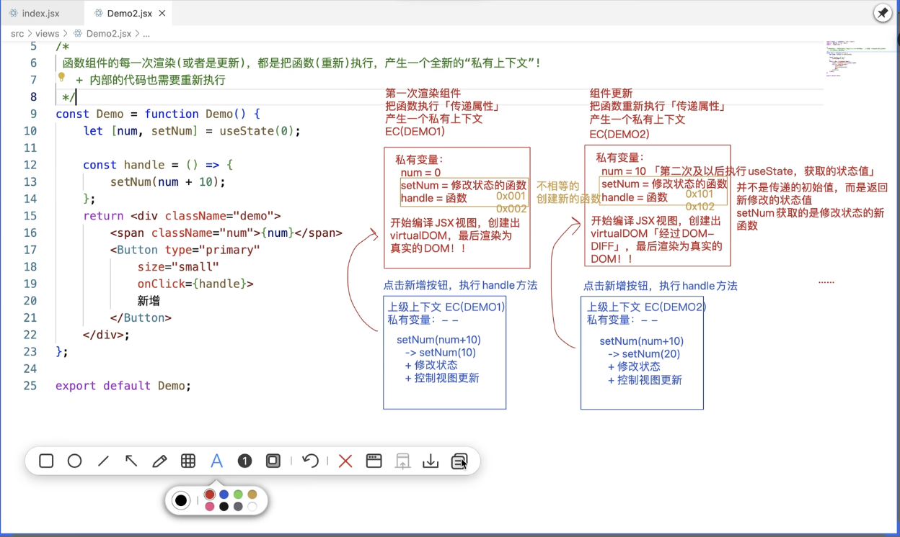

<div style="color:red">useState的大概代码原理</div>

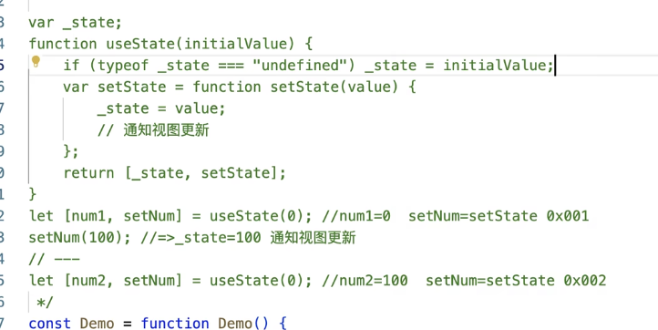

#### 12.4. 异步中的useState

异步中的state的值，是当前上下文的值，不是修改后的值，    因为每一次执行usestate后render后都会形成一个全新的执行上下文，当前上下文的state的值是没有改变的，拿到的值是当前上下文的

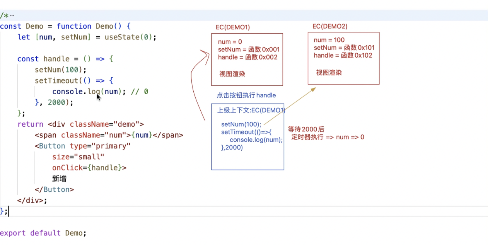

#### 12.5.多个useState状态如何处理

```jsx
// 不像类组件中的setState，不支持部分属性更改
    setState({
      supNum:state.supNum + 1 // 这样oop的值就成为undefined了
    });


// 解决1：

		setState({
                ...state,
                supNum:state.supNum + 1 // 这里相当于对象的属性重载
            });

// 解决二：

		官方建议：：需要多个状态就把useState执行多次
		let [opp,seOpp] = useState(0)
		let [sup,setSup] = useState(0)
  
// ------------------------------------代码--------------------------------

 function Vote(props) {
    let [state,setState]=useState({ // 集中处理
        supNum:0,
        oppNum:0
    });
    function handle(value) {
        if(value==='sup'){
            setState({
                ...state,
                supNum:state.supNum + 1 // 这里相当于对象的属性重载
            });
        }else{
            setState({
                ...state,
                oppNum: state.oppNum + 1
            });
        }
    }
    let {supNum,oppNum}=state;
    return <div className="vote-box">
      <div className="header">
        <h2 className="title">{props.title}</h2>
        <span>{supNum+oppNum}人</span>
      </div>
      <div className="main">
        <p>支持人数d：{supNum}人</p>
        <p>反对人数：{oppNum}人</p>
      </div>
      <div className="footer">
        <button onClick={handle.bind(null,'sup')}>支持</button>

        <button onClick={handle.bind(null,'opp')}>反对</button>
      </div>
    </div>;
  }
```

#### 12.6.  useState是同步还是异步

<div style="color:red">`这种方式测试是错误的，因为hanlder是一个闭包函数，拿到的x还是原来的x</div>

`<span style="color:yellow">`查看方式：在函数头部输出值，查看useState中的函数执行后重新执行了几次函数

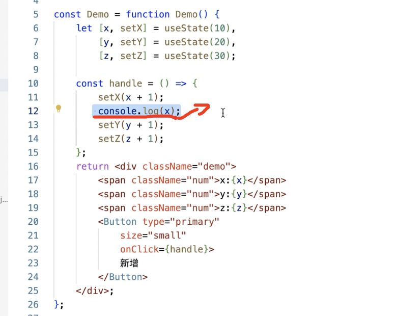

`<span style="color:red">`异步更新原理 

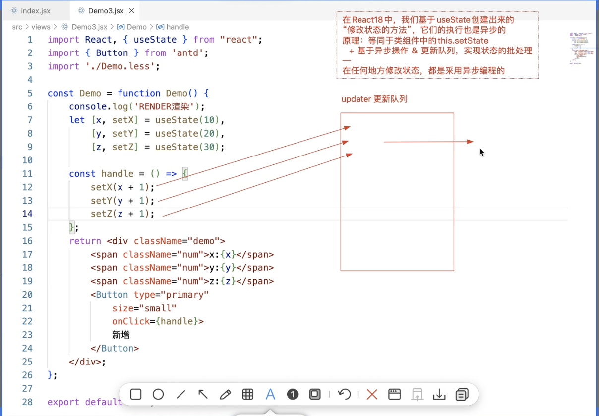


#### 12.7.使用flushSync将函数组件渲染变成同步

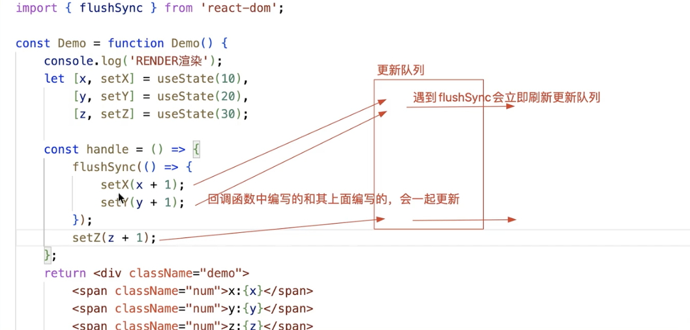


`<span style="color:yellow">`更新后形成一个新的渲染函数，再执行setZ吗，就可以拿到更新后的x，y的更新后的上文的值吗

```jsx
// 不管怎么样，异步不异步，函数组件中的值，只能是当前上下文，但是组件确实是更新了
function handleOpp() {
        flushSync(() => {
          setOppNum(oppNum + 1);
        });
        console.log("oppNum",oppNum) // 这里的值还是当前上下文的值，使用这个是setState和useState中的flushSync的区别，但是可以拿到更新后的dom元素（和dom元素中更新后的值）！！！！！！
        setSupNum(supNum + 1);
    }
```

<div style="color:red">Ps:除了不能像setState同步后拿到同步后的值，其他都一样  </div>

#### 12.8. react16中的useState

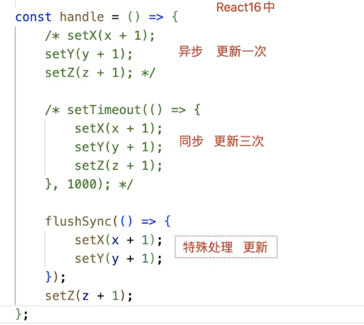

#### 12.9 . for循环中的useState

<div style="color:yellow">for循环中的useState</div>

这里渲染一次，视图中x的值为11

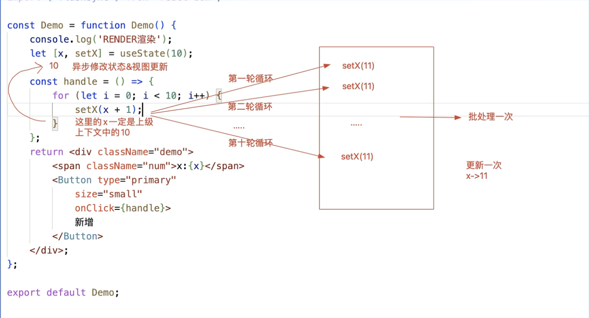

<div style="color:yellow">for循环中的flushSync和useState</div>

```jsx
useState的性能优化机制
  1.每次return更新前会拿现在的值和之前的状态值做object.is做比较，如果两次值一样就不会做更新【类似于PureComponent在shouldComponneUpdate中做的优化】

  2.为什么下图这里 渲染的结果x为11，打印出来两次“RENDER渲染” ，
  
      + 第一次渲染x为十一，
			+ 当第二次调用demo，执行到useState的时候会比较两次的state的值，这里发现一样，就不再继续执行了
  
```

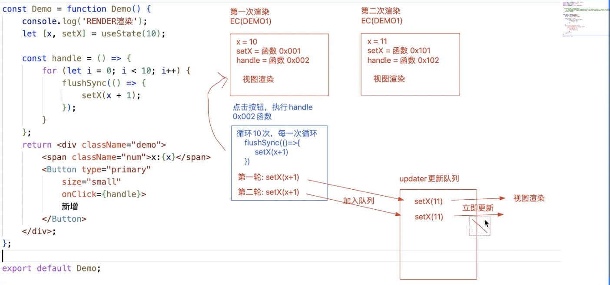


<div style="color:cyan">如何将渲染的结果变为20</div>

类似于setState,使用函数来操作

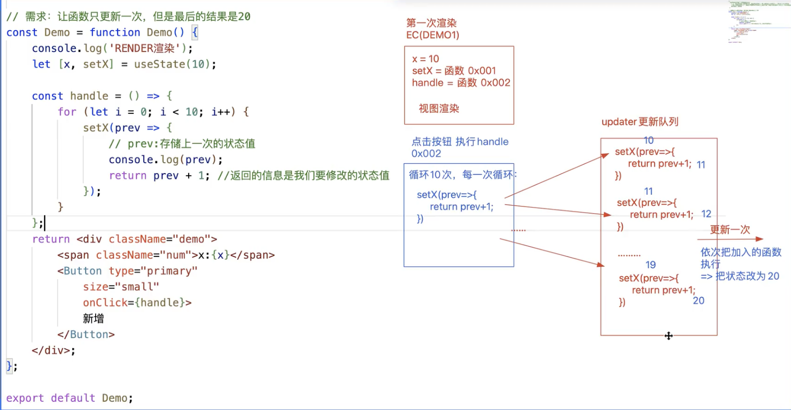

#### 12.10. useState的性能浪费的问题

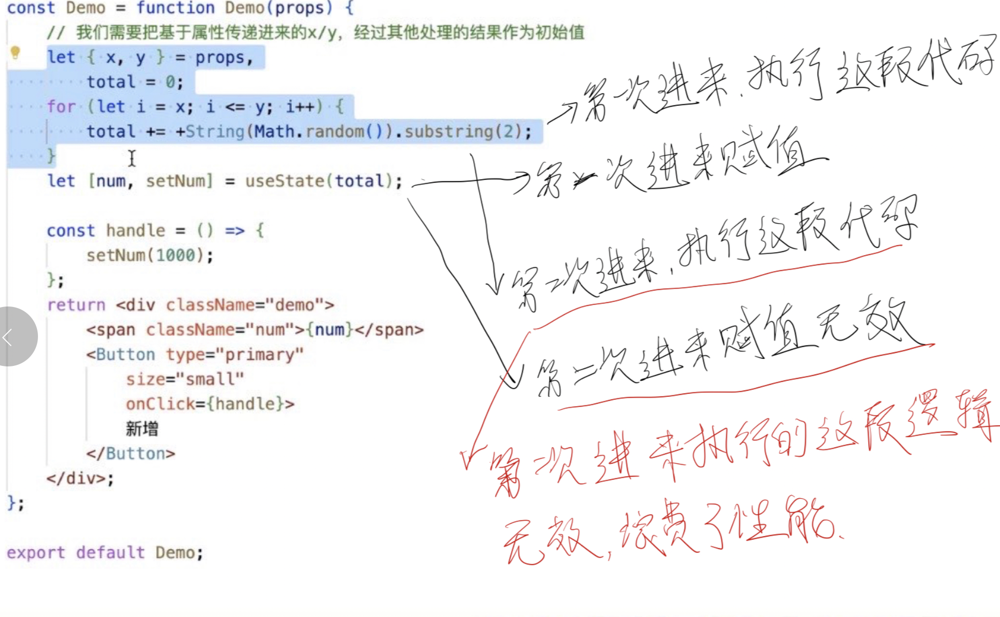

<div style="color:cyan">解决性能浪费的问题</div>

<div style="color:yellow">源码会在为初始值空的时候判断是否为函数，将其执行，如果不为空，不会执行传入值为函数的情况</div>

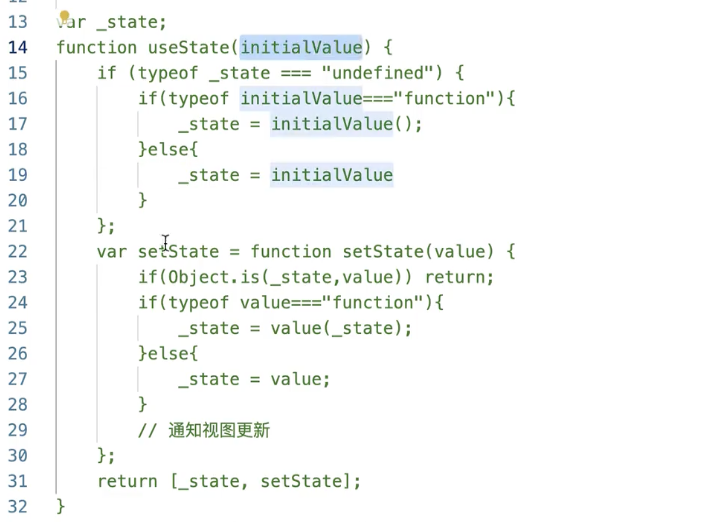

<div style="color:yellow">解决办法</div>

将不需要第一次进来处理初始值的逻辑写入函数中（初始值的惰性化处理）

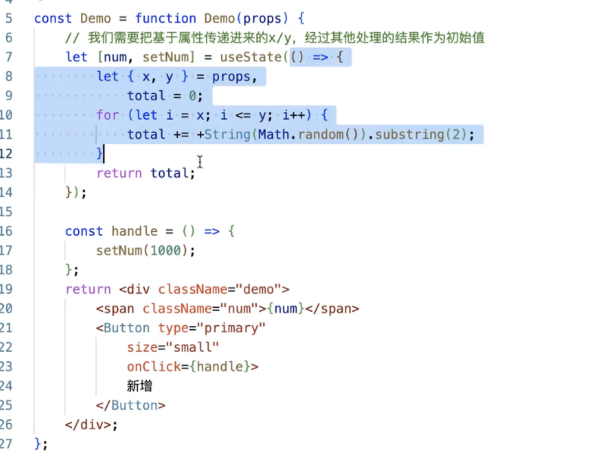

### 13. useEffect

#### 13.1. 使用useEffect的原因

```jsx
1. 可以在函数组件中使用生命周期函数
```

#### 13.2. useEffect的使用

```jsx
useEffect(callback)
        + 第一次渲染完毕后执行callback，相当于componentDidMount
        + 在每次状态更新后都会执行callback，相当componentDidUpdate
        + 在组件内能拿到最新的状态值
  
    useEffect(callback, []) 
        + 第一次渲染完毕后执行callback，相当于componentDidMount
        + 每一次视图更新完毕后callback不再执行
  
    useEffect(callback, [状态值1,....,状态值n])
        + 第一次渲染完毕后执行callback，相当于componentDidMount
        + 每一次对应的状态值(一个或者多个)改变后，后都会执行callback
  
    useEffect(() => {return () => {}}); // 里面的return的函数执行的时机
        + return函数在组件释放（更新或者卸载）后执行，可以理解为当组件更新，释放原来的组件，就执行return里面的函数，所以return里面的函数拿到的是上一次的状态值 /*（组件释放会释放虚拟dom，真实dom，合成事件（解除关联）等，所以你拿不到对应的dom值【想要拿到值，可以吧dom赋值给一个变量】）*/
	
		 useEffect(() => {return () => {}},[])
			  + return函数在组件卸载后执行


```

#### 13.3. useffect的原理

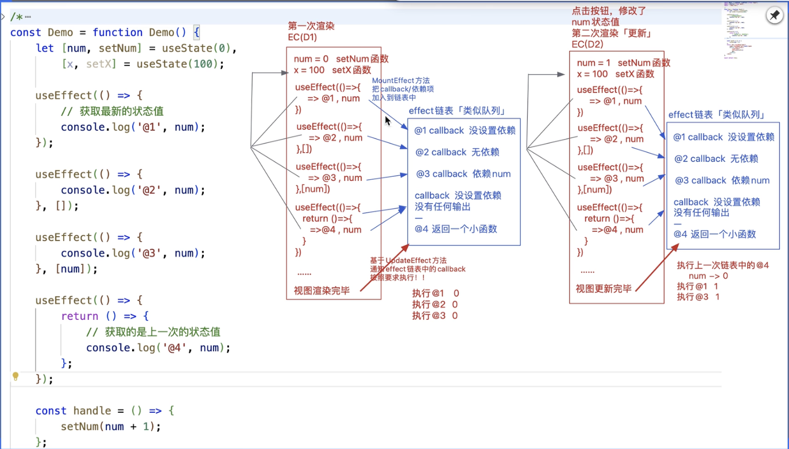

#### 13.4.  useEffect细节点

```jsx
1.useEffect必须在最外层使用，不能进行包裹
useEffect(()=>{
	if(num>5){
		...do someting
	}
},[num])
```

```jsx
2. 如何获取服务器数据
	// 错误解决方案
        useEffect( async ()=>{
            ...获取服务器数据代码 // 这里报错
        },[])

		ps: 原因：useEffect要返回的话必须为一个函数，async返回的是一个promise对象
  
 
  // 解决办法一：
    	使用.then方法

	// 解决办法二，包裹一层小函数
        useEffect( ()=>{
         let a = ()=>{
            	 ...获取服务器数据代码 // 这里报错
          }
           a()
        },[])
```

### 14. useLayoutEffect

#### 14.1. 使用useLayout的原因

```jsx
function Vote() {
    let [num,setNum] = useState(0);
    console.log("render")
    useLayoutEffect(()=>{
        if(num===0){
            setNum(1)
        }
    },[num])
    // useEffect(()=>{
    //     if(num===0){
    //         setNum(1)
    //     }
    // },[num])

    const changeColor = () => {
        setNum(0)
    }
    return <div className="vote-box">
      <span style={{color:num===0?'red':'green'}}>{num}</span>
      <div className="footer">
        <button onClick={changeColor}>改变颜色</button>
      </div>
    </div>;
  }
	// 第一次渲染，渲染完毕，执行useEffect/useLayoutEffect，再次渲染，

  1.点击changeColor，执行setNum，再次渲染，再执行useEffect，再次渲染(反复切换，反复渲染两次，会看见页面出现红色和绿色的闪烁效果), 两次渲染的结果（输出render）不像useLayoutEffect那样几乎同时渲染

 2. 使用useLayoutEffect,每次函数进来渲染和使用useLayoutEffect改变状态，都会渲染，但是几乎是同时渲染（几乎同时输出render），看不到红绿闪烁的画面

```

#### 14.2. useLayoutEffect的渲染原理

```jsx
 1.视图渲染是四步：
 			1.babel-preset-react-app编译jsx语法，
			2.执行函数，生成虚拟dom 
      3.虚拟dom转换为真实dom 
      	useLayoutEffect会阻塞第四步操作，先去执行callback函数（同步）
      4.浏览器绘制
 				useEffect（/*官方建议使用*/）
  
 2. seEffect和useLayoutEffect的区别:
			+ useEffect的callback执行的时候，真实dom已经出来了，浏览器已经绘制了，callback再次构建真实dom，再次进行浏览器绘制，所以会出现闪烁的画面
      + 而useLayoutEffect的callback执行的时候，html文档树出来了；，但是浏览器还没有绘制，两次会合并html文档树，执行浏览器绘制，所以看不到闪烁的画面

3. 两者的执行顺序：所以useLayoutEffect的方法比useEffect优先执行

4. 所以useLayoutEffect可以拿到dom

5. 所以useLayoutEffect会阻塞浏览器渲染真实dom
```

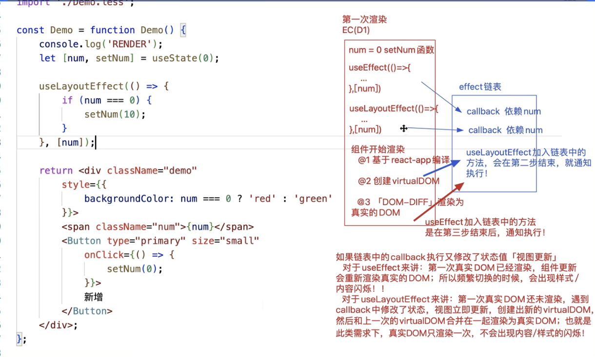

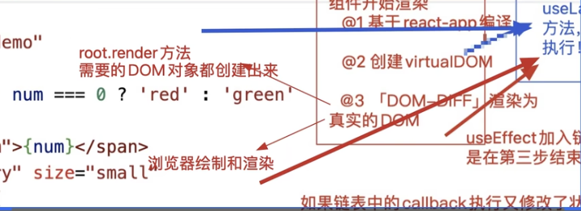

### 14. useRef

#### 14.1. ref获取dom元素<不推荐>

```jsx
function Vote() {
    let [num,setNum] = useState(0);
    let instance
    useEffect(()=>{
       console.log("instance",instance)
    })

    const changeColor = () => {
        setNum(num+1)
    }
    return <div className="vote-box">
      <span 
        ref={(vc)=>instance=vc}  // ref像类组件一样获取dom
        >{num}</span>
      <div className="footer">
        <button onClick={changeColor}>button</button>
      </div>
    </div>;
  }


```

#### 14.2. 使用currentRef获取对象

```jsx
let instance = React.createRef(); //创建一个ref对象
<span ref={instance}></span>
```

#### 14.3. 使用useRef获取对象

```jsx
let instance = useRef(null);  //创建一个ref对象
  <span ref={instance}></span>
```

#### 14.4. useRef和createRef的区别

```jsx
1. 每一次组件渲染createRef会重新创建一个ref对象，而useRef不会，所以useRef性能更好

// 代码
let prev1,prev2
function Vote() {
    let [num,setNum] = useState(0);
    let instance = useRef(null); 
    let instance1 = React.createRef();
    if(!prev1){
        // 第一次渲染
        prev1 = instance
        prev2 = instance1
    }else{
        // 组件更新，验证新创建的ref对象，和之前创建的是否一致
        console.log("prev1",prev1 === instance) // true useref每一次组件更新，都是同一个对象，不会创建新的ref对象，还是原来的ref对象[引用地址是同一个，赋值后两者用的都是一个堆]
        console.log("prev2",prev2 === instance1) // false，
        // 创建了新的ref对象，两次虽然看起来一样，但是引用地址已经变了

        // 所以useRef相比于createRef，更加节省性能
    }
    useEffect(()=>{
       console.log("createRef",instance.current)
       console.log("useRef",instance.current)
    })

    const changeColor = () => {
        setNum(num+1)
    }
    return <div className="vote-box">
      <span ref={instance} >{num}</span>
      <span ref={instance1} >{num}</span>
      <div className="footer">
        <button onClick={changeColor}>改变颜色</button>
      </div>
    </div>;
  }
```

#### 14.5.使用useRef获取类组件的实例

#### 14.6.获取函数组件的某个元素r

```jsx
const Ak = React.forwardRef((props,ref)=>{
    console.log("ref",ref) // 在demo中调用ak时候，传递的ref对象
    return <div ref={ref}>
        我是一个函数组件
    </div>
})
function Vote() {
    let instance = useRef(null); 
    useEffect(()=>{
        console.log(instance.current);
    },[])
    return <div className="vote-box">
      <Ak ref={instance}></Ak>
    </div>;
  }
```

#### 14.7.获取函数组件的方法和状态

```jsx

// useImperativeHandle
const Ak = React.forwardRef((props,ref)=>{
    let [state,setState] = useState(0);
    const handle = ()=>{
        setState(state+1);
    }
    useImperativeHandle(ref, () => {return { //暴露给父组件的实例值,类似于vue的defineExpose
        state,
    }});
    return <div ref={ref} onClick={handle}>
        我是一个函数组件{state}
    </div>
})
function Vote() {
    let instance =useRef(null); 
    useEffect(()=>{
        console.log(instance);
    },[])
    return <div className="vote-box">
      <Ak ref={instance}></Ak>
    </div>;
  }
```

### 15. useMemo

#### 15.1.使用useMemo的原因

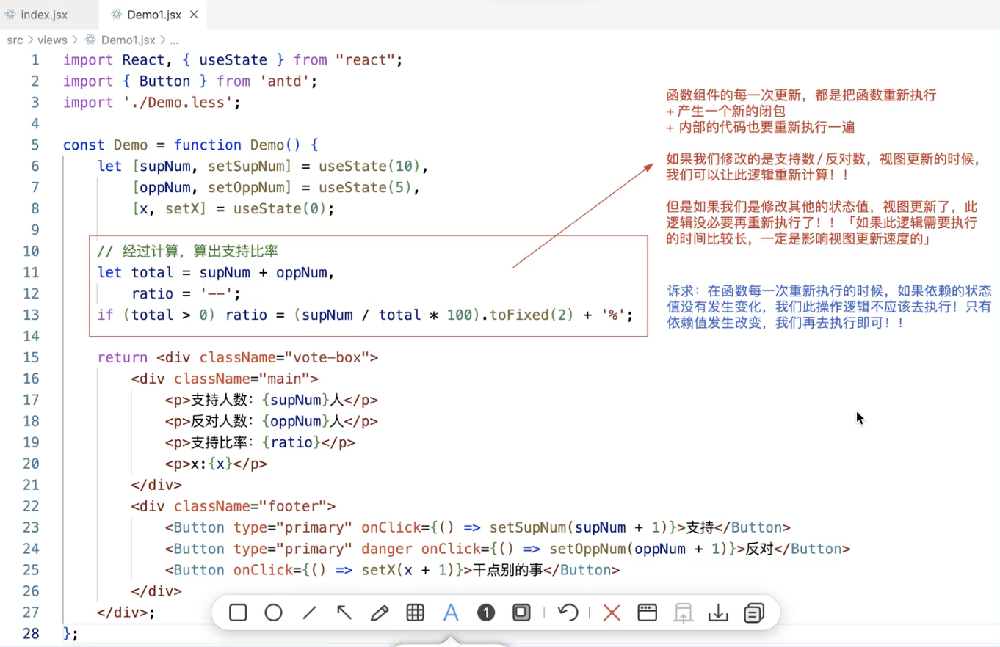

#### 15.2. 如何使用

```jsx
1. 相当于componentWillMount和componentWillUpdate，并且可以根据依赖的值决定是否更新
	ps: 比起useEffect，只更新一次，useEffect会在更新完成后，再次更新
	ps: 相当于vue的computed
let total = useMemo(()=>{
        return Math.ceil((supNum/(oppNum+supNum))*100)
    },[supNum,oppNum])
```

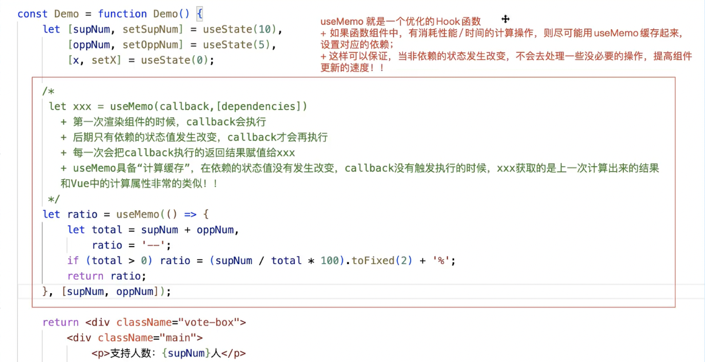

### 16. useCallback

#### 16.1. 使用useCallback的原因

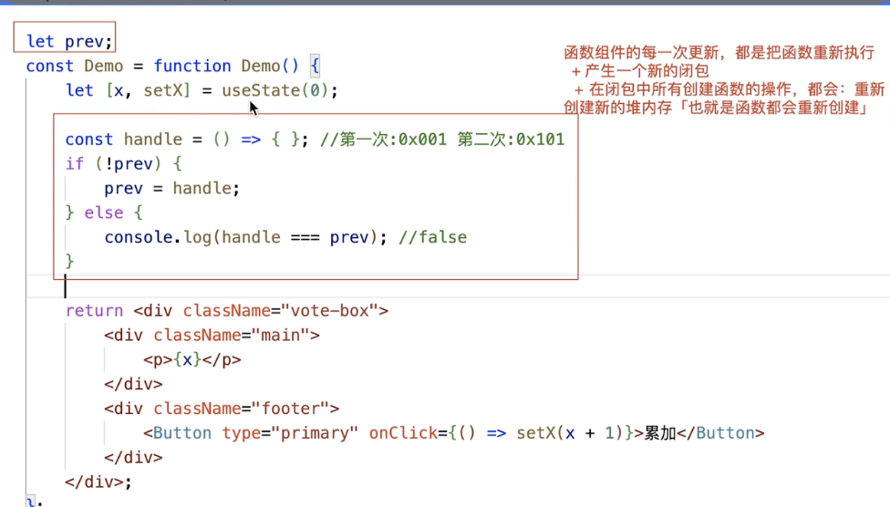

#### 16.2. useCallback的特点

```jsx
1. 并不是所有的函数都适合useCallback
2. 如果第二个参数为空里面的上下文永远是第一次执行的上下文，详见18.3函数组件父子通行中为什么加了callback，值没有发生变化
3. 第二个参数数组可以包含对应需要变化的值，当值变化的时候也会创建一个当前执行起上下文的函数
```


#### 16.3. useCallBack使用场景

```jsx
1. 父组件嵌套子组件，父组件要把内部的函数基于属性传递给子组件，此时传递的这个方法，使用useCallback处理一下
```

<div style="color:cyan">如何在父组件（函数组件）更新的时候子组件(类组件)不更新</div>

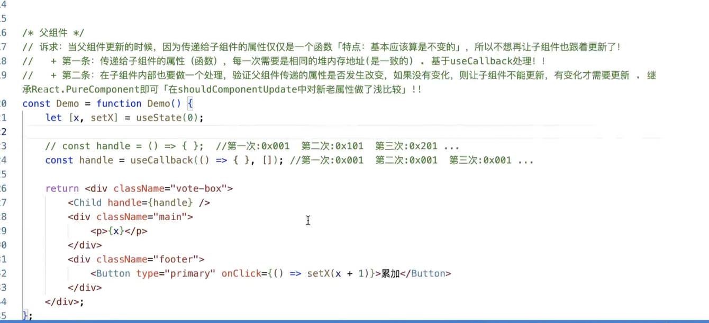

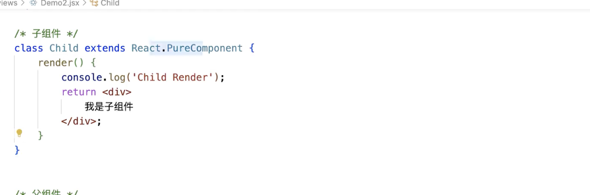

<div style="color:cyan">如何在父组件（函数组件）更新的时候子组件(函数组件)不更新</div>

<div style="color:yellow">使用React.memo包裹函数组件</div>

```jsx
1. 函数组件根据React.memo函数，对新老传递的属性值做比较，如果不一致，才会将函数组件执行，如果一致，父组件的更新不会导致子组件更新
```

### 17. 自定义hook组件(类似于vue的mixin)

```jsx
1.将公共的逻辑进行封装
```

#### 17.1.useState支持部分状态的更改

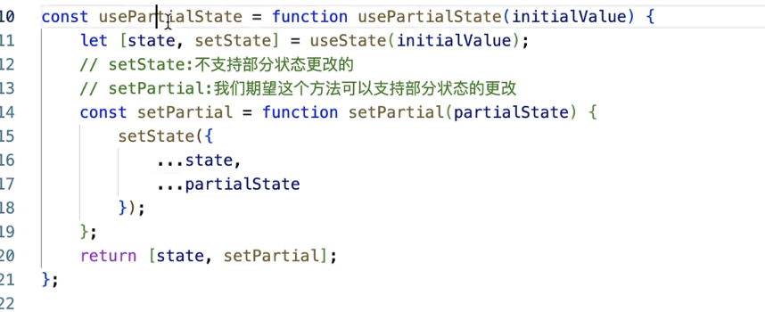

### 18. 父子组件通信

#### 18.1. 父子组件通信的思路

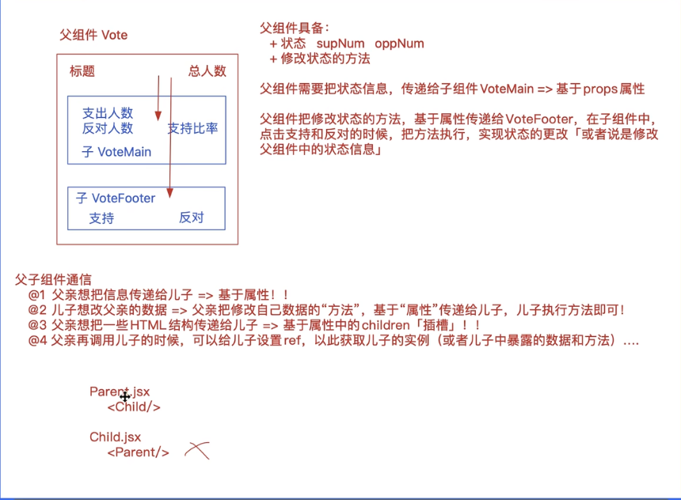

#### 18.2.类组件实现组件通信

```jsx
1. 核心，将属性和函数当属性传递给子组件
2. 子组件接收函数，也可以传递值给父组件
ps: antd组件调用就是父子组件通信
// 父组件
class Vote extends React.Component {
    state = {
        oppNum:0,
        supNum:0
    }
    updateOpp=(num)=>{
        this.setState({
            oppNum: this.state.oppNum + num
        })
    }
    updateSup=(num)=>{ // 这里必须使用箭头函数，不然this会出现问题（也可以在传值的时候bind this）
        this.setState({
            supNum: this.state.supNum + num
        })
    }
    render() {
        return <div className="vote-box">
            <div className="header">
                <h2 className="title">React是很棒的前端框架</h2>
                <span className="num">{this.state.oppNum + this.state.supNum}</span>
            </div>
            <VoteMain state={this.state} />
            <VoteFooter updateOpp={this.updateOpp}  updateSup = {this.updateSup}/>
        </div>;
    }
}

// 子组件
class VoteMain extends React.Component {
    constructor(props){
        super(props)
    }
    render() {
        let {supNum,oppNum} = this.props.state
        return <div className="main">
            <p>支持人数：{oppNum}人</p>
            <p>反对人数：{supNum}人</p>
            <p>支持比率：{(oppNum + supNum) ? Math.floor(oppNum/(supNum+oppNum)*100):0}%</p>
        </div>;
    }
}

// 子组件
class VoteFooter extends React.PureComponent { // 这个里面的属性值不会发生改变，这个组件就不会在父组件更新时更新了
    constructor(props) {
        super(props)
    }
    render() {
        let {updateSup,updateOpp} = this.props
        return <div className="footer">
            <Button type="primary" onClick={updateOpp.bind(this,1)}>支持</Button>
            <Button type="primary" onClick={updateSup.bind(this,1)} danger>反对</Button>
        </div>;
    }
}
```

#### 18.3. 函数组件父子通信

```jsx
1.useCallback的问题，为什么加上了之后，点击函数之后 值没有变化

const Vote = function Vote() {
    let [oppNum,setOppNum] = useState(0)
    let [supNum,setSupNum] = useState(0)
     // 为什么添加了useCallback之后（第二个参数为[]），状态值无法更新了（用到的值永远是第一次渲染的时候的上下文）
    let change = useCallback( (value)=>{  
        if(value ==="sup"){
            setSupNum(supNum + 1)
            return;
        }
        setOppNum(oppNum + 1)
    }, [supNum,oppNum]) // 这里其实可以不用使用useCallback,因为每一次更新，这两个值其中一个都会发生变化
  
    return <div className="vote-box">
        <div className="header">
            <h2 className="title">React是很棒的前端框架</h2>
            <span className="num">0</span>
        </div>
        <VoteMain state = {{oppNum:oppNum,supNum:supNum}}/>
        <VoteFooter change = {change}/>
    </div>;
};

// 子组件
const VoteFooter = React.memo((props) => {
    console.log("foot组件更新")
    let {change} = props
    return <div className="footer">
        <Button type="primary" onClick = {change.bind(null,'opp')}>支持</Button>
        <Button type="primary" danger onClick = {change.bind(null,'sup')}>反对</Button>
    </div>;
})


// 子组件
const VoteMain = function VoteMain(props) {
    let {supNum,oppNum} = props.state 

    let percent = useMemo(()=>{ // 计算属性，当oppNum和supNum变化的时候才会触发
        return (oppNum+supNum) ? Math.floor(oppNum/(oppNum+supNum)*100):0
    },[oppNum,supNum])

    return <div className="main">
        <p>支持人数：{oppNum}人</p>
        <p>反对人数：{supNum}人</p>
        <p>支持比率：{percent}%</p>
    </div>;
};
```

<div style="color:cyan">useCallback没有变化的原因</div>

<div style="color:yellow">useCallback包裹的组件，不会在渲染后重新创建，里面的值也只会拿到第一次创建的执行上下文，所以导致点击之后，值不会发生变化</div>

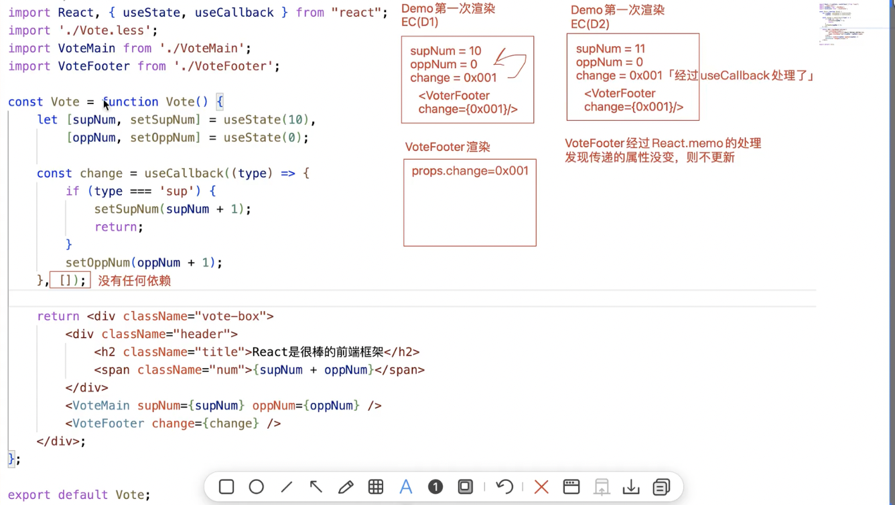

### 19. 祖先后代组件通信

#### 19.1 . 通信的思路

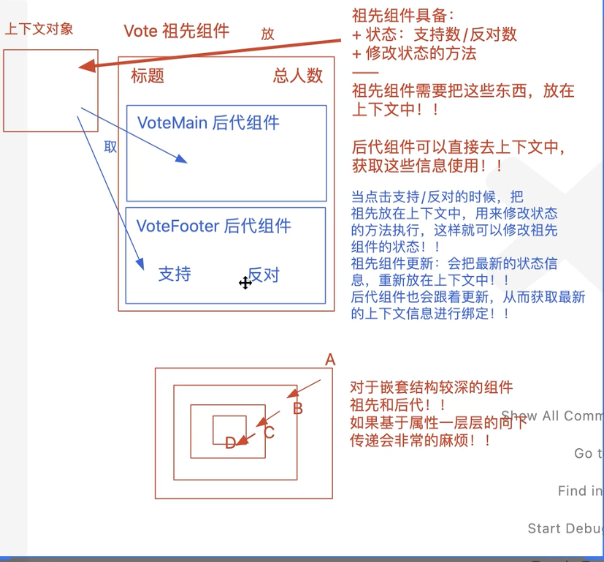

#### 19.2. 祖先元素通信（类组件）

<div style="color:cyan">1.创建上下文对象</div>

```jsx
import React from "react"
const ThemeContext  = React.createContext()// 创建上下文对象
export default ThemeContext
```

<div style="color:cyan">2.祖先元素调用方法将修改的信息存储到上下文中</div>

```jsx
  import ThemeContect from "@/ThemeContext";
 // 通过ThemeContect.Provider组件中的value(值是一个对象)，可以将信息存储在上下文中，
 //  当render函数执行，可以将最新的信息放入到上下文中
return <ThemeContect.Provider value={{
            oppNum:this.state.oppNum,
            supNum:this.state.supNum,
            updateOpp: this.updateOpp,
            updateSup:this.updateSup
        }}>
            ...子组件代码
        </ThemeContect.Provider>
```

<div style="color:cyan">3.后代组件获取祖先组件传递的值<div>

<div style="color:yellow">方案一：导入上下文信息，static contextType接收，使用this.context获取值</div>

```jsx
import ThemContext from "@/ThemeContext"
方案一
class VoteMain extends React.Component {
    static contextType = ThemContext // 设置静态属性contextType(必须为这个名字)，将上下文信息放在当前实例的context上
    render() {
        let {supNum,oppNum} = this.context
        return <div className="main">
            <p>支持人数：{oppNum}人</p>
            <p>反对人数：{supNum}人</p>
            <p>支持比率：{(oppNum + supNum) ? Math.floor(oppNum/(supNum+oppNum)*100):0}%</p>
        </div>;
    }
}
```

<div style="color:yellow">方案二：ThemeContext.Consumer来调用</div>

```jsx
class VoteMain extends React.Component {
    render() {
        // 使用ThemContext.Consumer来获取, 必须用一个函数来包裹返回的jsx，函数组件会传入一个context
        return <ThemContext.Consumer> 
            {
                (context)=>{ // context为上下文的信息
                    let {supNum,oppNum} = context
                   return <div className="main">
                        <p>支持人数：{oppNum}人</p>
                        <p>反对人数：{supNum}人</p>
                        <p>支持比率：{(oppNum + supNum) ? Math.floor(oppNum/(supNum+oppNum)*100):0}%</p>
                     </div>;
                }
            }
    
        </ThemContext.Consumer>
    }
}
```

#### 19.3 祖先组件通信（函数组件）

```jsx
1.构建context和父组件传子和类组件一样
```

<div style="color:yellow">方案一：和类组件一样通过ThemeContext.provide接收context</div>

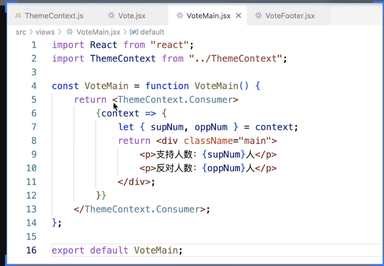

<div style="color:yellow">方案二：使用useContext</div>

```jsx
import React ,{useMemo,useContext} from "react";

import ThemeContext from "@/ThemeContext"

const VoteMain = function VoteMain() {
    let {supNum,oppNum} = useContext(ThemeContext)

    let percent = useMemo(()=>{ 
        return (oppNum+supNum) ? Math.floor(oppNum/(oppNum+supNum)*100):0
    },[oppNum,supNum])

    return  <div className="main">
   
    </div>;
};
```

#### 19.4. 平行组件通信也可以将需要的状态信息挂载到父组件上，就可以拿到对面的值了

```jsx
1.但是一般使用最多的是redux来做，这样逻辑太混乱了
```

### 20. 高阶组件

```jsx
1.使用闭包[柯里化]实现的组件代理
2. react-redux，react-router-dom中都会使用到，以及在类组件中使用reactjss
```

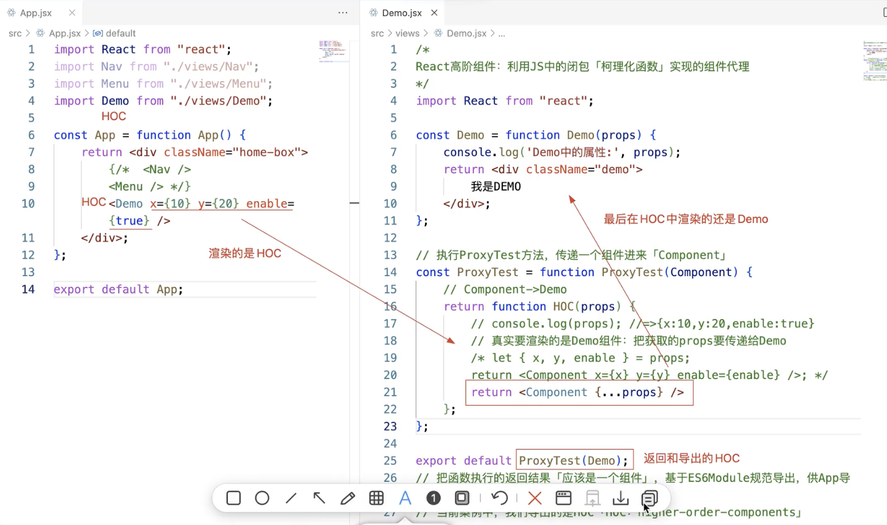

<div style="color:cyan">好处:可以在调用demo前，不仅可以拿到父组件的props，甚至可以在拿到props时候做处理后再传递给demo</div>

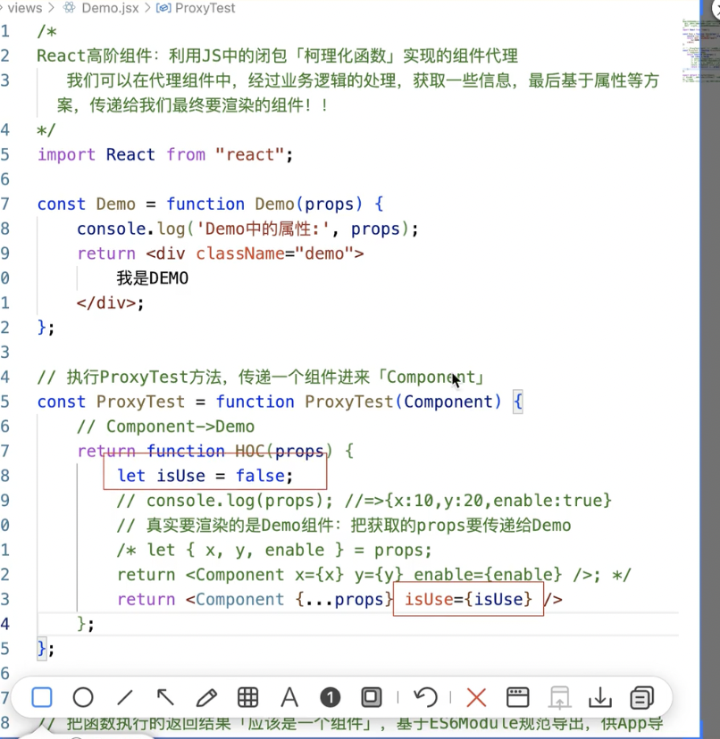

### 21. useReducer是对useState的升级

<div style="color:cyan">使用useState来做增加减少</div>

```jsx
import React ,{useState,useReducer} from 'react';
function A1() {
  let [num,setNum] = useState(0)
  return (
    <div>
      <h1>A1,{num}</h1>
      <br / >
      <button onClick={
        ()=>{
          setNum(num+1)
        }
      }>增加</button>
      <button onClick={
        ()=>{
          setNum(num-1)
        }
      }>减少</button>
    </div>
  );
}
export default A1;
```

<div style="color:cyan">使用useReducer来做增加减少</div>

```jsx
// 相当于在当前组件中创建一个store容器， initialState 就是初始值， reducer就是状态管理员，action就是派发的行为标识，dispatch就是派发行为标识通知reducer执行事件池的函数，通知状态更新，状态更新将组件更新拿到最新的state的值

// 如果组件中存在大量的状态，使用useReducer会更好，不需要一个一个的去创建状态，并且逻辑都统一化了
import React ,{useState,useReducer} from 'react';
const initialState ={
  num:0
};
let reducer = (state,action)=>{
  switch(action.type){
    case "add":
      state.num++;
      break;
    case "sub":
      state.num--;
      break;
  }
  return {...state};
}
function A1() {
  let [state,dispatch] = useReducer(reducer,initialState)
  return (
    <div>
      <h1>A1,{state.num}</h1>
      <br / >
      <button onClick={
        ()=>{
          dispatch({type:"add"})
        }
      }>增加</button>
      <button onClick={
        ()=>{
          dispatch({type:"sub"})
        }
      }>减少</button>
    </div>
  );
}
export default A1;
```

