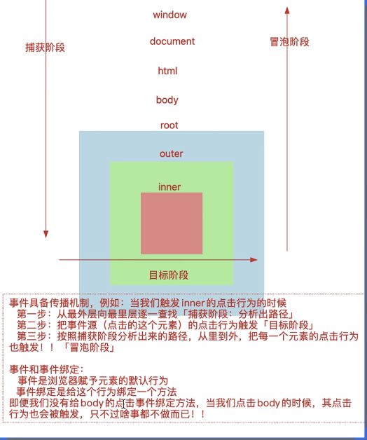
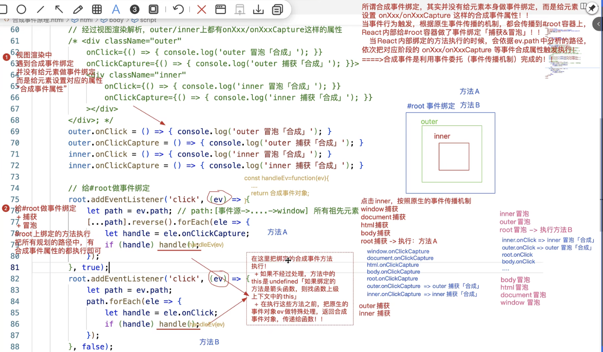
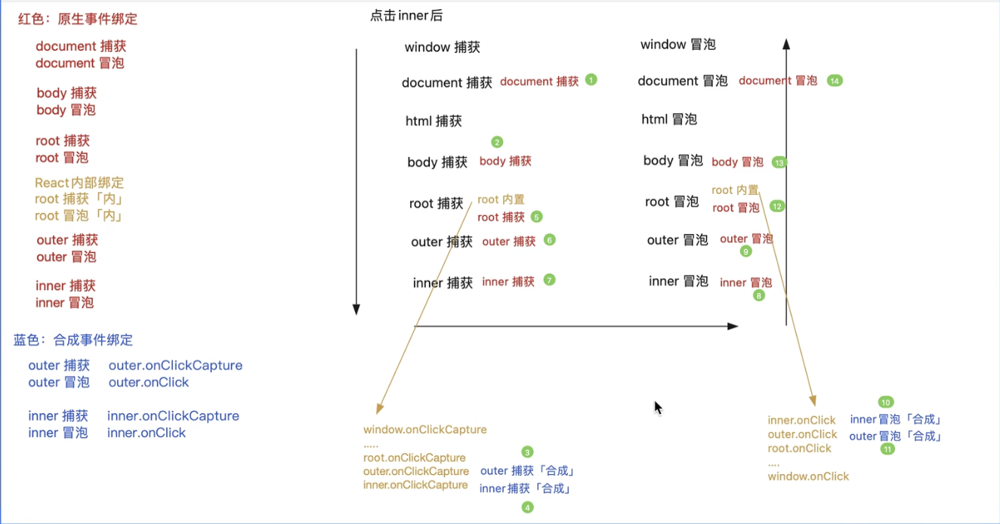
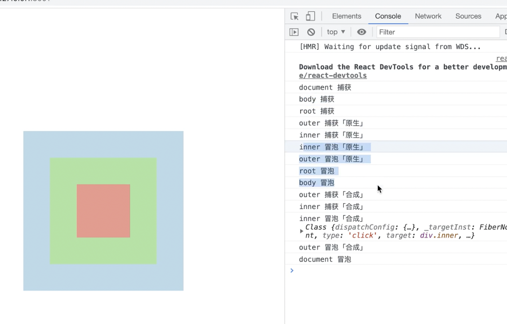
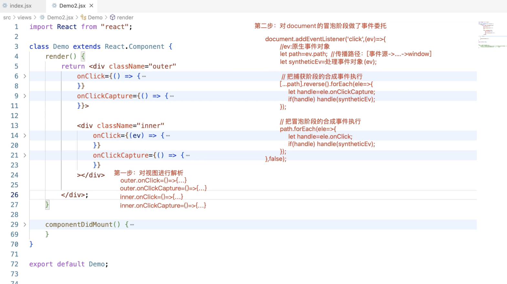
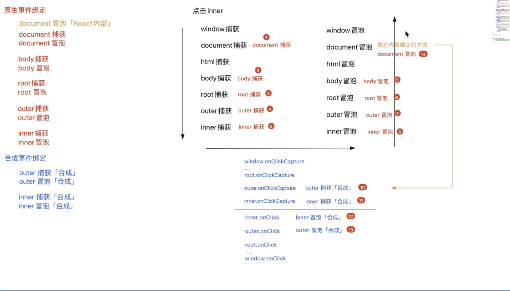
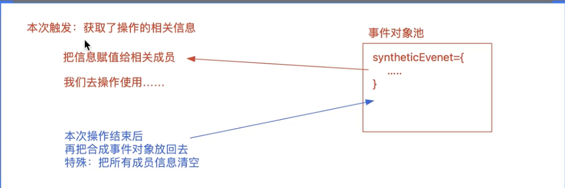

### 1.  react合成事件的基本使用

```jsx
  1. 不同类型函数中的this
    1.1 合成事件绑定的普通函数中的this
    	基于react内部的处理，合成事件绑定的普通函数（非箭头函数），方法中的this为undefined
  
       handle(){ // 添加到原型上
          console.log("我是一个普通函数",this) // this为undefined
      }

      (<>
          <button onClick={this.handle}>add</button>
      </>)
  
    1.2. bind解决合成事件中普通函数的this为undefined,
      <button onClick={this.handle.bind(this)}>add</button>
      相当于在this对象中添加handle函数

    1.3. 箭头函数解决合成事件中普通函数的this为undefined ，
      handle2=()=>{ // 原理：不像普通函数添加到原型上，箭头函数给实例添加私有属性，this就为上下文实例
        console.log("我是箭头函数",this)
    }

 2. react中的合成事件对象是什么
 
    2.1 react合成事件对象是react内部处理后，把各个浏览器的事件对象统一化后构成的事件对象
  
    2.2 react中如果想拿到浏览器内置事件对象【原生事件对象】，可以通过合成事件对象中的nativeEvent进行获取
 
  3. 不同函数类型中获取react合成对象
    3.1 普通函数 和箭头函数
        handle(e){ 
            console.log("普通函数e",e)
        }
        <button onClick={this.handle}>add</button>

        handle2=(e)=>{
            console.log("箭头函数e",e)
        }
        <button onClick={this.handle2}>add2</button>

    3.2 bind函数
        方法经过bind处理，最后一个实参就是合成事件对象
            handle1(x,y,e){
                console.log("我是普通函数bind",e)
            }
           <button onClick={this.handle1.bind(this,1,2)}>add1</button>
  
   4. bind在react事件绑定中的运用

        4.1. 在react事件函数中传参数，一般都是使用bind函数进行传参
         <button onClick={this.handle1.bind(this,1,2)}>add1</button>
   
        4.2. 给普通函数中的this绑定当前实例 

	5. 合成事件在后面加capture就是捕获，其他的是冒泡 比如onClick和onClickCaptrue

```

### 2.  原生事件

#### 2.1.  事件传播的三个阶段



```jsx
   <body>
    <div id="root" class="center">
        <div id="outer" class="center">
            <div id="inner" class="center"></div>
        </div>
    </div>
</body>

root.addEventListener("click",()=>{
            console.log("root捕获")
        },true)
        root.addEventListener("click",()=>{
            console.log("root冒泡")
        },false)
        outer.addEventListener("click",()=>{
            console.log("outer捕获")
        },true)
        outer.addEventListener("click",()=>{
            console.log("outer冒泡")
        },false)
        inner.addEventListener("click",()=>{
            console.log("inner捕获")
        },true)
        inner.addEventListener("click",()=>{
            console.log("inner冒泡")
        },false)

1.理解事件和事件绑定
// 点击inner，root捕获  ->outer捕获  ->inner捕获  ->inner冒泡 ->outer冒泡  ->root冒泡
// 只是我们给这些元素绑定了事件的方法（事件绑定）所以可以看到这个输出
// 实际上body，html，window的默认事件也会执行，只是没有给这些事件，进行事件绑定而已
```

#### 2.2.阻止冒泡，捕获(e.stopPropagation)

```jsx
1. 阻止捕获

  在捕获阶段使用 e.stopPropagation() ，在捕获阶段使用，冒泡阶段的事件绑定函数就一个都不会触发

	// 代码
	 root.addEventListener("click",(e)=>{
            e.stopPropagation() // 在捕获阶段阻止捕获
            console.log("root捕获")
        },true)
        root.addEventListener("click",()=>{
            console.log("root冒泡")
        },false)
        outer.addEventListener("click",()=>{
            console.log("outer捕获")
        },true)
        outer.addEventListener("click",()=>{
            console.log("outer冒泡")
        },false)
        inner.addEventListener("click",()=>{
            console.log("inner捕获")
        },true)
        inner.addEventListener("click",()=>{
            console.log("inner冒泡")
        },false)

// 点击inner 输出结果为： root捕获

2. 阻止冒泡
   在冒泡阶段使用 e.stopPropagation()

	// 代码
	 root.addEventListener("click",()=>{
   
            console.log("root捕获")
        },true)
        root.addEventListener("click",()=>{
            console.log("root冒泡")
        },false)
        outer.addEventListener("click",()=>{
            console.log("outer捕获")
        },true)
        outer.addEventListener("click",()=>{
            console.log("outer冒泡")
        },false)
        inner.addEventListener("click",()=>{
            console.log("inner捕获")
        },true)
        inner.addEventListener("click",(e)=>{
           e.stopPropagation() 
            console.log("inner冒泡")
        },false)
  // 点击inner，root捕获  ->outer捕获  ->inner捕获  ->inner冒泡,阻止了inner后的冒泡事件绑定函数的输出
```

#### 2.3. 阻止冒泡，捕获（e.stopImmediatePropagation）

```jsx
  
1.e.stopImmediatePropagation和e.stopPropagation()的区别

 + 如果一个元素绑定了两个相同事件函数（同捕获或者同冒泡），当其中一个事件函数使用e.stopPropagation()阻止的时候，这两个事件函数都会执行，但是你在其中一个事件函数使用e.stopImmediatePropagation()进行阻止的时候，另外一个事件函数将不再进行触发

// 代码：  这里的inner绑定了两个冒泡阶段的函数
				root.addEventListener("click",(e)=>{
            console.log("root捕获")
        },true)
        root.addEventListener("click",()=>{
            console.log("root冒泡")
        },false)
        outer.addEventListener("click",()=>{
            console.log("outer捕获")
        },true)
        outer.addEventListener("click",()=>{
            console.log("outer冒泡")
        },false)
        inner.addEventListener("click",(e)=>{
            console.log("inner捕获")
        },true)
        inner.addEventListener("click",(e)=>{
            // e.stopImmediatePropagation() // --> 输出 inner冒泡1
            e.stopPropagation() // --> 输出 inner冒泡1，inner冒泡2
            console.log("inner冒泡1")
        },false)
        inner.addEventListener("click",(e)=>{
            console.log("inner冒泡2")
        },false)
```

#### 2.4 事件委托

```jsx
1. 一个容器中有很多元素都要在点击时候做一些事情，这个时候就可以使用事件委托
  + 传统绑定：获取每个要做一些事情的元素，为其绑定事件方法
 			root.addEventListener("click",()=>{
            console.log("root")
        },false)
        outer.addEventListener("click",()=>{
            console.log("outer")
        },false)
        inner.addEventListener("click",(e)=>{
            console.log("inner")
        },false)

  + 事件委托：只需要给一个容器做委托，因为根据事件传播机制，任何一个元素的事件促发，都会促发容器的事件

 					body.addEventListener('click',(e)=>{ // e为事件源（当前点击的元素）
               if(e.target.id == "inner"){
                 console.log("inner")
               }else if(e.target.id == "outer"){
                 console.log("outer")
               }else if(e.target.id == "root"){
                 console.log("root")
               }else{
                 console.log("other")
               }
  
            })
    // 事件委托的好处：
				  1.内存占用少， 
          2.可以给新增的元素做事件绑定（如果传统的，在新增后还要加一个事件绑定）  
          3.处理逻辑集中在一起，逻辑清晰
  
   // 事件委托的限制：
					1. 当前操作的事件必须支持冒泡传播机制。 mouseenter，mouseleave没有冒泡传播机制
          2. 单独做的事件绑定，如果阻止了事件传播机制，那么事件委托也不会生效（子元素阻止传播到容器，事件委托就不会生效）
   						body.addEventListener('click',(e)=>{ //  点击inner，outer，root都没有触发输出，因为子元素阻止了冒泡
               if(e.target.id == "inner"){
                 console.log("inner")
               }else if(e.target.id == "outer"){
                 console.log("outer")
               }else if(e.target.id == "root"){
                 console.log("root")
               }else{
                 console.log("other")
               }
            })
            root.addEventListener("click",(e)=>{
                e.stopPropagation()
            },false)

```

### 3. 合成事件

#### 3.1. 合成事件和原生的事件传播的现象

```jsx
// 合成事件的传播现象
    render(){
        return  <div   
                className="outer" 
                onClick={()=>{console.log("outer冒泡[合成]")}} 
                onClickCapture={()=>{console.log("outer捕获[合成]")}} 
                >
                    <div  
                    className="inner" 
                    onClick={()=>{ console.log("inner冒泡[合成]")}} 
                    onClickCapture={()=>{console.log("inner捕获[合成]")}}  
                    ></div>
                </div>
    }
    componentDidMount(){
        document.body.addEventListener("click",()=>{
            console.log("body冒泡")
        })
        document.body.addEventListener("click",()=>{
            console.log("body捕获")
        },true)

        document.querySelector("#root").addEventListener("click",()=>{
            console.log("root冒泡")
        })
        document.querySelector("#root").addEventListener("click",()=>{
            console.log("root捕获")
        },true)
        //  单独绑定
        document.querySelector(".outer").addEventListener("click",()=>{
            console.log("outer冒泡[原生]")
        })
        document.querySelector(".outer").addEventListener("click",()=>{
            console.log("outer捕获[原生]")
        },true)
        document.querySelector(".inner").addEventListener("click",()=>{
            console.log("inner冒泡[原生]")
        })
        document.querySelector(".inner").addEventListener("click",()=>{
            console.log("inner捕获[原生]")
        },true)
    // 给outer和inner分别绑定元素事件和合成事件
    // 执行结果 body捕获--> outer捕获[合成]--> inner捕获[合成]--> root捕获-->
    //  outer捕获[原生]--> inner捕获[原生]--> inner冒泡[原生]--> 
    //  outer冒泡[原生]--> inner冒泡【合成】 --> outer冒泡[合成]--> root冒泡--> body冒泡
    }
}
```

#### 3.2. 合成事件的处理原理

```jsx
 1.  react合成事件不是给当前元素基于addEventListener做的事件绑定【合成事件不是给当前元素做事件绑定】（事件传播机制不一样），他有一套自己的规则， 都是基于事件委托处理的
		+ 在react17以后版本都是委托给root这容器【这个容器的捕获和冒泡都做了委托】
		+ 在react17以前，都是委托给document，只做了冒泡阶段的委托
    + 对于没有实现传播机制的事件，单独做的事件绑定（onMouseLeave，onMouseEnter）

 2. 在组件渲染阶段（render），如果发现</元素属性中有on开头的属性，不是给当前元素直接做事件绑定，只是把绑定的方法赋值给元素的相关属性/>
      例如：
	 				outer.onClick=()=>{console.log("outer冒泡")}
      	 inner.onClick=()=>{console.log("inner冒泡")}
      ps：元素的onclick事件不同于react中的onClick

 3. 给#root容器做事件绑定【捕获和冒泡都做了】
   + 原因：因为组件中所渲染的，最后都插入到#root容器中，点击页面任何一个元素，最后都会触发root的事件行为
   + 给root绑定的方法中，把之前给元素设置的on开头的属性在相关的阶段执行

```

<div style="color:red">合成事件处理原理图</div>



<div style="color:red">react里面的合成事件和元素事件的事件传播图</div>




<div style="color:red">react合成事件的模拟实现</div>

```jsx
<body>
    <div id="root" class="center">
        <div id="outer" class="center">
            <div id="inner" class="center"></div>
        </div>
    </div>
<script>
     const  root = document.getElementById("root"),
            outer = document.getElementById("outer"),
            inner = document.getElementById("inner");

    // 视图渲染解析，给outer/inner元素上加上on开头的属性，和属性对应的方法
        outer.onClick=()=>{console.log("outer冒泡")}
        outer.onClickCaptrue=()=>{console.log("outer捕获")}
        inner.onClick=()=>{console.log("inner冒泡")}
        inner.onClickCaptrue=()=>{console.log("inner捕获")}
        const handleE = (e) =>{
            //  将原生事件e转换为react合成事件e传递给handle函数
            return e
        }
    // 给root做事件委托
    // composedPath()可以获取当前冒泡的传播路径[事件源,...,window]
         root.addEventListener("click",(ev)=>{
            let path = ev.composedPath()
            let newPath = [...path].reverse() // [window,..., 事件源]
            newPath.forEach(item => {
                let handle = item.onClickCaptrue;
                if(handle) handle(handleE(e)); // 这里可以解释为什么react普通函数中的this拿不到了,箭头函数的this是绑定时的this使用可以拿到
            })

        },true)
        root.addEventListener("click",(ev)=>{
            let path = ev.composedPath()
            let newPath = [...path]
            newPath.forEach(item => {
                let handle = item.onClick;
                if(handle) handle(handleE(e));
            })
        },false)
```

#### 3.3. 合成事件的事件传播

```jsx

1.原生阻止事件传播，和合成事件的阻止事件传播

onClick={(e)=>{ console.log("inner冒泡[合成]",
                    // e.stopPropagation() // 1.阻止合成事件中的事件传播（比如在inner中阻止冒泡，就不会冒泡到合成事件的outer），2.阻止原生事件的事件冒泡（不会冒泡到原生事件的body，因为合成事件的事件委托在#root中）
                    e.nativeEvent.stopPropagation()  // 只阻止原生事件的冒泡，不会阻止合成事件的冒泡（在合成事件inner中进行阻止冒泡，合成事件的outer也会触发，但是原生事件的body不会触发）
                    )}} 

2.  e.nativeEvent.stopImmediatepPropagation()可以阻止同级的#root事件冒泡
```

#### 3.4 react16和react18的区别

```jsx
1. react16将元素委托给document，且只做了冒泡阶段的委托，并且在委托的方法中，将onxxxcapture和onxxx一起执行
2. react16对合成事件对象做了‘事件对象池’的缓存机制，react17以后取消了这个事件对象池的缓存
	+ 每一次事件触发的时候，如果传播到了委托的[document| #root]中，在委托的方法中，我们首先对内置事件对象做处理，生成合成事件对象
	+ react16中，为了防止每一次都创建新的合成对象，设置了一个事件对象池，当事件触发的时候，我们从事件对象池中获取存储的合成事件对象，将对象赋值给相关的成员，当本次操作结束后将合成事件的成员信息清空掉，再放入事件对象池中
	+ 导致的问题：react16中的合成事件设置定时器去拿合成对象的属性值，拿不到这些属性值（事件被清空了，返回事件池了），解决办法：设置e.presist()可以将合成对象的值保存下来
```

<div style="color:red">点击inner合成事件和原生事件的执行顺序</div>



<div style="color:red">合成事件原理</div>



<div style="color:red">完整的执行流程图</div>



<div style="color:red">react16中的合成事件池</div>




### 4.  click事件

```jsx
1. 移动端的click是单击事件，pc端的click是点击
2. 连续点击两下，pc端会促发两次click，一次dbclick，移动端不会触发click，会促发dbclick
   @单击事件：第一次点击后，检测300ms，是否有第二次点击操作，如果没有就算单击，如果有就是双击
3. 移动端使用touch touchStart touchEnd touchMove
4. 移动端使用click会有300ms的延迟

```

#### 4.1.移动端解决click延迟问题

<div style="color:red">方案一：有缺陷，代码太多</div>

```jsx
-- 使用touchStart touchEnd touchMove解决click延迟的问题
  // 手指按下的事件
    touchStart = (e)=>{
        let finger = e.changedTouches[0]
        this.touch = {
            startX: finger.pageX,
            startY: finger.pageY,
            isMove: false // 是否移动
        }
    }
    // 手指移动
    touchMove = (e)=>{
        let finger = e.changedTouches[0]
        // 偏移值如果大于十，就说明手指移动了，改变isMove的状态
        let {startX, startY}  = this.touch
        let changeX = finger.pageX - startX,
            changeY = finger.pageY - startY;
        // 判断误差也没有超过十，分析是否发生移动
        if(Math.abs(changeX)>10 || Math.abs(changeY)>10){
            this.touch.isMove = true
        }
    }
    // 手指离开:更具isMove判断是否是点击
    touchEnd = ()=>{
        let {isMove} = this.touch
        // 为true不是点击，为false是点击
        if(isMove) return;
        console.log("点击了按钮")
    }
```

<div style="color:red">2.fastclick解决</div>

```jsx
// 一般放入到index,jsx全局组件中就好了

import FastClick from "fastclick"
 FastClick.attach(document.body) // 对document的click统一处理（委托给body），解决click300ms的问题，内部也是touchStart，touchEnd来解决的


class Demo2 extends React.PureComponent{
    render(){
        return (<>
            <button onClick={
                ()=>{

                }
            }>cccc</button></>)
    }
}
```


### 5. 循环事件绑定

```jsx
 // 给span做循环绑定
 
 {
                    arr.map(item=>{
                        return <span key={item.id} onClick={this.spanClick.bind(this,item)} style={{padding:'5px 15px',margin:'10px',border:'1px solid #ddd'}}>{item.title}</span>
                    })
                }

// 这种按道理做事件委托是最好的，但是这种事件是合成事件，加的就是一个属性，不需要自己做事件委托了
```

<div style="color:red">vue中的事件绑定没有做事件委托，使用需要自己手动做事件委托</div>

```vue
<template>
  <div id="app">
    <!-- 优化选项：不在li上面做事件绑定，在ul上做事件委托，设置一个data-item将item传递过去 -->
    <ul class="box" @click="handler">
      <li
        class="item"
        v-for="(item, index) in arr"
        :data-item="item"
        :key="index"
      >
        {{ item }}
      </li>
    </ul>
  </div>
</template>

<script>
export default {
  name: "App",
  data() {
    return {
      arr: [10, 20, 30],
    };
  },
  methods: {
    handler(ev) {
      let target = ev.target;
      if (target.tagName === "LI") {
        console.log(target.getAttribute("data-item"));
      }
    },
  },
};
</script>
```

