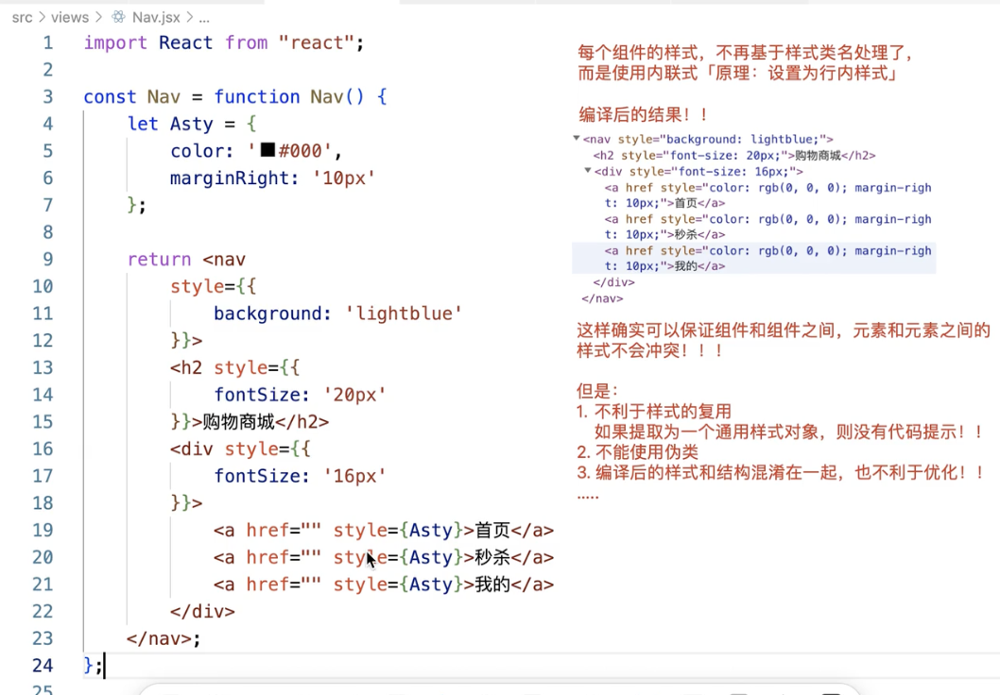
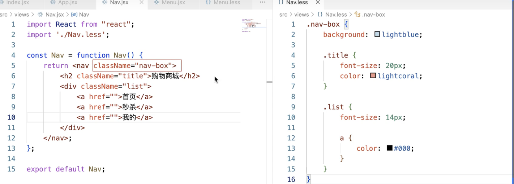
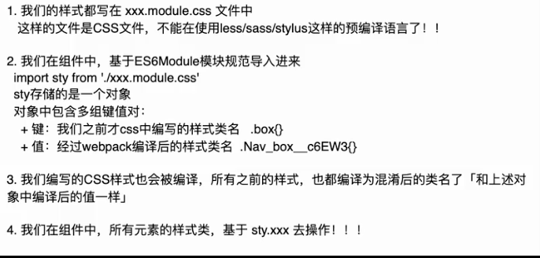

### 1. 使用样式私有化处理的原因

```jsx
1. 在组件开发的过程中，一个页面会把所有所有的组件合并在一起渲染，各个组件的样式会冲突，样式不冲突就是样式私有化
```

### 2.   内联样式解决

```jsx
// 这种方式不建议（可以用来设置权重比较高的样式）
1. 给每个元素加上对应的style样式 
```



### 3. 基于样式表和样式类名解决

```js
// 这种也不建议
1. 保证组件最外层的类名不冲突（人为的控制）
		类名： 路径+组件名   作为最外层容器的名字
  
2. 组件内部的样式嵌入到最外层的容器中书写
```



### 4. 使用css_module解决样式冲突

```jsx
import style from "./menu.module.less" // 将样式文件以module.css或者module.less结尾命名
console.log("style",style)
const Vote = function Vote() {
    return <nav className={style.box}>
        <ul className={style.list}>
            <li>手机</li>
            <li>电脑</li>
            <li>家电</li>
        </ul>
    </nav>;
};

//  
```

<div>



<div style="color:cyan">如何在.module.xxx的文件中定义全局样式</div>

```css
:global(.xxx){
	// :global()里面的类名不会经过编译
}
```

### 5. react-jss插件实现私有化处理(和vue中的style scoped差不多了)

<div style="color:yellow">ps: react-jss思想就是css-in-js的思想，在js中书写css</div>

#### 5.1.如何使用

```jsx
import {createUseStyles} from "react-jss"
let styles = createUseStyles({ 
    /*
        返回一个函数
         + 对象中的每个成员就是创建的样式类名
         + 可以类似于less等预编译语言中的嵌套语法，为后代设置样式
        
    */
    box:{
        backgroud:'green',
        fontSize:'24px',
        "&:hover":{
            background: "red"
        }
    },
    list:{
        background:"yellow",
        "& li":{
            color:"cyan"
        }
    }
})

const Vote = function Vote() {
    console.log(styles()) // 返回一个对象，包含类名
    return <nav className={styles().box}>
        <ul className={styles().list}>
            <li>手机</li>
            <li>电脑</li>
            <li>家电</li>
        </ul>
    </nav>;
};
```

#### 5.2. reactjss动态化管理


<div style="color:cyan">reactjss相对于cssmodule的好处，可以实行样式的动态化管理</div>

```jsx
let styles = createUseStyles({ 
    box:{
        backgroud:'green',
        "&:hover":{
            background: props=>props.color1 
        }
    },
    list:props => {  // 函数只能加在最外面（加入到& li中没有效果）
        return {
          "& li": {fontSize: props.size + "px"}
        }
    }
    }
)

const Vote = function Vote() {
    let {box,list} = styles({  // 传入参数进行动态化处理
        size: 14,
        color1:'orange'
    })
    return <nav className={box}>
        <ul className={list}>
            <li>手机</li>
            <li>电脑</li>
            <li>家电</li>
        </ul>
    </nav>;
};
```


#### 5.3. 类组件中使用reactjss

<div style="color:yellow">reactjss不能直接在类组件中使用,需要创建一个代理函数组件才能使用</div>

```jsx
let styles = createUseStyles({ 
    box:{
        backgroud:'green',
        "&:hover":{
            background: props=>props.color1
        }
    },
    list: props => { // props函数只能加在最外面
        return {
          "& li": {fontSize: props.size + "px"}
        }
    }
    }
)

class Vote extends React.Component{
    render(){
        let {box,list} = this.props
        return  <nav className={box}>
        <ul className={list}>
            <li>手机</li>
            <li>电脑</li>
            <li>家电</li>
        </ul>
    </nav>;
    }
}

// 创建一个代理函数组件：获取基于reactjss编写的样式，把样式传递给类组件

const ProxyComponent = function(Component){ 
    
    //  Component是我们要渲染的组件
    // 方法执行必须要返回一个函数组件
    return function HOC(props){
        let style = styles({ 
            size: 14,
            color1:'orange'
        })
        // props本来是传递给类组件的，但是实际上传递给了函数组件，所以需要转发给类组件，
        return <Component {...props} {...style}/>
    }
}
```

#### 5.4.styled-components


```jsx
import styled from "styled-components"
/**
 * 基于‘styled.xxx’样式进行编写
 *  + 样式要放在模版字符串中
 *  + xxx表示一个元素标签，可以说div等等
 *  + 输出结果为自定义组件，将组件放入到jsx中，组件包裹的内部可以使用模版字符串的样式
 *  + 可以将属性传递到这个NavBox中
 *  + 可以设置默认值
 *  p s: 如果编写样式没有提升，可以安装vscode-styled-components插件
 */

// nav是包裹组件的容器会被渲染为nav
const NavBox = styled.nav` 
    background-color: lightblue;
    width:300px;
    .title{
        color:yellow;
        font-size:${props => props.size}px  // 通过传递的属性值设置大小
    }
`
// .attr(()=>{return {默认值}})  设置默认值
const Div =styled.div.attrs(props=>{return {
    size:16  // 用户如果没有传递size，默认值为16
}})`
    font-size:${props=>props.size}px
`

const Vote = function Vote() {
    /* size={16}传递样式值,NavBox被渲染为nav */
    return <NavBox size={16}>
        <h2 className='title'>购物商场</h2>
        <div>
            <a href="">首页</a>
            <a href="">秒杀</a>
            <a href="">我的</a>
        </div>
    </NavBox>;
};
```

#### 5.5.总结


