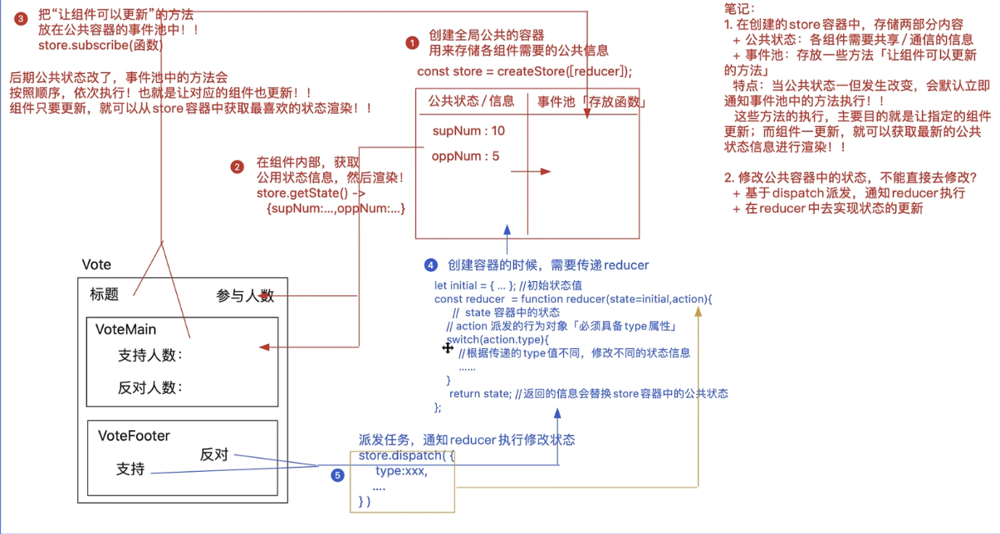
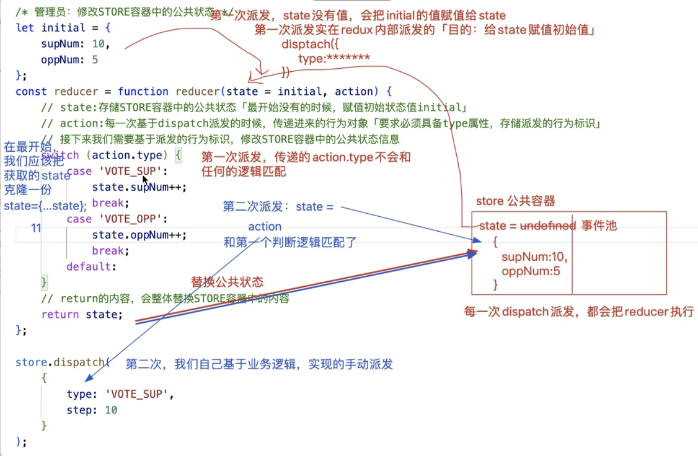
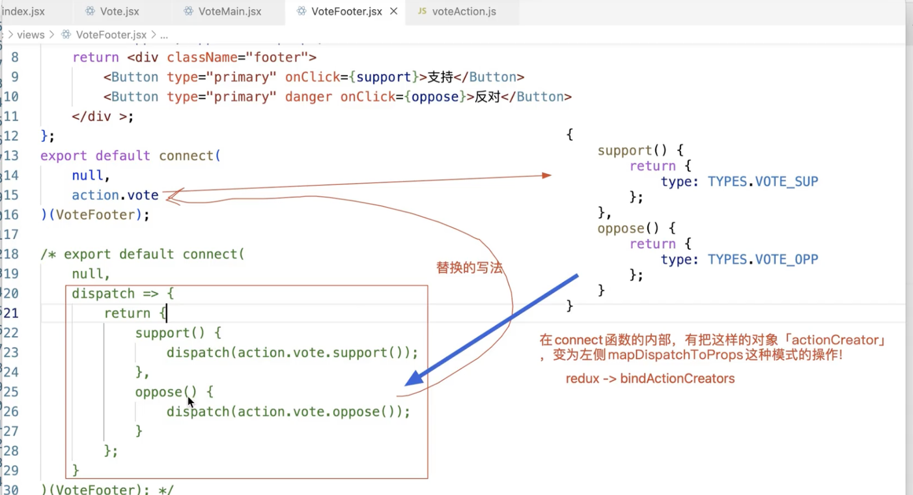
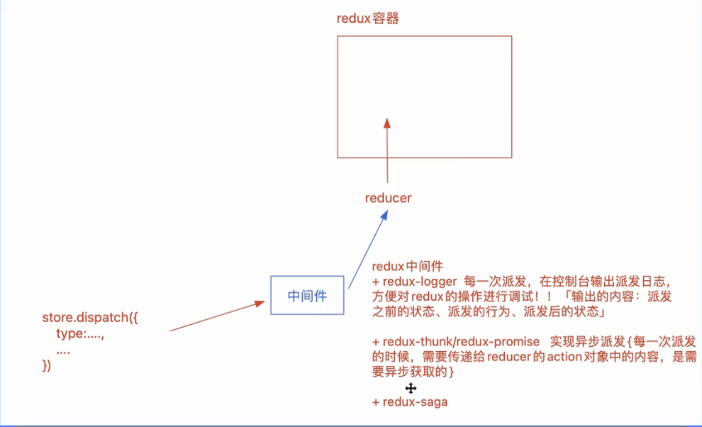
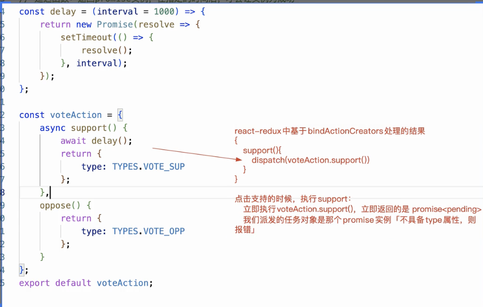
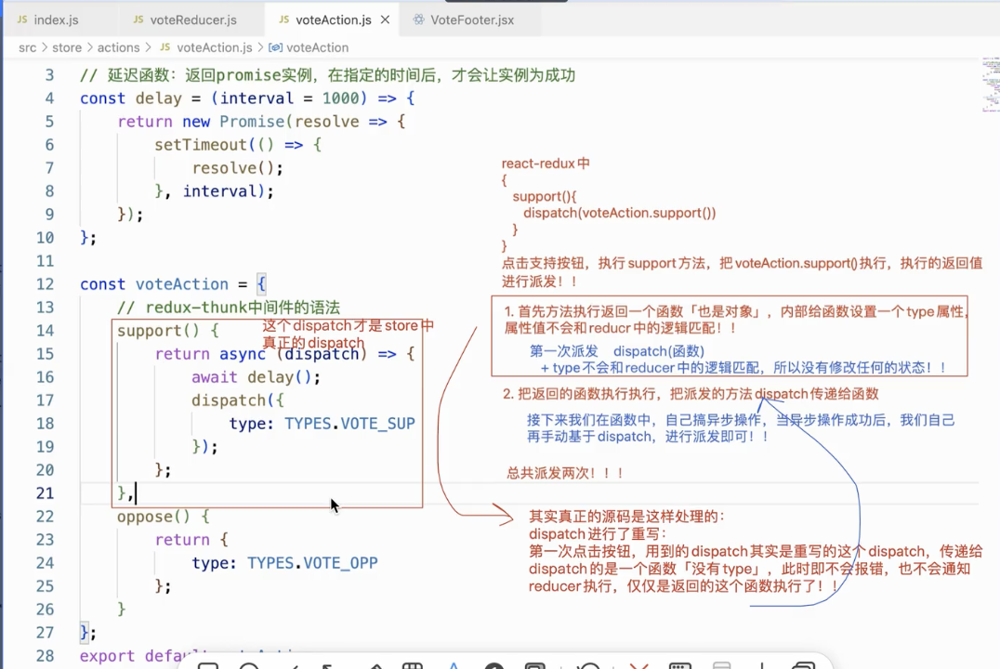
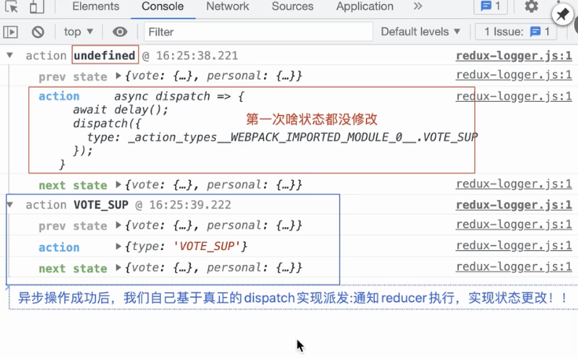
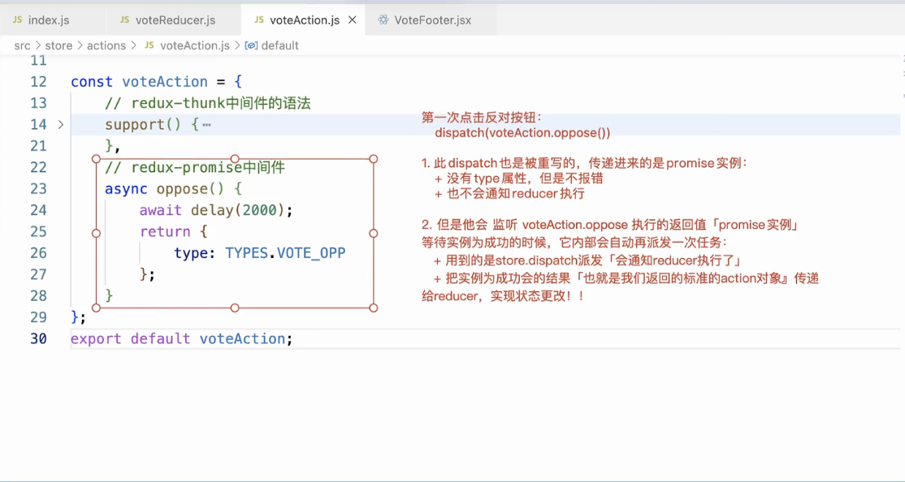
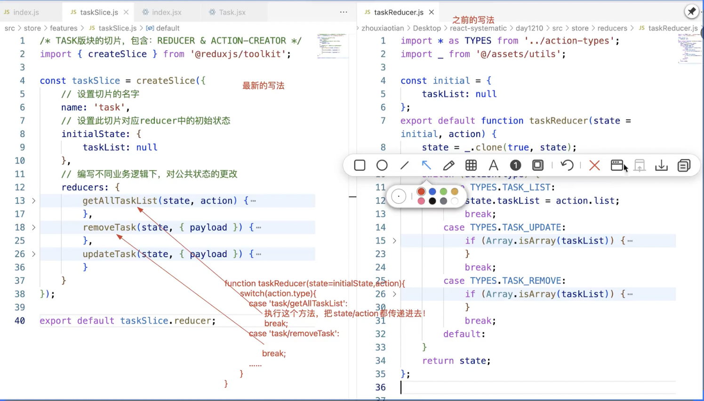
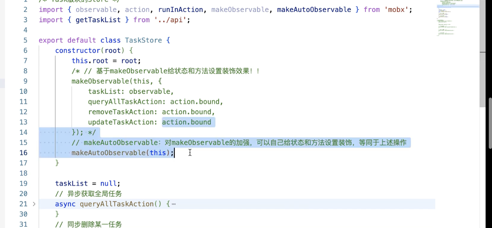

### 1. redux工作流程图

```jsx
/ 完整流程：
	1. 创建容器createStore(reducer) --> reducer可以用来修改容器中的状态
  /*ps:不能直接修改状态，放在reducer中修改，方便状态的管理，所以应该对对象深克隆，防止用户直接更改掉*/
  2. 组件获取状态值： store.getStore
  3. 组件给容器中事件池 塞入 可以在状态值更改后，自动更新组件（获取最新状态值的方法） store.subscribe
  4. 组件给reducer派发任务，通知reducer修改状态
  5. 修改完状态会自动执行事件池中的函数（让组件更新的方法），组件更新可以拿到最新的状态值

```



<div style="color:cyan">vote和votemain、voteFooter都需要store，我们可以将stote放在根组件的context中，后代组件直接获取就可以了</div>

#### 1.1.  创建redux容器

<div style="color:yellow">ps:工作流程图中的1，4步骤</div>



```jsx
/ store->index.js


import {createStore} from "redux"
/**
 * 1.创建管理员reducer（负责修改store里面的公共状态）
 *  + state存储store容器中的公共状态（initial是初始值）
 *  + action是每一次基于dispatch派发的时候创建的行为对象(必须具备type属性，存储派发的行为标识)
 *  + return的内容会   /整体/   替换store容器的内容
 * 
 * 2.基于派发的行为标识（action type）修改容器中的公共状态信息
    store.dispatch({
        type:"VOTE_SUP",
        step:10
    })
 */

/**
 * 工作流程：
 *  1. 第一次；创建公共容器，state初始值为undefined，第一次dispatch为redux内部进行派发（type值不会和任何的逻辑匹配），将initial的值给state，最后return state
 *    + 目的：给state赋值初始值
 * 
 *  2. 第(2..n)次dispatch：自己使用dispatch派发，拿到的state为innitial初始值（或者上次修改后的state），这时action的type和reducer的type如果匹配，就会修改state的值（不能拿容器中的state直接修改[ps:不能直接修改状态，放在reducer中修改，方便状态的管理，所以应该对对象深克隆，防止用户直接更改掉])，需要将容器中state的值进行克隆，将克隆的值改变，最后将值修改后进行return）
 *    + 为了接下来的操作中不直接修改容器的公共信息，需要先克隆
 *  
 */

/**
 * {...浅克隆} ，第一级克隆的对象地址不一样，但是第二级对象的地址是一样的
 * let a = {s:{d:1},b:2}
    let k = {...a}
    a===k // false
    a.s === k.s // true
 */
let initial = {
    oppNum:5,
    supNum:10
}
const reducer =function reducer(state=initial,action){ 
    state = {...state} // 这里只是浅克隆（安全起见应该需要深克隆）
    switch(action.type){
        case 'VOTE_SUP':
             state.supNum++
            break;
        case 'VOTE_OPP':
            state.oppNum++
            break;
    }
    return state // 返回的值会替换容器中的状态值
}
// 创建store公共容器
const store = createStore(reducer)
export default store
```

#### 1.2.  将store容器放入上下文

```jsx
1.为了所有的组件都能够使用到store对象，可以使用context上下文对象将store对象托管到index.jsx根组件中(所有组件都为index.jsx的根组件)

import store from "./store"
import ThemeContext from "./ThemeContext"
const root = ReactDOM.createRoot(document.getElementById('root'));

root.render(
  <>
  <ConfigProvider  local={zhCN}>
      <ThemeContext.Provider value={
        {
          store
        }
      }>
          <App></App>
      </ThemeContext.Provider>
    </ConfigProvider>
  </>
);
```

#### 1.3. 组件如何使用redux

```jsx
/ 给公共容器中添加让组件更新的方法
  1. 获取上下文中的context
  		 let { store } = useContext(ThemeContext)
   
  2. 获取容器中的状态
     let { supNum, oppNum } = store.getState()
  3. 编写可以让组件更新的方法
  		+ 创建状态值，这个里面包含让组件更新的方法【这个状态值和状态方法虽然不使用，但是是为了让组件更新的方法，不可缺少】
    	 let [num,setSum] = useState(0)
  
      + 第一次组件创建完成的时候，把可以让组件更新的放入放入事件池中[状态值更改后就会通知事件池里面的方法执行，执行完组件就会更				新，然后拿到最新状态值]
      const update = ()=>{
          setSum(num+1)
      }
  
 4. 将让组件更新的方法放入到事件池中
 		+ 错误的写法: 不能写成下面这样,因为这样每次update都是第一次上下文中的update，而且里面的sum都是0，所以只会更新（useState			的浅比较）
  
				useEffect(()=>{
          store.subscribe(()=>{
                  setSum(update) 
              })
        },[])

		+ 解决方案一： 让组件更新将最新的update更新方法放入事件池中 /*但是要每一次都要清除上一次的事件池中的方法*/
    		 useEffect(()=>{
          let unsubscribe = store.subscribe(update) // 返回一个unsubscribe函数【可以将组件更新的方法从事件池中移除】
          return ()=>{ // 拿到上一次的函数上下文的值进行删除上一次事件池的方法
              unsubscribe()
          }
        },[num])  
			 /*ps:类组件中塞入可以让组件更新的方法可以使用this.forceUpdate -- > store.subscribe(()=>{this.forceUpdate()})  */
     + 方案二，保证每一次更新中的事件次的方法设置的值不一样/*最优解*/
				 useEffect(()=>{
            let unsubscribe = store.subscribe(()=>{
                setSum({}) // 让组件更新的方法 ,修改的状态值（每次都不一样）：每次的引用地址都不一样，组件也会更新
            })
            return ()=>{
              // 让组件释放的时候，删除事件池中的方法
              unsubscribe()
            }
        	},[])

	5.  dispatch，派发状态，通知reducer更改状态
  		store.dispatch({
                type:"VOTE_OPP"
            })


```

<div style="color:cyan">完整代码</div>

```jsx
// vote
	const Vote = function Vote() {
    let { store } = useContext(ThemeContext)
    // 获取容器中的公共状态
    let { oppNum, supNum } = store.getState()
    let [num,setSum] = useState(0)
    const update = ()=>{
        setSum(num+1)
    }
    useEffect(()=>{ // 塞入可以让组件更新的方法到事件池中
        store.subscribe(()=>{
            setSum({}) 
        })
    },[])

    return <div className="vote-box">
        <div className="header">
            <h2 className="title">React是很棒的前端框架</h2>
            <span className="num">{supNum + oppNum}</span>
        </div>
        <VoteMain />
        <VoteFooter  />
    </div>;
};


//votemain
 // 父组件更新也会更新，因为这个组件没有收到父组件的值，而且也没有做React.memo的比较更新的操作
	const VoteMain = function VoteMain() {  
    let {store} = useContext(ThemeContext) // 拿到store容器
    let { supNum, oppNum } = store.getState() // 获取状态值
    // 基于useMemo实现复杂逻辑的“计算缓存”
    let ratio = useMemo(() => {
        let ratio = '--',
            total = supNum + oppNum;
        if (total > 0) ratio = (supNum / total * 100).toFixed(2) + '%';
        return ratio;
    }, [supNum, oppNum]);

    return <div className="main">
        <p>支持人数：{supNum}人</p>
        <p>反对人数：{oppNum}人</p>
        <p>支持比率：{ratio}</p>
    </div>;
	};

// votefooter
	const VoteFooter = function VoteFooter() {
    let {store} = useContext(ThemeContect)
    return <div className="footer">
        <Button type="primary" onClick={()=>{
            store.dispatch({ // 通知事件池的reducer修改状态
                type:"VOTE_SUP"
            })
        }
  
        }>支持</Button>
        <Button type="primary" danger onClick={()=>{
            store.dispatch({
                type:"VOTE_OPP"
            })
        }
  
        }>反对</Button>
    </div>;
};


```

#### 1.4. 部分源码实现

```jsx
import _ from './assets/utils';

/* 实现redux的部分源码 */
export const createStore = function createStore(reducer) {
    if (typeof reducer !== 'function') throw new Error("Expected the root reducer to be a function");

    let state, //存放公共状态
        listeners = []; //事件池

    /* 获取公共状态 */
    const getState = function getState() {
        // 返回公共状态信息即可
        return state;
    };

    /* 向事件池中加入让组件更新的方法 */
    const subscribe = function subscribe(listener) {
        // 规则校验
        if (typeof listener !== "function") throw new TypeError("Expected the listener to be a function");
        // 把传入的方法(让组件更新的办法)加入到事件池中「需要做去重处理」
        if (!listeners.includes(listener)) {
            listeners.push(listener);
        }
        // 返回一个从事件池中移除方法的函数
        return function unsubscribe() {
            let index = listeners.indexOf(listener);
            listeners.splice(index, 1);
        };
    };

    /* 派发任务通知REDUCER执行 */
    const dispatch = function dispatch(action) {
        // 规则校验
        if (!_.isPlainObject(action)) throw new TypeError("Actions must be plain objects");
        if (typeof action.type === "undefined") throw new TypeError("Actions may not have an undefined 'type' property");

        // 把reducer执行，传递：公共状态、行为对象；接收执行的返回值，替换公共状态；
        state = reducer(state, action);

        // 当状态更改，我们还需要把事件池中的方法执行
        listeners.forEach(listener => {
            listener();
        });

        return action;
    };

    /* redux内部会默认进行一次dispatch派发，目的：给公共容器中的状态赋值初始值 */
    const randomString = () => Math.random().toString(36).substring(7).split('').join('.');
    dispatch({
        // type: Symbol()
        type: "@@redux/INIT" + randomString()
    });

    // 返回创建的STORE对象
    return {
        getState,
        subscribe,
        dispatch
    };
};
```

#### 1.5.redux的不足

```jsx
1. 为了防止用户直接修改状态，所以需要做对象深克隆
2. 项目庞大reducer会过于臃肿，需要做工程化处理
3. 不论哪个状态更新，组件都会更新【在传入事件池的方法中存储上一份状态，把当前的状态和以前的状态做对比，如果没有变化，就不进行更新，但是这样操作很消耗性能]
		+ 虽然原有的操作逻辑配合react-router操作的时候（无论状态改变，事件池方法都会更新），但是router会让很多组件释放掉，只展示当前组件[spa单页面]，即便组件的方法进行更新，但是因为组件释放掉了，也不会产生很大的影响，而且我们也可以在组件卸载掉的时候，将对应的更新方法从事件池中移除掉】
4. reducer的合并，不是合并到一起，是创建一个总的reducer，当任务派发的时候，是将所有的reducer都执行一遍[即使发现匹配的逻辑，依然会将所有的模块都执行]，应该在找到对应的type中的，进行break
```

### 2. redux工程化

#### 2.1. reducer拆分

```js
当项目庞大后，reducer中的逻辑会很多，所以我们需要将reducer里面的方法拆分
// ->在store目录下新建reducer文件夹用来管理所有的reducer和合并reducer
	--> 
		store 
 		+ reducer
			+ voteReducer.js
      + personalReducer.js
			+ index.js
```

```jsx
1. 此时的合并后的状态为
   state = {
       vote:{ 
             oppNum:5,
             supNum:10,
             num:0
        },
        personal:{
            num:100,
            info:null
        }
   }

  2.获取对应模块的状态: store.getStore().vote.num,
        store.getStore().personal.num来获取状态

 3. 派发(dispatch)的操作不需要改动，每一次派发会/*在所有的reducer中去找对应的type*/，然后就修改状态
		+ /* action中的type可能会重名 */ ，所以所有模块下的type值不能重名

// vote.js
	const initial = {
   //...
}
export default function voteReducer(state=initial,action){
    state  = JSON.parse(JSON.stringify(state))
    switch(action.type){
            // ....
    }
    return state
}


// personal.js
const initial = {
  // ...
}
export default function personalReducer(state=initial,action){
    state  = JSON.parse(JSON.stringify(state))
    switch(action.type){
        //..
    }
    return state
}


// 合并reducer
import { combineReducers } from "redux";
import voteReducer from "./vote";
import personalReducer from "./personal";
const reducer = combineReducers({ // 关键合并方法
    vote:voteReducer,
    personal:personalReducer
})
export default reducer


// store -> index.js 创建store
	import {createStore} from "redux"
  import reducers from "./reducers"
  const store = createStore(reducers)
  export default store

```

#### 2.2. 基于宏管理，让所有的行为标识（type）有唯一性

```jsx
// 执行dispatch的时候会在所有的reducer中寻找对应的type值进行状态修改，当type值重名可能会出现冲突问题

 --> 在store目录下新建action_types 对所有的type值进行管理
 
```

```jsx
/** 
		统一管理需要进行派发的行为标
			+ 为了保证不冲突，一般命名都是模块名+派发的行为标识 ，变量名和值一样，然后导出组件和reducer中
*/
 

1. action_types.js 

export const VOTE_SUP = "VOTE_SUP"
export const VOTE_OPP = "VOTE_OPP"

export const PERSONAL_INFO  = "PERSONAL_INFO"


2. 组件中 
import { VOTE_SUP } from "action_types.js"
store.dispatch({
  type: VOTE_SUP
})


3. reducer中
		import {PERSONAL_INFO} from "../action-types"
    const initial = {
        ...
    }
  export default function personalReducer(state=initial,action){
      state  = JSON.parse(JSON.stringify(state))
      switch(action.type){
          case PERSONAL_INFO:
              state.info = action.payload
          break;
          default:
      }
      return state
  }
```

#### 2.3. action统一管理也叫actionCreator对象[利于react-redux的管理]

```jsx
1. 将dispatch的逻辑全部放在对应的模块中
 1.1 在store下创建action文件夹里面创建对应的模块下派发的对象
 	store 
 		+ action
			+ voteAction.js
      + personalAction.js
			+ index.js

 	// + voteAction.js 
		import {VOTE_SUP,VOTE_OPP} from "@/store/action-types"
			 + 统一处理vote模块中的派发的行为对象 
			const voteAction = {
    	support(){
        return {
            type:VOTE_SUP
        }
    	},
    	oppose(){
        return {
            type:VOTE_OPP
        }
    	}
		}
		export default voteAction

		// + personalAction.js
	import {PERSONAL_INFO} from "@/store/action-types"
	const personalAction = {
    getInfo(){
        return {
            type:PERSONAL_INFO
        }
    }
	}
	export default personalAction

		// + index.js
	 -- 把各个板块的action合成一个action[actionCreator]
    import voteAction  from "./voteAction";
    import personalAction from "./personalAction";
    const action = {
        vote:voteAction,
        personal:personalAction
    }
    export default action

1.2 在组件中使用
	import action from "@/store/action"
	const VoteFooter = function VoteFooter() {
    let {store} = useContext(ThemeContect)
   
    return <div className="footer">
        <Button type="primary" onClick={()=>{
            store.dispatch(action.vote.oppose())  
        }}>支持</Button>
        <Button type="primary" danger onClick={()=>{
            store.dispatch(action.vote.support())
        }
  
        }>反对</Button>
    </div>;
	};

```

#### 2.4 combineReducers源码思想

```jsx
// 不是合并为一个reducer，而是将创建一个总的reducer，在派发任务的时候，通知小的reducer执行（所有的reducer都会执行一遍）
const combineReducers = function combineReducers(reducers) {
    // reducers是一个对象，以键值对存储了：模块名 & 每个模块的reducer
    let reducerskeys = Reflect.ownKeys(reducers);
    // reducerskeys:['vote','personal']
    /* 
    返回一个合并的reducer 
      + 每一次dispatch派发，都是把这个reducer执行
      + state就是redux容器中的公共状态
      + action就是派发时候传递进来的行为对象
    */
    return function reducer(state = {}, action) {
        // 把reducers中的每一个小的reducer（每个模块的reducer）执行；把对应模块的状态/action行为对象传递进来；返回的值替换当前模块下的状态！！
        let nextState = {};
        reducerskeys.forEach(key => {
            // key:'vote'/'personal'模块名
            // reducer:每个模块的reducer
            let reducer = reducers[key];
            nextState[key] = reducer(state[key], action);
        });
        return nextState;
    };
};
export default combineReducers;

/* store.dispatch({
    type: TYPES.VOTE_SUP
}); */
```

### 3. react-redux

```jsx
1.让redux在组件中使用更简单方便
   + 内部自己创建了上下文对象，并且我们可以把store放在上下文中，在组件中使用中，无需自己获取上下文中的store
   + 不用基于上下文对象获取store，基于react-redux函数提供的connect函数获取即可，而且不需要手动将更新的方法放入到事件池中
```

#### 3.1. 使用react-redux创建上下文对象

```jsx
/ index.js根目录
import {Provider} from "react-redux" // 自动创建上下文对象

 {/* 将store挂载到上下文中 */}
      <Provider store={store}>
          <App></App>
      </Provider>
```

#### 3.2. 组件中使用react-redux

```jsx
  / connect的使用

    1. connect(mapStateToProps,mapDispatchToProps)返回一个函数，mapStateToProps,mapDispatchToProp都不是必选项，函数需要组件做参数
       1.1 mapStateToProps函数: 可以获取redux中的公共状态，把需要的信息作为属性，传递给组件
   
         + connect(state=>{
                // 可以获取存储redux容器中，所有模块的公共信息
                return {
                    // 返回对象中的信息，就是要作为属性传递给组件的信息, 通过props传递给组件
                    // state是react-redux中返回的state
                    AA: state.vote.supNum  
                }
            })(vote)

       1.2 mapDispatchToProps函数，可以将需要派发的任务，作为属性传递给组件:如果没有这个参数，默认传递dispatch方法

        // 老语法
         connect(null,
        dispatch=>{ // dispatch 存放的是 store.dispatch（派发任务的方法）
            return {
                // 派发的任务，作为属性传递给组件
            }
        })(VoteFooter)

        // 新语法,acion.type是上面创建的管理派发type的文件（文件返回的是一个对象）
           connect(null,action.vote)(VoteFooter)
           + 在connect函数内部有把{support(){},oppose(){}}变为老语法中的mapDispatchToProps函数这样的操作
                + 用的是redux中的bindActionCreators这样的函数，所以action文件中的写法必须是这样的写法
```

```jsx
/ vote.jsx
import {connect} from "react-redux" // connect关键函数
const Vote = function Vote(props) {
    return <div className="vote-box">
        <div className="header">
            <h2 className="title">React是很棒的前端框架</h2>
            <span className="num">{props.supNum + props.oppNum}</span>
        </div>
        <VoteMain />
        <VoteFooter  />
    </div>;
};
export default connect(state=>state.vote)(Vote); // connect函数获取state中的状态
```

```jsx
/ voteMain.jsx
	import {connect} from "react-redux"
	const VoteMain = function VoteMain(props) { 
    let {supNum,oppNum} = props
    let ratio = useMemo(() => {
        let ratio = '--',
            total = supNum + oppNum;
        if (total > 0) ratio = (supNum / total * 100).toFixed(2) + '%';
        return ratio;
    }, [supNum, oppNum]);

    return <div className="main">
        <p>支持人数：{supNum}人</p>
        <p>反对人数：{oppNum}人</p>
        <p>支持比率：{ratio}</p>
    </div>;
};
export default connect(state=>state.vote)(VoteMain);
```

```jsx
/ voteFooter.jsx

import {connect} from "react-redux"
import action from "@/store/action" // 用于获取模块中用于派发任务的对象
const VoteFooter = function VoteFooter(props) {
   let {support,oppose} = props
    return <div className="footer">
        <Button type="primary" onClick={support}>支持</Button>
        <Button type="primary" danger onClick={oppose}>反对</Button>
    </div>;
};

// 新语法
export default memo(connect(null,action.vote)(VoteFooter)) 

/*老语法*/
export default memo(connect(null,dispatch=>{ // dispatch为派发任务的方法
    return { // 将返回的函数作为对象传入组件中
        support(){
            dispatch(action.vote.support()) // action.vote.support()中存储派发任务的type等值
        },
        oppose(){
            dispatch(action.vote.oppose())
        }
    }
})(VoteFooter));
```

<div style="color:cyan">mapDispatchToProps可以不是一个函数，是一个对象的原因</div>



#### 3.3.react-redux的源码实现

```jsx
import React, { createContext, useContext, useEffect, useState, useMemo } from "react";
import { bindActionCreators } from 'redux';
const ThemeContext = createContext();

/* Provider:把传递进来的store放在根组件的上下文中 */
export function Provider(props) {
    let { store, children } = props;
    return <ThemeContext.Provider
        value={{
            store
        }}>
        {children}
    </ThemeContext.Provider>;
};

/* connect:获取上下文中的store，然后把公共状态、要派发的方法等，都基于属性传递给需要渲染的组件；把让组件更新的方法放在redux事件池中！ */
export function connect(mapStateToProps, mapDispatchToProps) {
    // 处理默认值
    if (!mapStateToProps) {
        mapStateToProps = () => {
            // 不写则:什么都不给组件传递
            return {};
        };
    }
    if (!mapDispatchToProps) {
        mapDispatchToProps = (dispatch) => {
            // 不写则:把dispatch方法传递给组件
            return {
                dispatch
            };
        };
    }
    return function currying(Component) {
        // Component:最终要渲染的组件「Vote」
        // HOC:我们最后基于export default导出的组件
        return function HOC(props) {
            // 我们需要获取上下文中的store
            let { store } = useContext(ThemeContext),
                { getState, dispatch, subscribe } = store;

            // 向事件池中加入让组件更新的办法
            let [, forceUpdate] = useState(0);
            useEffect(() => {
                let unsubscribe = subscribe(() => {
                    forceUpdate(+new Date());
                });
                return () => {
                    // 组件释放的时候执行：把放在事件池中的函数移除掉
                    unsubscribe();
                };
            }, []);

            // 把mapStateToProps/mapDispatchToProps，把执行的返回值，作为属性传递给组件！！
            let state = getState(),
                nextState = useMemo(() => {
                    return mapStateToProps(state);
                }, [state]);

            let dispatchProps = {};
            if (typeof mapDispatchToProps === "function") {
                // 是函数直接执行即可
                dispatchProps = mapDispatchToProps(dispatch);
            } else {
                // 是actionCreator对象,需要经过bindActionCreators处理
                dispatchProps = bindActionCreators(mapDispatchToProps, dispatch);
            }

            return <Component
                {...props}
                {...nextState}
                {...dispatchProps}
            />;
        };
    };
};
```

### 4.redux中间件

#### 4.1. 什么是redux中间件

```jsx
1. 由dispatch直接通知reducer进行状态处理，改为dispatch通知中间件，中间件通知reducer修改状态【中间件可以在通知reducer修改状态之前进行某些逻辑的处理】
2.常见的redux中间件：
	+ redux-logger --> 用于输出派发状态的中间件
	+ redux-saga --> 实现异步派发
  + redux-thunk/redux-promise --> 用于实现异步派发，比如先获取先获取接口信息再传递派发对象
  + redux-persit实现数据持久化存储的 -同步redux到localstorage中
```



#### 4.2. 使用中间件

```jsx
 // 使用redux中间件必须使用applyMiddleware(...中间件)
 // 导入可以使用中间件的容器applyMiddleware
import {createStore,applyMiddleware} from "redux"
import reducers from "./reducers"
import reduxLogger from "redux-logger"

// 将导入的中间件传入store中
const store = createStore(reducers,
    applyMiddleware(reduxLogger)
);
export default store
```

#### 4.3. 异步派发的问题

```jsx
// 在actionCreators对象中不支持异步操作

// 延迟函数
const delay = (interval=1000)=>{
    return new Promise(resolve=>{
        setTimeout(()=>{
            resolve()
        },interval)
    })
}

const voteAction = {
    support(){
        return {
            type:VOTE_SUP
        }
    },
    // 异步的处理 (直接这样写会报错，因为拿到的是promise实例<pending>(需要then方法才能拿到返回的值)，而不是返回的一个普通对象)
    async oppose(){ // 在connect函数中经过bindActionCreators处理后还是返回的是一个promise<pengding>,reducer需要的是一个普通对象，所以会出现报错
        await delay
        return {
            type:VOTE_OPP
        }
    }
}
export default voteAction
```



#### 4.4. redux-thunk派发异步任务

```jsx
// 导入redux-thunk中间件 
import reduxThunk from "redux-thunk"
	const store = createStore(reducers,
    applyMiddleware(reduxLogger,reduxThunk)
	);

// 使用redux-thunk的语法：
   oppose(){
        return async (dispatch)=>{
            await delay()
            dispatch({ // 异步操作成功之后需要自己手动派发一次（不像之前可以通过bindActionCretors可以自动创建对应的函数）
                type:VOTE_OPP
            })
        }
    }
```

<div style="color:cyan">为什么要手动派发和在外面包裹一次函数</div>



<div style="color:yellow">redux-logger显示任务会派发两次</div>



#### 4.5. 使用redux-promise派发异步任务

```jsx
// 导入redux-promise中间件 
import reduxPromise from "redux-promise"
	const store = createStore(reducers,
    applyMiddleware(reduxLogger,reduxPromise)
	);

// 使用redux-thunk的语法：
  async oppose(){
            await delay()
            return{ 
                type:VOTE_OPP
            }
        }
    }
```

<div style="color:cyan">原理</div>




<div style="color:yellow">此模式中的异步派发也会派发两次</div>

### 5. redux-toolkit

```jsx
/作用：简化react-redux的步骤(将reducer和actionCreator混合在一起了)

```

```jsx
/ 创建store
import reduxPromise from "redux-promise"
 import reduxThunk from "redux-thunk"
import voteReducers from "./features/vote"
import reduxLogger from "redux-logger"
// 使用@reduxjs/tookit创建容器
import {configureStore} from "@reduxjs/toolkit"


const store = configureStore({
    // 1.传入reducer、2.使用中间件(类似于combineReducers,最后按照指定的模块去管理个模块的状态)
    /**
     * state:{
     *  vote:{
     *  
     *  },
     *  personal:{
     *  
     *  }
     * }
     */
    reducer:{
        // 按模块管理各个reducer
        vote: voteReducers
    },
    // 默认集成了redux-thunk，如果自己导入，会替换原来的redux-thunk
    middleware:[reduxLogger,reduxThunk,reduxPromise]
})
export default store
```

``` jsx
/ 创建reducer

	/**
 * vote模块下面的切片（reducer+action）
 * 
 */

import {createSlice} from "@reduxjs/toolkit"

const vote = createSlice({
    // 切片的名字
    name: "vote",
    // 切片reducer中的初始状态
    initialState:{
        oppNum:5,
        supNum:10,
        num:0
    },
    // 编写不同业务下，对公共状态的更改（类似于react-redux中的reducer）
    reducers:{
        setOppNum(state, action){ 
            console.log("action",action)
            // 基于immer库管理，不需要自己克隆state
            // action派发的行为对象，无需考虑行为标识问题，传递的其他信息，都是以action.payload接收传递进来的值
            state.oppNum = state.oppNum + action.payload
        },
        setSupNum(state, action){ 
            state.supNum = state.supNum  + action.payload
        }
    }
})
// 从切片中获取actionCreators（vote.actions）,并且导出，就可以在组件中拿到这几个方法
// 和reducers中的名字相同，但是不是同一个方法
export let {setOppNum,setSupNum} = vote.actions

// console.log(setOppNum([])) // 方法执行返回需要派发的行为对象
/**
输出
    {
        payload: []
        type: "vote/setOppNum"
    }
 */

    // 如果需要异步派发，比如调用接口什么的，可以引入api
     const delay = (interval=1000)=>{
        return new Promise(resolve=>{
            setTimeout(()=>{
                resolve()
            },interval)
        })
    }

    // 使用thunk中间件
    export const setOppNumAsync = ()=>{
       return async dispatch => {
            await delay()
            // 拿取actionCreator行为对象
            dispatch(setOppNum(1))
        }
    }
// 导出ruducer到store中
export default vote.reducer;

```




```jsx
/ 根组件中引入
// 如果使用redux-tookit+react-redux来做，需要使用useSelector,useDispatch(类同connect也可以获取state和dispatch)
import {useSelector} from "react-redux"

const Vote = function Vote() {
    // 获取公共状态
    let {oppNum,supNum} = useSelector(state=>state.vote)
    return <div className="vote-box">
        <div className="header">
            <h2 className="title">React是很棒的前端框架</h2>
            <span className="num">{supNum + oppNum}</span>
        </div>
        <VoteMain />
        <VoteFooter  />
    </div>;
};
```

```jsx
/ 组件中使用
// 如果使用redux-tookit+react-redux来做，需要使用useSelector,useDispatch(不使用connect)
import {useSelector} from "react-redux"

const Vote = function Vote() {
    // 获取公共状态
    let {oppNum,supNum} = useSelector(state=>state.vote)
    return <div className="vote-box">
        <div className="header">
            <h2 className="title">React是很棒的前端框架</h2>
            <span className="num">{supNum + oppNum}</span>
        </div>
        <VoteMain />
        <VoteFooter  />
    </div>;
};

import {useDispatch} from "react-redux"
import {setSupNum,setOppNumAsync} from "../store/features/vote" // 引入actionCreator状态
const VoteFooter = function VoteFooter() {
    let dispatch = useDispatch()  // 获取到派发的方法
    return <div className="footer">
        <Button type="primary" onClick={()=>{
            dispatch(setOppNumAsync()) // 使用dispatch进行派发
        }}>支持</Button>
        <Button type="primary" danger onClick={
            ()=>{
                dispatch(setSupNum(1))
            }
        }>反对</Button>
    </div>;
};
```

### 6.  defineProperty

```js

// 对象本身的规则限制：1.冻结， 2，密封， 3.扩展

let obj = {
    x: 100
}

// 查看对象某个成员的规则
/**
 * configurable: 是否可以删除 delete
 * writable // 是否可以更改 obj.x = 1000
 * enumerable // 是否可枚举 for...in...，object.keys
 * value // 属性本身的值
 */
console.log(Object.getOwnPropertyDescriptor(obj,'x'))

// 获取所有成员的规则
// console.log(Object.getOwnPropertyDescriptors(obj))

// 设置对象中某个成员的规则
// 如果成员存在，修改属性规则，如果不存在,新增成员(默认规则都是false)
Object.defineProperty(obj,"x",{
    configurable:false,
    writable:true,
    enumabled:true,
    value:1
})
```

### 7. 装饰器

<div style="color:cyan">create-react-app中如何使用装饰器</div>

```jsx
1.vscode 
	打开setting --> decorator  语法支持

 2.webpack默认不支持装饰器语法，需要安装
   "@babel/plugin-proposal-class-properties",
   "@babel/plugin-proposal-decorators"
     "roadhog": "^2.5.0-beta.1",
	等系列插件
   
   
  3.  修改babel配置项
        "babel": {
            "presets": [
            "react-app"
            ],
            "plugins":[
            [
                "@babel/plugin-proposal-decorators",
                {
                "legacy":true
                }
            ],
            [
                "@babel/plugin-proposal-class-properties",
                {
                "loose":true
                }
            ]
            ]
        }

  4. roadhog@2.5.0-beta.1解决babel包和装饰器插件之间语法兼容的问题
 
```

#### 7.1.类装饰器

```jsx
1. 类的装饰器（可以给类添加属性方法等）
	const test = (target)=>{
        target.num = 100 // 添加静态属性
        target.getNum = function getNum(){} // 添加静态方法
        target.prototype.say = ()=>{} // 添加原型属性

    }
    @test   // 装饰器函数
    class Demo{
    }

2. 原理
			 var _class;
       const test = target => {
            target.num = 100; 
            target.getNum = function getNum() {}; 
            target.prototype.say = () => {}; 
        };
        // ps: 将Demo类传入到test中，如果函数没有返回值，将改变后的Demo赋值给Demo，所以函数不能返回值
        let Demo = test(_class = class Demo {}) || _class; 

3.装饰器函数的复用
			const test = (target)=>{
        console.log(2)
       }
      const test1 = (target)=>{
        console.log(1)
       }
      @test
			@test1
      class Demo{
      }
			// ps: 装饰器的执行顺序1-->2 ,装饰器函数从下往上开始执行

4. 装饰器工厂函数
	// ps: 装饰器不能返回一个值，为什么工厂模式可以返回函数，因为在装饰器的工厂模式中会先执行外层的函数，然后返回一个装饰器函数再执行
	const test = (x,y)=>{ 
        return (target)=>{ // 返回一个装饰器函数
            target.num = x
            target.getNum = function getNum(){} 
            target.prototype.say = ()=>{
                return y
            } 
        }
    }
    @test(10,20)
    class Demo{

    }

 5. 装饰器工厂函数的执行顺序
	// ps:工厂函数的外层处理后，获取到装饰器函数后，才会从下往上执行装饰器函数
       const test = (x,y)=>{ 
          console.log("1")
          return (target)=>{ 
              console.log("4")
          }
      }
      const test2 = (x)=>{ 
          console.log("2")
          return (target)=>{ 
              console.log("3")
          }
      }
      @test(10,20)
      @test2(1)
      class Demo{

      }
 // 结果1，2，3，4 
 
```

#### 7.2. 方法/属性装饰器

```jsx
1.函数/属性得函数装饰器
 		+ 主要给属性/方法进行设置descriptor的
		+ 主要的参数
 			+ target，类的原型Demo.prototype
			+ name：属性名
      + 属性的descriptor,{configurable: true, enumerable: true, writable: true, initializer(可以设置初始值，相当于value): ƒ}
     +  方法的descriptor{configurable: true, enumerable: true, writable: true, value:getX()}
    + 执行顺序从下往上

2. 属性装饰器
const property = (target,name,descriptor)=>{
    // 可以给类设置只读属性
    descriptor.writable = false
    /**
     * 方案二：设置只读属性，通过返回一个对象
     * return {
     *  writable: false
     * }
     */
}

3. 方法装饰器
/**记录时间的装饰器 */
const loggerTime = (target,name,descriptor)=>{
    let func = descriptor.value
    // 函数进行重构,后期调用的时候，执行的是重写后的函数
    descriptor.value = function(...params){
        console.time(name)
        let result = func.call(this,...params) // 箭头函数的this
        console.timeEnd(name)
        return result
    }
   
   
}

class Demo{
    // 属性装饰器
    @property
    x = 100
    // 函数装饰器,不能写成箭头函数，否则装饰器函数不会执行
    @loggerTime
    getX(){
        return this.x
    }
}
let d = new Demo()
console.log("d",d.getX())

```

### 8.  mobx

<div style="color:cyan">为什么要使用mobx</div>

```
1.使用redux太复杂，开发难度太高，代码太多，性能没有mobx好
2.相对于redux而言，redux某个状态更新，事件池里面的事件会执行，所有的组件都会更新，而mobx不一样，对应的值更新，对应的组件才会更新
```

<div style="color:cyan">如何使用mobx</div>

```jsx
1.使用mobx需要让项目支持js装饰器语法（需要给create-react-app提供下面的插件）
	 "@babel/plugin-proposal-class-properties",
         "@babel/plugin-proposal-decorators"
          "roadhog": "^2.5.0-beta.1",
2.在packjson中提供babel处理
	"babel": {
            "presets": [
            "react-app"
            ],
            "plugins":[
            [
                "@babel/plugin-proposal-decorators",
                {
                "legacy":true
                }
            ],
            [
                "@babel/plugin-proposal-class-properties",
                {
                "loose":true
                }
            ]
            ]
        }
3. 安装mobx和mobx-react第五代版本 
			yarn add mobx@5 mobx-react@6
```

#### 8.1 mobx基本语法

<div style="color:cyan">基本语法</div>

```jsx
/ 基本语法
1. 引入observable, action，observer，autorun等装饰器函数
		+ @observable，将当前状态设置为可以被监听的[observer,autorun等检测机制机制才会生效]
		+ @action，将当前方法设置为可以修改公共状态的方法
		+ @observer 将当前组件变为观察者，当公共状态发生变化时，会自动更新视图
2. 创建store容器
		class Store{ // 创建一个容器
      @observable num = 10 // 相当于公共状态
        @action changeMsg(){ // 相当于修改公共状态的方法
            this.num++ 
            console.log("num",this.num)
        }
    }
		let store = new Store // new store == new Store()
3. 使用store（类组件）
		@observer 
    class Demo extends Component {
      render() {
        return (
          <div>
            <h2>mobx</h2>
             {/*使用容器中的状态*/}
            <p>{store.num}</p>
            {/*使用容器中的方法*/}
            <button onClick={() => store.changeMsg('hello mobx')}>change msg</button>
          </div>
        )
      }
    }
4. 函数组件使用store
	 /** 函数组件不允许使用装饰器
     *      + 类装饰器的原理是装饰器函数(参数为当前类)执行后，返回一个新的类，替换原来的类)
     *      + 所以可以使用装饰器函数(函数组件)
     */
    const Demo = observer(function Demo(){  
        return (
            <div>
                <h2>mobx</h2>
                <p>{store.num}</p>
                <button onClick={() => store.changeMsg('hello mobx')}>change msg</button>
            </div>
        )
    })

4. 完整代码
import React, { Component } from 'react'
import { observable, action } from 'mobx' 
import { observer } from 'mobx-react'
class Store{
    @observable num = 10
    @action changeMsg(){
        this.num++ 
        console.log("num",this.num)
    }
}
let store = new Store

// 类组件
@observer 
class Demo extends Component {
  render() {
    return (
      <div>
        <h2>mobx</h2>
        <p>{store.num}</p>
        <button onClick={() => store.changeMsg('hello mobx')}>change msg</button>
      </div>
    )
  }
}

// 函数组件
	const Demo = observer(function Demo(){  
        return (
            <div>
                <h2>mobx</h2>
                <p>{store.num}</p>
                <button onClick={() => store.changeMsg('hello mobx')}>change msg</button>
            </div>
        )
    })
export default Demo

```

<div style="color:yellow">mobx5和mobx6的区别，mobx6需要将所有方法和属性置顶，手动添加</div>



#### 8.2.autorun监听函数的使用

<div style="color:cyan">autorun监听函数的使用</div>

```jsx
/ autorun的使用 
  import { observable, action ,autorun } from 'mobx';

  class Store{
      @observable x = 10
  }
  let store = new Store
  autorun(() => { // 相当于watcheffect
      // 首先自动执行一次，自动检测依赖的状态，当依赖的状态（必须给需要依赖的状态添加监听observable）改变，会执行回调函数
			// 只有observable建立监听后，在值改变后才会在set中将回调函数的值进行执行
      console.log(store.x) // 执行两次
  })
  setTimeout(() => {
      store.x = 100
  }
  , 1000);
```

#### 8.3.observable的基本原理

<div style="color:cyan">observable的基本原理</div>

```jsx
1. observable 是使用es6中的proxy【这也是mobx>=5不支持ie的原因】
2. observable的原理: 通过proxy对象进行代理，然后在get和set中进行数据劫持,这样修改状态值，就可以/*在set函数中做处理，比如将依赖状态值的函数进行执行*/
3. proxy可以可以对当前的对象进行数据劫持和代理
let obj = {
    x:10,
    y:20
}
let proxyObj = new Proxy(obj,{ // 返回代理对象，可以使用get，set对数据进行劫持
    get(target,key){ // 获取对象值触发
        console.log('get',key);
        return target[key];
      
    },
    set(target,key,value){ // 设置对象值触发
        console.log('set',key,value);
        target[key] = value;
        return true; // 严格模式下要返回值
    }
})
proxyObj.x = 100;
```

#### 8.4. obseve监听函数对对象进行监听

<div style="color:cyan">obseve监听函数对对象进行监听</div>

```jsx
import { observable,observe} from 'mobx';

let obj = observable({ 
    name: '张三',
    age: 20
});

// 当对象中的值改变，触发回调函数
observe(obj, (change) => {// 只执行一次，相当于watch
    console.log(change); // 可以获取到变化和变化之前的属性和值
});

obj.name = '李四';

// ps:无法检测原始值，需要使用observe.box(10) --> 返回一个ObservableValue对象
// 使用observe.box(10).get()方法获取值，set设置这个值
```

#### 8.5.computed计算属性

<div style="color:cyan">computed计算属性</div>

```jsx
// autorun会在每次变化后都执行回调，computed会在调用的时候，进行输出
import { observable,computed} from 'mobx';

class Person {
    @observable name = '张三';
    @observable age = 20;
    @computed get msg(){ // 
        return `${this.name}今年${this.age}岁了`
    }

}
let person = new Person();
person.name = '李四'; // 当值发生改变时，computed会自动更新
person.age = 30;
console.log(person.msg); // 调用
```

#### 8.6. reaction监听函数

<div style="color:cyan">reaction监听函数</div>

```jsx
import { observable,reaction,autorun} from 'mobx';

class Person {
    @observable name = '张三';
    @observable age = 20;
}
let person = new Person();
// reaction和autorun都是监听器，但是可以提供更加精细的监听[可以指定要监听什么状态]（默认是不会执行的）
reaction(() => [person.name,person.age],(arr) => {
    console.log(arr); //[ '李四', 20 ]  [ '李四', 30 ]
})
// autorun(() => {
//     return person.age;
// })
person.name = '李四';
person.age = 30;
console.log(person.msg);
```

#### 8.7. action

<div style="color:cyan">action</div>

```jsx
/ 后期修改都使用action更改state状态，不要在外面通过实例去更改，因为action是异步批处理，当多个状态修改完成才通知监听器执行一次

import { observable,action, autorun} from 'mobx';

class Person {
    @observable name = '张三';
    @observable age = 20;
    @action change = () => {
        this.name = '李四';
        this.age = 30;
    }

}
let person = new Person();

autorun(() => {// 修改多个状态会让监听器执行多次
    console.log("name:", person.name, person.age)
})

setTimeout(() => {
    // person.name = '李四'
    // person.age = 30
    person.change(); // 异步批处理【useState,setState一样】，当多个状态修改完成通知监听器autorun执行一次
}, 1000)
```

#### 8.8.action.bound

<div style="color:cyan">action.bound</div>

```jsx
// 不使用action.bound或者箭头函数
import { observable,action, set} from 'mobx';

class Person {
    @observable name = '张三';
    @observable age = 20;
    @action change () { // 如果不使用监听函数，那么进行赋值调用，会出现this指向问题
        this.name = '李四';
        this.age = 30;
        console.log(this.name, this.age)
    }

}
let person = new Person();
let pers = person.change;
pers();

// 使用action.bind 保证函数如何执行，函数中的this都是当前类的实例
@action.bound change () { 
}
```

#### 8.9. configure全局配置

<div style="color:cyan">开启严格模式<div>

```jsx
import { observable,action, configure} from 'mobx';

// mobx的全局配置
configure({
    // 强制使用action修改数据，不能使用实例去修改状态
    enforceActions: 'observed' // 开启严格模式
});
```

#### 8.10.runInAction监听函数

<div style="color:cyan">runInAction监听函数</div>

```jsx
// 用于通过实例修改状态
import { runInAction} from 'mobx';

// 这样也是异步批处理，和avtion一样
runInAction(() => {
    person.name = '李四';
    person.age = 30;
})
```

#### 8.11. 异步action

```jsx
import { observable,action, configure,runInAction} from 'mobx';

const delay = (interval=1000)=>{
    return new Promise(resolve=>{
        setTimeout(()=>{
            resolve(100)
        },interval)
    })
}
class Person {
    @observable name = '张三';
    @observable age = 20;
    @action.bound async change () {  // action异步处理
        let res = 0;
        try{
            res = await delay();
        }catch(e){}
        runInAction(()=>{ // 需要在异步结束后，runinaction才能改变状态
            this.age = res
        })
    }

}
let person = new Person();
// 返回promise实例
person.change().then(()=>{
    console.log('change success',person.age)

})
```

### 9. mobx实际运用

#### 9.1. 构建store

```jsx
// vote模块下的store
    import {observable,action,runInAction} from 'mobx';
    const delay = (interval=1000)=>{
        return new Promise(resolve=>{
            setTimeout(()=>{
                resolve(1)
            },interval)
        })
    }
    export default class VoteStore{
        constructor(rootStore){ // 可以获取根store的实例，根据这个可以拿到其他模块的store
            this.rootStore = rootStore;
        }
        @observable state = {
            supNum:10,
            oppNum:5
        }
        @action.bound async changeSupNum(){
            try{
                await delay();
            }catch(err){}
            runInAction(()=>{
                this.state.supNum++;
            })
            console.log('changeSupNum',this.state.supNum)
        }
        @action.bound changeOppNum(){
            console.log('changeOppNum',this.state.oppNum)
            this.state.oppNum++;
        }
    }
    
  // personal模块下的store
      import {observable,action} from 'mobx';
      export default class PersonalStore{
          constructor(rootStore){ // 可以获取根组件的实例
              this.rootStore = rootStore;
          }
          @observable info = null;
          @action.bound setInfo(info){
              this.info = info;
          }
      }
   
  // 合并各个模块的store
      import  VoteStore from './VoteStore';
      import  PersonalStore from './PersonalStore';
      class Store{ // 根store
          constructor(){
              // 这里的this是将当前根实例传递给子模块，这样也可以在子模块中拿到根实例，获取其他模块的实例
              this.Vote = new VoteStore(this);
              this.Personal = new PersonalStore(this);
          }
      }
      // 导出一个store的实例
      /**
       *  + 实例汇总包含每个store中的实例
       */
      export default new Store();	
```

#### 9.2. 将store实例放在上下文中

```jsx
/ index.js

import store from "./store/index"
// 将store放在各个板块的上下文中
import { Provider } from "mobx-react"
const root = ReactDOM.createRoot(document.getElementById('root'));

root.render(
  <>
  <ConfigProvider  local={zhCN}>
    
    <Provider {...store}> {/* vote={} personalInfo={} 放入到上下文中 */}
      <App />
    </Provider>
    </ConfigProvider>
  </>
);


```


#### 9.3 组件中使用

```jsx
/ 核心inject和observer

  /**	
   * 
   * 类组件中使用
   * import {observer,inject} from "mobx-react"
   *  @observer  // 状态更改，视图更新
   *  @inject("vote","personal") // 把基于provider放入在上下文中的store实例，分别挂载到当前组件的props上，通过this.props.Vote获取
   * 
   *  class Vote extends React.Component {
   *   ...
   *  }
   * 
   * 
   */

1. 函数组件中使用

// vote.jsx
import { observer, inject } from "mobx-react"

const Vote = function Vote(props) { 
    let { supNum, oppNum } = props.Vote.state;
    return <div className="vote-box">
        <div className="header">
            <h2 className="title">React是很棒的前端框架</h2>
            <span className="num">{supNum + oppNum}</span>
        </div>
        <VoteMain />
        <VoteFooter  />
    </div>;
};
export default inject("Vote","Personal")(observer(Vote)); // 将store实例作为props传入到函数组件中

// voteFooter
import {observer, inject} from "mobx-react"
const VoteFooter = function VoteFooter(props) {
    let changeSupNum = props.Vote.changeSupNum
    let changeOppNum = props.Vote.changeOppNum
    return <div className="footer">
        <Button type="primary" onClick={changeOppNum}>支持</Button>
        <Button type="primary" danger onClick={ changeSupNum }>反对</Button>
    </div>
};

export default inject("Vote","Personal")(observer(VoteFooter))
```

