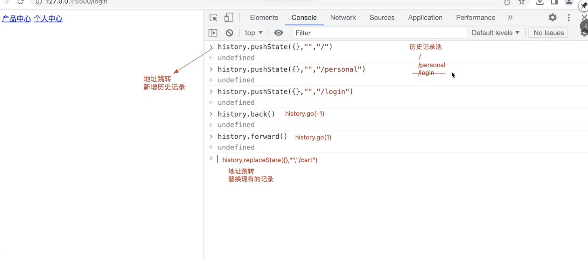
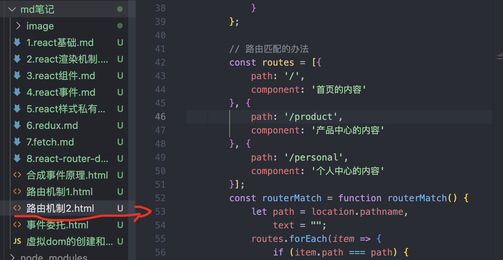
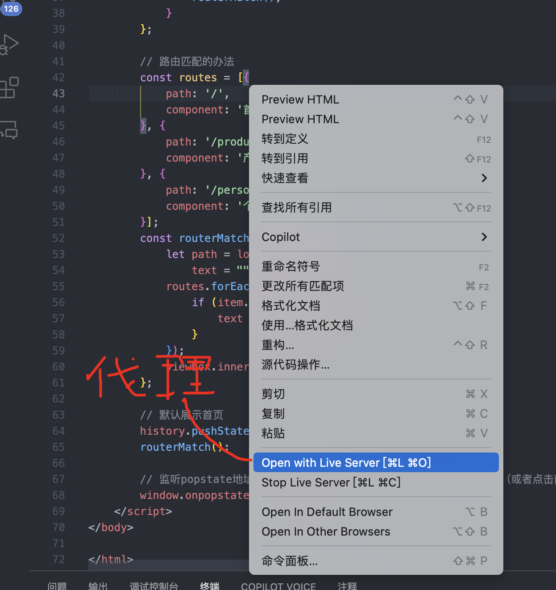

### 1.  路由机制hash路由

```html
// 关键步骤
	1. location.hash --> 获取hash值，
	2. window.onhashchange --> 当hash值变化，进行重新匹配路由表
	3. 路由表进行hash匹配
<body>
    <nav class="nav-box">
        <a href="#/">首页</a>
        <a href="#/product">产品中心</a>
        <a href="#/personal">个人中心</a>
    </nav>
    <div class="view-box"></div>

    <!-- IMPORT JS -->
    <script>
        /*
        HASH路由 
          + 改变页面的哈希值（#/xxx），主页面是不会刷新的
          + 根据不同的哈希值，让容器中渲染不同的内容「组件」
        */
        // 获取渲染内容的容器
        const viewBox = document.querySelector('.view-box');
        // 构建一个路由匹配表：每当我们重新加载页面、或者路由切换（切换哈希值），都先到这个路由表中进行匹配；根据当前页面的哈希值，匹配出要渲染的内容(组件)！！
        const routes = [{
            path: '/',
            component: '首页的内容'
        }, {
            path: '/product',
            component: '产品中心的内容'
        }, {
            path: '/personal',
            component: '个人中心的内容'
        }];

        // 路由匹配的办法
        const routerMatch = function routerMatch() {
            let hash = location.hash.substring(1),
                text = "";
            routes.forEach(item => {
                if (item.path === hash) {
                    text = item.component;
                }
            });
            viewBox.innerHTML = text;
        };

        // 一进来要展示的是首页的信息，所以默认改变一下HASH值
        location.hash = '/';
        routerMatch();

        // 监测HASH值的变化，重新进行路由匹配
        window.onhashchange = routerMatch;
    </script>
</body>

</html>
```

### 2. 路由机制 history路由

```html
1. history给url添加地址，不会刷新页面
2. location.pathname获取地址
3. window.onpopstate监听地址变化
4. 但是如果页面刷新，这个地址是不存在的（pushState改变了原来的地址，改变后的地址是不存在的），会报404错误！！此时我们需要服务器的配合：在地址不存在的情况下，也可以把主页面内容返回！
<body>
    <nav class="nav-box">
        <a href="/">首页</a>
        <a href="/product">产品中心</a>
        <a href="/personal">个人中心</a>
    </nav>
    <div class="view-box"></div>

    <!-- IMPORT JS -->
    <script>
        /*
        History路由{浏览器路由} 
          + 利用了H5中的HistoryAPI来实现页面地址的切换「可以不刷新页面」
          + 根据不同的地址，到路由表中进行匹配，让容器中渲染不同的内容「组件」
        问题：我们切换的地址，在页面不刷新的情况下是没有问题的，但是如果页面刷新，这个地址是不存在的，会报404错误！！此时我们需要服务器的配合：在地址不存在的情况下，也可以把主页面内容返回！！
        */
        const viewBox = document.querySelector('.view-box'),
            navBox = document.querySelector('.nav-box');

        // 点击A实现页面地址切换，但是不能刷新页面
        navBox.onclick = function (ev) { // 事件委托
            let target = ev.target;
            if (target.tagName === 'A') {
                ev.preventDefault(); //阻止A标签页面跳转&刷新的默认行为
                history.pushState({}, "", target.href); // 跳转到对应的地址，不刷新页面
                // 直接去路由匹配
                routerMatch();
            }
        };

        // 路由匹配的办法
        const routes = [{
            path: '/',
            component: '首页的内容'
        }, {
            path: '/product',
            component: '产品中心的内容'
        }, {
            path: '/personal',
            component: '个人中心的内容'
        }];
        const routerMatch = function routerMatch() {
            let path = location.pathname, // 获取变化的路由地址
                text = "";
            routes.forEach(item => {
                if (item.path === path) {
                    text = item.component;
                }
            });
            viewBox.innerHTML = text;
        };

        // 默认展示首页
        history.pushState({}, "", "/");
        routerMatch();

        // 监听popstate地址变化事件；此事件：执行go/forward/back等方法（或者点击前进后退按钮）可以触发，但是执行pushState/replaceState等方法无法触发（所以在上面进行history.pushState后自己去路由匹配routerMatch）！！
        window.onpopstate = routerMatch;
    </script>
</body>
```

<div style="color:cyan">historyapi</div>




<div style="color:yellow">为什么路由刷新后就404了</div>





```jsx
/ 原因
图上的路由机制二，经过代理到浏览器上地址应该是:http://127.0.0.1:5500/react-demo/md笔记/路由机制2.html，但是经过pushstate的地址是http://127.0.0.1:5500/ ，所以刷新后，找不到对应的地址，所以需要在刷新后，在页面不存在的情况下，让服务器返回主页面的地址
```

### 3. React-router-dom基本语法

```jsx

/**
 * 路由地址匹配的规则
 * 非精准匹配：只要path中包含路由地址，就可以匹配上
 * 精准匹配：路由地址和path指定的值一模一样，才可以匹配上
 * /a1/ --> /a1是一个整体，不是值得/a和/a1
 *  页面地址    路由地址    非精准匹配  精准匹配
 *  /           /          匹配        匹配
 *  /           /a         不匹配      不匹配
 *  /a          /          匹配        不匹配
 *  /a/b        /a         匹配        不匹配
 *  /a/b        /a/b       匹配        匹配
 *  /a1/b        /a         不匹配      不匹配
 */ 


	/ 基本语法

 1.基于HashRouter将所有的组件进行包裹 
  + HashRouter会自动给地址加上#号http://127.0.0.1:8080/#/】，开启hash路由
  + Router和Link都需要基于HashRouter使用
 
 2. Link: 用于实现跳转的组件
  + 最后渲染的还是a标签
  + 可以根据路由模式[hash或者history模式]，自动给a标签加上href属性
  + to属性值是一个对象，可以设置对应的跳转地址
 
 3.component: 用于实现路由匹配需要渲染的组件
   + <Route path='/' component={A} />当path值为/的时候，渲染A组件
   + 页面地址为/b的时候，/和/b都会匹配上，所以会渲染/组件和b组件
      + 解决方案：精准匹配exact + switch
          + <Route exact path='/' component={A} />当path值为/的时候，渲染A组件
   + switch确保路由中只有一项被匹配到，匹配到后就不再向下匹配了		

 4. Redirect: 重定向
       to属性跳转到什么地址去 ，
       from属性表示从什么地址来再to到什么地址去，from不写表示无论从什么地址来，都重定向到什么地址去
       exact属性表示对from地址进行精准匹配          


import { HashRouter ,Route, Switch, Redirect, Link} from "react-router-dom";
const NavBox = styled.nav`
  display: flex;
  justify-content: space-around;
  align-items: center;
  height: 50px;
  background-color: #ccc;
  a {
    color: #000;
    font-size: 20px;
  }
`;
const App = function App() {
  return (
    <HashRouter>
        <NavBox>
            <Link to="/">A</Link>
            <Link to="/b">B</Link>
            <Link to="/c">C</Link>
        </NavBox>
        {/* 每一次①页面加载或者②路由切换，都会根据当前的hash值，到这里和每一个路由进行匹配，把匹配的组件放入到容器中渲染*/}
        <div className="box">
            {/* 
                switch确保路由中只有一项被匹配到，匹配到后就不再向下匹配了
                extact: 精准匹配
             */}
            <Switch> 
                {/* 这里使用switch如果不存在地址，就会匹配到Redirect上，如果不使用switch，还会向下匹配，最后什么都没有 */}
                <Route exact path='/' component={A} />
                <Route path='/b' component={B} />
                <Route path='/c' component={C} />
                {/*  <Route path='/*' component={404} /> 以上都不匹配进行匹配*/}
               
                <Redirect to='/'></Redirect>
            </Switch>
        </div>
    </HashRouter>
  );
}
export default App;

/ 使用render代替component
<Route exact path='/' render={()=>{
    // 当路由地址匹配后，先把render函数执行，render函数的返回值作为组件渲染到页面中
    // render函数中可以写一些逻辑代码，比如权限判断，如果有权限就渲染组件，没有权限就跳转到登录页
  }}/>
```

### 4. 多级路由

```jsx
  /*父组件*/
	 <HashRouter>
        <NavBox>
            <Link to="/">A</Link>
            <Link to="/b">B</Link>
            <Link to="/c">C</Link>
        </NavBox>
        <div className="box">
            <Switch> 
                <Redirect exact from='/' to='/a'/>   
                <Route path='/a' component={A} />
                <Route path='/b' component={B} />
                <Route path='/c' component={C} />
                <Redirect to='/'></Redirect>
            </Switch>
        </div>
    </HashRouter>

/*子组件*/
    <div>
      <h1>A</h1>
      <NavBox>
        {/* 子组件不需要使用HashRoute进行包裹 */}
        <Link to="/a/a1">A1</Link>
        <Link to="/a/a2">A2</Link>
        <Link to="/a/a3">A3</Link>
      </ NavBox>
      <Switch>
        		{/*二级路由地址需要带上一季路由地址*/}
            <Redirect exact from="/a" to="/a/a1" />
            <Route path="/a/a1" component={A1} />
            <Route path="/a/a2" component={A2} />
            <Route path="/a/a3" component={A3} />
     </Switch>
    </div>
```

### 5. 路由表

```jsx
/ 对路由进行统一管理,像vue一样写在一个文件中统一管理
路由表就相当于vue中的router-view
react-router-dom v5需要在每个组件中对路由进行管理，比如app管理一级路由，app下面的a组件管理二级路由
建立公共组件渲染路由表，
```

#### 5.1. 创建路由表

<div style="color:cyan">将路由表渲染为一个组件</div>

```js
// 调用组件，基于属性传递路由表进来，更具路由表动态生成路由(这一套相当于vue中的router-view)
import React,{Suspense} from 'react';
import { Route, Switch ,Redirect} from 'react-router-dom';
const RouterView = (props) => {
    let { routes } = props; // 获取传递的路由表
    return <>
        <Switch>
            {
                // 循环设置路由规则
                routes.map((item, index) => {
                    //Component组件return，前字母必须要大写
                    let {redirect,path,component:Component,exact,from,meta,children,name ,to} = item
                    let config = {}
                    
                    if(redirect){
                        // 重定向规则
                        config = {to}
                        if(from) config.from = from;
                        if(exact) config.exact = true;
                        return <Redirect key={index} {...config} />
                    }else{
                        // 正常匹配规则
                        config = {path}
                        if(exact) config.exact = true;

                        return <Route key={index} {...config} render={
                            ()=>{
                                return <>
                                  {/*Suspense用于实现懒加载，因为不能保证一进来懒加载的组件渲染完成*/}
                                  <Suspense>
                                    {Component && <Component/>}
                              		</Suspense>
                                </>
                            }
                        }/>
                    }
                })
            }
        </Switch>
    </>
} 
export default RouterView;
```


<div style="color:cyan">一级路由表</div>

```js
// react路由表
/**
		可以自定义需要渲染的信息
     * redirect 重定向
     * path 路径
     * component 组件
     * exact 是否严格匹配
     * from 重定向路径
     * exact 是否严格匹配
     * meta 路由元信息  
     * children 子路由
     * name 路由名称
     * to 重定向路径
 */

// 一级路由
import A from "../views/A" 
import B from "../views/B"
import C from "../views/C"
import aRoutes from "./aRoutes"
const routes = [
    {
        redirect: true,
        from: '/',
        to: '/a',
        exact: true
    },
    {
        path: '/a',
        component: A,
        name: 'A',
        children: aRoutes
    },
    {
        path: '/b',
        component: B,
    },
    {
        path: '/c',
        component: C,
    },
    {
        redirect: true,
        to: '/a',
    }
]
export default routes
```


<div style="color:cyan">二级路由表</div>

```js
// 二级路由
import A1 from "../views/a/A1"
import A2 from "../views/a/A2"
import A3 from "../views/a/A3"
 const routes = [
        {
            redirect: true,
            from: '/a',
            to: '/a/a1',
            exact: true
        },
        {
            path: '/a/a1',
            component: A1,
            exact: true,
            name: 'A1',
        },
        {
            path: '/a/a2',
            component: A2,
            name: 'A2',
        },
        {
            path: '/a/a3',
            component: A3,
            name: 'A3',
        }
    ]
export default routes
```

#### 5.2. 使用路由表

<div style="color:cyan">在app中使用一级路由表</div>

```jsx

import routes from "./router/routes"; // 一级路由表
import RouteView from "./router"; // 渲染路由表的组件
const App = function App() {
  return (
    <HashRouter>
        <NavBox>
            <Link to="/">A</Link>
            <Link to="/b">B</Link>
            <Link to="/c">C</Link>
        </NavBox>
        <div className="box">
          {/*渲染一级路由表*/}
                <RouteView routes={routes} />
        </div>
    </HashRouter>
  );
}
export default App;
```

<div style="color:cyan">在a组件中使用二级路由表</div>

```jsx

import routes from "../router/aRoutes"; // 二级路由表
import RouteView from "../router";
function A() {
  return (
    <div>
      <h1>A</h1>
      <NavBox>
        {/* 子组件不需要使用HashRoute进行包裹 */}
        <Link to="/a/a1">A1</Link>
        <Link to="/a/a2">A2</Link>
        <Link to="/a/a3">A3</Link>
      </ NavBox>
      {/*渲染二级路由表*/}
      <RouteView routes={routes} />
    </div>
  );
}
export default A;
```

### 6. 路由懒加载

<div style="color:cyan">使用路由懒加载</div>

```js
1. 没有进行懒加载的路由，最后都会打包在一起，从服务器加载资源会导入的资源会导致加载很慢
2. 进行懒加载的路由会分割为多个模块，利于treesharking，利于页面加载优化，页面加载的时候只加载需要的资源，路由加载的时候，导入需要的资源，这样页面的性能会更好
// 使用lazy函数 + Suspense进行懒加载
 import {lazy} from "react"
 {
        path: '/a',
        component: A, // 第一次进来需要加载a组件，可以不用做懒加载
        name: 'A',
        children: aRoutes
    },
    {
        path: '/b',
        component:lazy(() => import("../views/B")) // 使用懒加载组件
    },
      
 // 异步加载组件需要使用Suspense进行包裹路由组件（因为一进来不能保证组件渲染完毕，）
      
  // 在公共路由组件中把组件进行包裹
       <Suspense   fallback={}>
         {Component && <Component/>}
      </Suspense>
ps:fallback可以在组件没有渲染完成之前进行处理
```


<div style="color:cyan">将模块或者逻辑相同的模块打包到一个js文件中</div>

```js
// 如何将几个路由懒加载组件打包到一个里面js里面
// 使用/* webpackChunkName:"AcChild" */ 指定webpack打包后的名字，名字相同的打包到一个文件中
 {
            path: '/a/a1',
            component: A1,
            exact: true,
            name: lazy(() => import(/* webpackChunkName:"AcChild" */"../views/a/A1")),
        },
        {
            path: '/a/a2',
            component: lazy(() => import(/* webpackChunkName:"AcChild" */"../views/a/A2")),
            name: 'A2',
        },
        {
            path: '/a/a3',
            component: lazy(() => import(/* webpackChunkName: "AcChild" */"../views/a/A3")),
            name: 'A3',
        }
```

### 7. 在组件中使用路由信息

#### 7.1 如何获取

```jsx
1. 在react-router-dom v5中基于Route渲染的组件(类似这样的：<Route path="/" component={a}>)，会默认给组件传递三个props属性
	+ history
	+ location
  + match
  // ps :<Route path="/" component={a}> 会给这样的组件传递三个属性,组件中可以通过props/this.props拿去这三个属性值

 2. render渲染的组件
    <Route path="/" render={(props)=>{
      return <A {...props}></A>
    }}>
      // 需要自己传递给组件
 
  3.  可以使用react-router-dom提供的hooks函数获取这三个属性（类组件不能使用hook函数）
	import {useRouteMatch, useHistory, useLocation} from "react-router-dom"
	 ps：必须在HashRouter/BrowerRouter组件中包裹的函数组件才能使用


```

#### 7.2. app.jsx根组件如何获取路由信息

```jsx
/ app.js获取不到路由信息，但是Link可以单独拆分出来一个组件（HomeHead），获取路由信息
const App = function App() {
  return (
    <HashRouter>
        <HomeHead />
        <div className="box">
           <RouteView routes={routes} />
        </div>
    </HashRouter>
  );
}
export default App;
```


<div style="color:cyan">函数组件HomeHead获取路由信息</div>

```jsx

因为app.jsx不在HashRouterBrowserRouter包裹中，有不是Route中渲染的组件，所以app.jsx中获取不到 history 、location、match，需要将app.jsx 中的link单独拆分出来为一个组件(也可以用HashRouterBrowserRouter将app.jsx进行包裹)，因为器在HashRouter中，所以可以获取路由的信息
	// 导航组件
      /**
       * 只要在hashRouter/browserRouter包裹中的组件，都可以使用{useRouteMatch,useLocation,useHistory}这三个hooks(函数组件)即便这个组件不是基于Route匹配上的组件
          但是只有在Route中渲染的组件才能通过props获取到history,location,match这三个对象
      */
      function HomeHead(){ // 这也不是基于Route渲染的值
          return <NavBox>
                  <Link to="/">A</Link>
                  <Link to="/b">B</Link>
                  <Link to="/c">C</Link>
              </NavBox>
      }
      export default HomeHead;
```


<div style="color:cyan">类组件HomeHead获取路由信息</div>

```jsx
/ 这个组件没有经过Route匹配，又不能使用hooks函数，如何获取路由信息呢
1.解决办法1：基于函数高阶组件使用
import {useRouteMatch, useHistory, useLocation} from "react-router-dom";
class HomeHead extends React.Component{ 
         render(){
          console.log("props",this.props)
           return <NavBox>
                  <Link to="/">A</Link>
                  <Link to="/b">B</Link>
                  <Link to="/c">C</Link>
              </NavBox>
         }
      }

const HomeHeadFn = (Component)=>{
  return function HOC(props){
     const match = useRouteMatch();
      const history = useHistory();
      const location = useLocation();
      let info = {
        match,
        history,
        location
      }
     return <Component {...props} {...info}/>
  }
}
export default HomeHeadFn(HomeHead)

2. 解决办法二： withRouter高阶组件（react-router-dom v5版本中）
// 原理就是方法一的高阶组件
import {withRouter} from "react-router-dom";
class HomeHead extends React.Component{ 
         render(){
          console.log("props",this.props)
           return <NavBox>
                  <Link to="/">A</Link>
                  <Link to="/b">B</Link>
                  <Link to="/c">C</Link>
              </NavBox>
         }
      }

export default withRouter(HomeHead)
```


#### 7.3 路由的跳转

```jsx
/*
	路由的跳转有两种方式：
		1. 基于Link跳转 to属性可以传参
		2. 基于编程式导航进行跳转 history.push
*/

// history常用的api
1.go: ƒ go(n) // 指定前进几步
2.goBack: ƒ goBack() // 指定后退几步
3.goForward: ƒ goForward() // 前进一步
4.push: ƒ push(path, state)  // 新增历史记录，跳转到指定路由
5.replace: ƒ replace(path, state) // 替换一条历史记录替换当前的历史记录，跳转到指定路由

// location常用api
1. hash: ""
2. pathname: "/a/a3" // 当前路径地址
3. search: "" // 路由传参接收
4. state: undefined // 路由隐式传参接收

// match常用的api
1.isExact: false // 是否精准匹配
2.params: {} // 路径参数
```

#### 7.4.路由的传参

```jsx
1. 路由传参数有三种方案
	+ ？传参
	+ 路由传参：把要传递的参数作为路由中的一部分
	+ 隐式传参
```


<div style="color:cyan">?传参的三种方案</div>

```jsx

1. ？传参的三种方案
/*？传参数的特点：
		①会出现在地址页上，
		②长度限制，
		③不安全，
		④即便路由刷新也会存在于地址栏上
		*/

①.通过?直接传参数
	history.push("/c?id=100&name='yan'")

②. 通过search传参(参数必须为urlencoded字符串)
  history.push({
    pathname:"/c",
    search:"id=100&name='yan'"
  })

③. 通过qs库转换对象为urlencoded对象实现传参
import qs from "qs"
history.push({
    pathname:"/c",
    search:qs.stringify({
      id:100,
      name:"yan"
    })
  })

2. 获取？传递的参数
	①使用location中的search获取传递的值
		// 通过qs.parse将urlencoded字符串转换为对象
	import qs from "qs"
  const location = useLocation() // search: "?id=1&name=%E5%BC%A0%E4%B8%89"
  let params = qs.parse(location.search.slice(1)) // 转换为obj对象
  
  	// 除了也可以通过new URLSearchParams(location).get('id')也可以获取传递的值 
```

<div style="color:cyan">路由传参</div>

```jsx
1.传递参数 

 ps: 参数也在地址栏中，浏览器刷新也不会消失
	// 修改路由正则表，
    {
            path: '/c/:id?/:name?', // ? 表示当前参数可以传也可以不传
            component: lazy(() => import("../views/B")),
        },
          
   // 传递参数
          history.push("/c/1/张三")

2. 获取参数
	①. 使用useRouterMatch中的params可以获取传递的参数对象
    import {useRouteMatch ,useParams} from "react-router-dom"
    let  params = useRouteMatch().params	
  
 	②.使用useParams()也可以直接获取值（只适合函数组件）
		let  params = useParams()
  
```

<div style="color:cyan">隐式传参</div>

```jsx
/*
  什么是隐式传惨：
    ①传递的参数不会出现在地址栏中, 
    ②传递的参数在浏览器刷新后就会丢失
  */
1. 如何传递参数
   history.push({
            pathname:"/c",
            state:{
              id:1,
              name:"张三"
            }
          })

2. 获取参数：使用useLocation中的state可以获取对象的值
let  params = useLocation().state
	
  
```

### 8.Link和NavLink的区别

```jsx
1.  NavLink会每一次页面加载或者路由跳转后将当前的路由地址和NavLink的to进行匹配，匹配到的值会加上class="active"
		+ 作用：给选中的导航添加选中的样式

    // ps: /b会匹配/和/b，所以根据情况加exact 
      <NavBox>
  			{/*通过activeClassName="yan"将匹配到的class：avtive的改成class:yan*/}
        <NavLink to="/a" activeClassName="yan">A</NavLink>
      	<NavLink to="/b">B</NavLink>
      	<NavLink to="/c">C</NavLink>
      </NavBox>
```

### 9.  react-router-dom v6

```jsx
// 区别
	1.移除了
  	Switch --> 代替方案：Routes默认匹配完成一个就不再向下匹配了代替了switch
    Redirect --> 代替方案： Navigator 
    WithRouter --> 代替方案： 自己写一个高阶组件
    render，component --> 代替方案 element ={<A></A>} // 不能直接放入A进行渲染了
		exact---> 代替方案Routes（Routes里面的Route每一项匹配都是精准匹配)）
    二级路由中的Link手动跳转 --> Navigate （遇到这个组件就会跳转） ->  跳转改为<Navigate to=""/>
    useHistory --> 使用useNavigator替代
    useRouterMatch --> 使用useParams替代
    
  2. 多级路由不能像v5版本一样，分散到各个组件中去书写路由，而是统一写在一起
  
  3.  v6和v5的隐式传参不一样，刷新后仍然可以拿到对应的值，不会丢失
```

#### 9.1 基本使用

```jsx
 // 基本使用
/*
	 Navigator中的to重定向到相应的地址，replace也是重定向到相应的地址（会替换当前地址）
	 to也可以是一个对象 to;{
	 		pathname:'',
	 		search:""
	 }
*/
<Routes>
  <Route path="/" element={<Navigate to="/a" />} />
  <Route path="/a" element={<A/>} />
  <Route path="/b" element={<B/>} />
  <Route path="/c" element={<C/>} />
  <Route path="*" element={<Navigate to="/a" />} />
</Routes>
```

#### 9.2 多级路由

```jsx
// 多级路由不能像v5版本一样，分散到各个组件中去书写路由，而是统一写在一起

// app.jsx 统一放置所有路由
	 <Routes>
    <Route path="/" element={<Navigate to="/a" />} />
    <Route path="/a" element={<A/>} >
      {/*在一级路由下，构建二级路由组件*/}
      <Route path="/a" element={<Navigate to="/a/a1" />} />
      <Route path="/a/a1" element={<A1/>} />
      <Route path="/a/a2" element={<A2/>} />
      <Route path="/a/a3" element={<A3/>} />
    </Route>
    <Route path="/b" element={<B/>} />
    <Route path="/c" element={<C/>} />
    <Route path="*" element={<Navigate to="/a" />} />
</Routes>

// A.jsx需要渲染二级路由需要用到<Outlet>容器，渲染到的路由组件会放入到<Outlet>容器中，相当于<router-view>
 <div>
      <h1>A</h1>
      <NavBox>
        <NavLink to="/a/a1">A1</NavLink>
        <NavLink to="/a/a2">A2</NavLink>
        <NavLink to="/a/a3">A3</NavLink>
      </ NavBox>
      <Outlet></Outlet>
    </div>


```

#### 9.3. 路由传参

​	

```jsx
// 在react-router-dom v6中即便当前组件是基于<Route>进行渲染的，也不能通过props获取路由信息（history，match，location），想获取信息只能通过hook函数获取
```

<div style="color:cyan">?问号传参数</div>

```jsx
1. ？传参的三种方案
/*？传参数的特点：
		①会出现在地址页上，
		②长度限制，
		③不安全，
		④即便路由刷新也会存在于地址栏上
		*/

①.通过?直接传参数
	navigate("/c?id=100&name='yan'")

②. 通过search传参(参数必须为urlencoded字符串)
  navigate({
    pathname:"/c",
    search:"id=100&name='yan'"
  })

③. 通过qs库转换对象为urlencoded对象实现传参
import qs from "qs"
navigate({
    pathname:"/c",
    search:qs.stringify({
      id:100,
      name:"yan"
    })
  })

2. 获取？传递的参数
	①使用location中的search获取传递的值
		// 通过qs.parse将urlencoded字符串转换为对象
	import qs from "qs"
  import {useLocation} from "react-router-dom"
  const location = useLocation() // search: "?id=1&name=%E5%BC%A0%E4%B8%89"
  let params = qs.parse(location.search.slice(1)) // 转换为obj对象
  
  	// 除了qs也可以通过new URLSearchParams(location).get('id')也可以获取传递的值 
  
  ②使用useSearchParams获取参数
  import {useSearchParams} from "react-router-dom"
    function C() {
      let  [usp] = useSearchParams() // 返回一个数组
      let id = usp.get("id") // 使用get方法获取对应的值
      let name = usp.get("name")
      return (
        <div>
          <h1>C</h1>
          <h2>B组件传递的值:id:{id}  name:{name}</h2>
        </div>
      );
    }
```

<div style="color:cyan">路由传惨</div>

```jsx
1.传递参数 

 ps: 参数也在地址栏中，浏览器刷新也不会消失
	// 修改Route中的path属性
 	 <Route path="/c/:id?/:name?" element={<C/>} />
    
          
   // 传递参数
          navigate.push("/c/1/张三")

2. 获取参数
  ①使用useParams()也可以直接获取值（只适合函数组件）
		let  params = useParams()
```

<div style="color:cyan">隐式传惨</div>

```jsx
/*
  v6和v5的隐式传参不一样，刷新后仍然可以拿到对应的值，不会丢失
  */
1. 如何传递参数
   navigate("/c",{
     // replace:true,// 替换现有的地址
     state:{ 
       id:1,
       name:"yan"
     }
   })

2. 获取参数：使用useLocation中的state可以获取对象的值
let  params = useLocation().state
```

### 10. 构建路由表 v6

```
可以使用v6 路由中的的useRoutes渲染一套路由表，也可以使用自己的方式渲染路由表
```

#### 10.1 创建路由表

```jsx
// react路由表
/**
 * path 路径
 * component 组件
 * from 重定向路径
 * meta 路由元信息  
 * children 子路由
 * name 路由名称
 * to 重定向路径
 */
import { Navigate } from "react-router-dom"
import A from "../views/A" 
// 使用lazy进行懒加载
import {lazy} from "react"
const routes = [
    {
        component:()=><Navigate to="/a"/>, // 函数包裹，组件没有直接调用，
        from: '/',
        to: '/a'
    },
    {
        path: '/a',
        component: A, // 第一次进来需要加载a组件，可以不用做懒加载，A表示组件没有被调用，<A/>表示组件被直接调用
        name: 'A',
        children: [
            {
                path: '/a',
                component:()=> <Navigate to='/a/a1' />
            },
            {
                path: '/a/a1',
                component: lazy(() => import("../views/a/A1")),
                name: 'A1',
                meta: {
                    title: 'A1'
                }
            },
            {
                path: '/a/a2',
                component: lazy(() => import("../views/a/A2")),
                name: 'A2',
                meta: {
                    title: 'A2'
                }
            },
            {
                path: '/a/a3',
                component: lazy(() => import("../views/a/A3")),
                name: 'A3',
                meta: {
                    title: 'A3'
                }
            },
        ]
    },
    {
        path: '/b',
        component: lazy(() => import("../views/B")),
    },
    {
        path: '/c/:id?/:name?',
        component: lazy(() => import("../views/C")),
    },
    {
        path: '*',
        component:()=> <Navigate to='/a' />
    }
]
export default routes
```

#### 10.2.渲染路由表

```jsx
import { Suspense } from "react"
import routes from "./routes"
import { Routes,Route ,useNavigate,useLocation,useParams,useSearchParams} from "react-router-dom"

function Element(props){ //当路由匹配成功，调用该组件 ，可以用于做动态校验/权限，传递属性,Component才是真实要渲染组件
    let {component:Component} = props
    // 把路由信息传递给组件（这样类组件也可以拿到信息）
    let usp = useSearchParams()
    let state = {
         navigate: useNavigate(),
         location: useLocation(),
         params: useParams(),
         usp: usp
    }
    // ps：非动态路由，拿不到这里的state的值
    return <Component {...state} /> 
}   
function createRoutes(routes) {
    return <>
            {
                routes.map((item,index) => {
                    if(item.children){
                      return <Route key={item.path + index} path={item.path} element={<Element {...item} />}>
                             {createRoutes(item.children)}
                        </Route>
                    }else{
                        return <Route key={item.path + index} path={item.path} element={<Element {...item} />} /> 
                    }
                })
            }
        </>
}

export  default function RouterView(){
   return <Suspense>
                <Routes>
                    {createRoutes(routes)}
                </Routes> 
        </Suspense>
}
```

