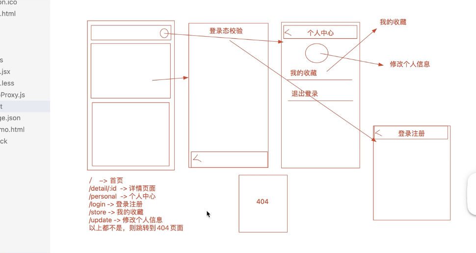
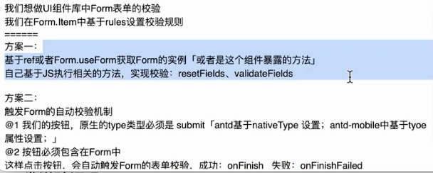
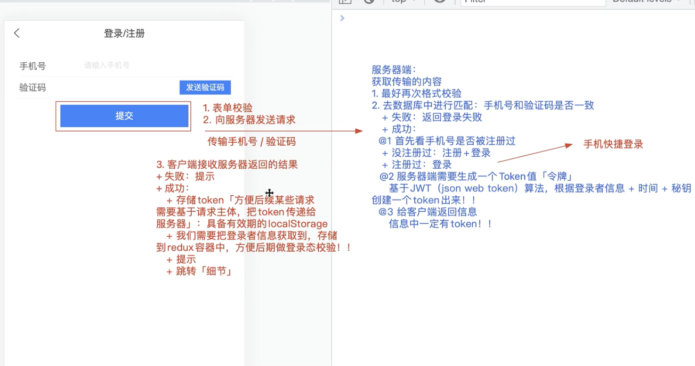
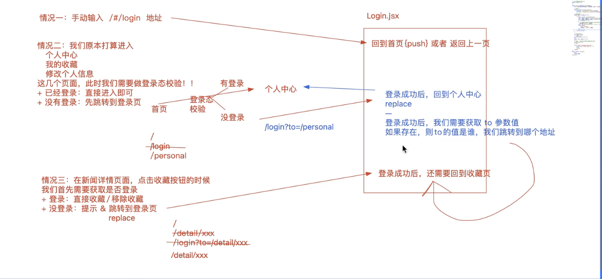
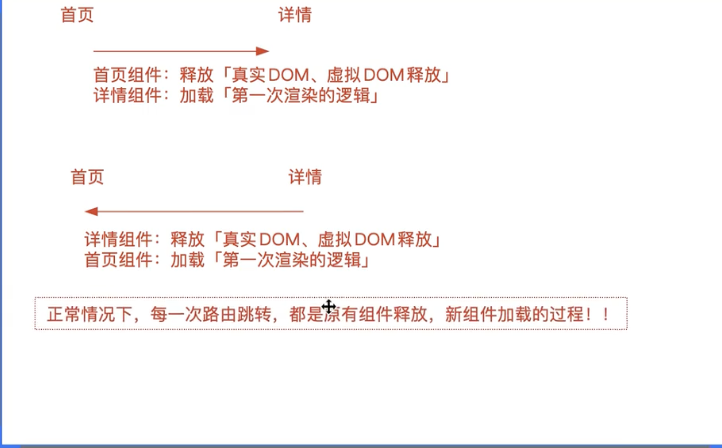

### 1. 项目启动前准备

```pseudocode
知乎日报-WebApp  zhihu
  技术栈：create-react-app、React18、redux/react-redux「你可以使用mobx或者reduxjs/toolkit」、react-router-dom V6、Fetch、less、AntdMobile...

从零开始构建React项目「本项目不采用任何系解决方案（例如：淘系），就是基于最纯正的React实现开发」
  1. 基于create-react-app创建工程化项目
    $ npm i create-react-app -g
    $ create-react-app 项目名
    ---
    $ yarn eject 暴露webpack配置项
    修改脚手架默认的配置
      + 配置less：less/less-loader@8
      + 配置别名 @ 代表 src 目录「选配」
      + 配置浏览器兼容
      + 配置客户端启动服务的信息
      + 配置跨域代理：http-proxy-middleware
      + 配置REM响应式布局的处理：lib-flexible、postcss-pxtorem
      + 配置打包优化
      + ...
  2. 准备一些项目开发必备的材料
    src/api/http.js：fetch请求的二次封装
    src/assets：
      + reset.min.css 清除浏览器默认样式
      + images 静态资源图片
      + utils.js 自己封装的常用方法库
      + ...
  3. 配置好REM响应式布局 && 样式处理
    lib-flexible 设置REM和PX换算比例的
      + 根据设备宽度的变化自动计算
      + html.style.fontSize=设备的宽度/10+'px';
      + 750设计稿中  1REM=75PX : 初始换算比例
      + 375设备上 1REM=37.5PX
    postcss-pxtorem 可以把我们写的PX单位，按照当时的换算比例，自动转换为REM，不需要我们自己算了
    ----
    @1 假设设计稿还是750的，我们测出来多少尺寸，我们写样式的时候，就写多少尺寸，并且不需要手动转换为REM「我们在webpack中，针对postcss-pxtorem做配置，让插件帮我们自动转换」
       const px2rem = require('postcss-pxtorem');
       px2rem({
         rootValue: 75, // 基于lib-flexible,750设计稿,就会设置为1REM=75PX；此时在webpack编译的时候，我们也需要让px2rem插件，按照1REM=75PX，把我们测出来的并且编写的PX样式，自动转换为REM；
         propList: ['*'] // 对所有文件中的样式都生效{AntdMobile组件库中的样式}
       })
    @2 在入口中，我们导入lib-flexible，确保在不同的设备上，可以等比例的对REM的换算比例进行缩放！！
    @3 手动设置：设备宽度超过750PX后，不再继续放大！！

  4. 配置路由管理
  5. 配置redux架子
  6. 其它的基础框架配置
  7. 逐一开发项目，注意组件的抽离封装
  8. 开发完毕后
     + 项目优化
     + 封装提取
     + 内部测试
     + 部署上线 

知乎日报-后端 zhihu_admin
  后端的数据接口分为两部分
    + 从知乎日报官方实时拉取数据「新闻、新闻详情、新闻的评论数...」
    + 自己研发的个人中心系统「登录/注册、发送验证码、个人信息获取和修改、收藏体系...」
  后端技术栈：
    + Node、Express
    + 数据存储：我采用json文件的方式代替了专业的数据库存储「mongodb、MySQL」
  如何启动和配置更改
    @1 跑环境
    @2 在package.json中，修改后端服务的配置项
       "config": {
            "server": 7100, //后端启动服务器的端口号
            "secret": "ZFPX", //和JWT算法相关的
            "maxAge": "7d"
        }
    @3 API.txt 接口文档
       code.txt 存储发送的手机验证码
    @4 启动后端
       $ node server.js   终端窗口关闭，启动的服务器就会停止
       ---
       $ pm2 start server.js --name ZHIHU  基于pm2持久管理服务
    @5 验证后端是否启动成功
       http://127.0.0.1:7100/news_latest 可以获取数据，则说明启动成功
```

### 2. rem

#### 2.1 rem的原理

```html
<!DOCTYPE html>
<html lang="en">
<head>
    <meta charset="UTF-8">
    <!-- 
        移动端开发需要设置viewport要设置，如果不设置，浏览器会按照980的宽度渲染页面，手机宽度不足980，整个页面会整体缩小 
        width=device-width html的渲染宽度和设备宽度一致
        initial-scale=1.0 初始缩放比例，不放大也不缩小
        minimum-scale=1.0 最小缩放比例，不允许用户缩小到比1.0更小的比例
        maximum-scale=1.0 最大缩放比例，不允许用户放大到比1.0更大的比例
        user-scalable=no 禁止用户缩放
    -->
    <meta name="viewport" content="width=device-width, initial-scale=1.0,minimum-scale=1.0,maximum-scale=1.0,user-scalable=no">
    <link rel="stylesheet" href="../../react-demo/src/assets/reset.min.css" />
    <title>Document</title>
    <style>
        /*
            实现rem开发的步骤
            1. 找到参照比例（找到设计稿的宽度，一般为750px），在这个比例下给予html中的font-size一个初始值(这个初始值就是1rem的大小)
               + html{
                    // 750px的设计稿中1rem = 100px
                    // 未来我们要将设计稿中测量的尺寸(px单位)转换为rem单位去设置样式
                     font-size: 100px; 
                  }
            2. 根据当前设备的宽度，计算相对于设计稿750的比例缩放的比例（因为设计稿为750），让rem的转换比例也跟着缩小【rem和px的换算比例修改，之前相对于rem为单位的样式也需要缩小】

            3. 一般还会给页面设置最大宽度，比如750px，这样当设备宽度超过750px时，不让rem比例继续变大，内容居中，左右留白
            */
            html{
                font-size: 100px;
            }
  
            #root{ /*设置页面最大宽度*/
                max-width: 750px;
                margin: 0 auto;
            }
            .box{
                width: 2rem;
                height: 2rem;
                border:1px solid black;
                background-color: red;
            }
    </style>
</head>
<body>
    <div id="root">
        <div class="box">box</div>
    </div>
    <script>
        (function(){
            const computed =()=>{// 1. 获取当前设备的宽度
                var deviceWidth = document.documentElement.clientWidth;
                // 2. 计算当前设备宽度和设计稿宽度的比例
                // 3. 如果当前设备大于设计稿的宽度，就让比例等于设计稿的宽度
                if(deviceWidth > 750){
                    deviceWidth = 750;
                }
                var scale = deviceWidth / 750;
                // 4. 设置html的font-size
                document.documentElement.style.fontSize = scale * 100 + 'px';
            }
            computed();
            window.addEventListener('resize',computed);
        })();
   
    </script>
</body>
</html>
```

#### 2.2. lib-flexible、 postcss-pxtorem

```jsx
// 使用（假设设计稿为750px，我们测出来多少尺寸就写多少尺寸，不需要自己转换rem）
1. lib-flexible 用于设置rem和px的比例
	+ 根据设备比例自动换算
	+ html.style.fontSize = 当前设备/10 + "px"
  + 750的设计稿上1rem为75px
  + 350的设备上1rem为37.5px

2. postcss-pxtorem 可以将px单位按照rem和px的比例，自动换算为rem，就不需要自己换算了

// 使用 
1. webpack中需要对 postcss-pxtorem
	① 在webpack中导入postcss-loader，然后进行配置设置
	 px2rem({
     rootValue: 75, // 因为当前设计稿为750，lib-flexible默认转换1rem为75px
     propList: ['*'], // 以px为单位，对所有文件都转换为rem「包括ant-moblie中的组件」，ant-moblie也是以75单位进行设置的
     selectorBlackList: ['html'],
   }),
 
2. 在入口文件中导入lib-flexible，保证所有组件都可以等比例缩放
 		需要在index.jsx根目录中引用 lib-flexible
		 // ps：浏览器切换模拟器发现大于540px的时候，根目录最大的font-size为54px，比如750的设计稿最大也为54px,这个是不影响的
			// 1.为什么不影响，因为在手机端，不会去更改大小，默认经过下图的3的处理默认就可以超过54px
			// 2.如果你想要开发的时候切换模拟器，可以吧源码拉下来copy一份，改成750就可以了
  
   

3. 手动设置超过750宽度的处理方式
	// 	js设置最大的宽度，因为设置了px会自动转换为rem 
      (function(){
      const handleMAX = function(){
        let html = document.documentElement;
        let root = document.getElementById('root');
        let width = html.clientWidth;
        root.style.maxWidth ='750px'; // 设置最大的宽度，如果设备超过了，也只能显示750px
        if(width > 750){ // 
          html.style.fontSize ='75px'; // 设备超过了也最大显示75px
        }
      }
      handleMAX();
  		// 项目上线的的时候不需要这个 ，因为进去后手机的宽度不会切换了，可以在调试的时候使用
      // window.addEventListener('resize',handleMAX); 
    })()

// 存在问题，样式转换为rem只在less，css等文件夹中生效，在jsx，js等样式写的px没有被转换
	// 如果你想在使用的styled-components中也可以进行rem的转换，可以安装babel-plugin-styled-components-px2rem这个插件
	// 在package.json中配置
"babel": {
    "presets": [
      "react-app"
    ],
    "plugins": [
      [
        "babel-plugin-styled-components-px2rem",
        {
          "rootValue": 75
        }
      ]
    ]
  }


```

### 3. 路由骨架



### 4. 触底加载的思想

```jsx
1. 在第一次加载列表的时候(列表数据为0)，触底加载的loading效果不应该显示出来
2. 在第一次加载完毕之后拿去loading组件的ref，用new intesectionObserver进行监听（当元素出现在视图中，或者离开就会触发回调）
3. 当loading组件出现在视图中，加载下一条数据，并且将它添加到第一条加载的数据中
4. 组件缓存，避免加载后，跳转再回来，加载的数据不在了（数据刷新了）
 useEffect(()=>{
        // 创建监听器(用来监听元素是否进入了设备的可视区域之内（比如滚动到底，看到loadmore了就会触发回调函数，离开也会触发回调)
        let ob = new IntersectionObserver( async changes=>{
           let {isIntersecting} = changes[0]; // 为false表示在视野外，为true表示在视野内(触底了)
           if(isIntersecting){
                // 获取当前的新闻就可以拿到昨天的新闻
                try{
                  let time = newsList[newsList.length - 1].date; 
                  let res = await getBeforeNews(time)  // 获取下一条数据
                  newsList.push( // 将这条数据添加到第一条中
                        {
                            date:res.date,
                            stories:res.stories
                        }
                  )
                  setNewsList([...newsList]) // 解构为新数组，因为newsList赋值了，两边值一样useSteate不会更新视图
                } catch(err){
          
                }

           }
        })
        ob.observe(loadMore.current)
        return ()=>{ // 组件卸载和释放的时候，取消监听
            ob.disconnect()
        }
    },[])

		{/* 加载更多,display:none方便在第一次渲染完成拿到dom */}
	<div style={{ display:newsList.length>0?'block':'none'}} className="load_more" ref={loadMore} >
 		 正在加载中<DotLoading ></DotLoading>
	</div>

```

### 5. 将html插入到jsx文件中

```
dangerouslySetInnerHTML={{__html:需要插入的html}}
```

### 6..useState拿去更新后的元素

```jsx
// 使用flushSync获取 
useEffect(()=>{
        (async ()=>{
            // 获取新闻详情
            try{
                let res = await getNewsDetail(id);
     
                flushSync(()=>{ //视图立马更新
                    setDetail(res)
                    handleStyle(res)
                }) // 组件立马渲染，这虽然handleImage拿不到更新后的值，但是可以拿到更新后的dom【含有更新后的状态值】
                handleImage(res)
     
            }catch(e){
                console.log("detail接口调用失败：",e)
            }
        })()
        return ()=>{ // 移除handleStyle插入的css的样式
            !link || document.head.removeChild(link)
        }
    },[])

// 使用useEffect获取
   useEffect(()=>{
         // 处理传递回来的image图片和css样式
         if(detail){// 为什么不在获取数据的时候执行函数，因为修改状态会更新，这个时候你还拿不到获取回来的html元素，或者你使用flushsync来更新渲染后拿到数据
            handleStyle(detail)
            handleImage(detail)
         }

```

### 7. 表单校验的两种方式

5. 

### 8. 封装loading防抖节流的组件

```jsx
import {useState} from "react"
import { Button } from "antd-mobile"
// 本组件用于发送请求的按钮处理(二次封装)
function ButtonAgain(props){
    let options = {...props}
    let {children,onClick:handle } = options
    // 拿到children将其中options移除掉,因为options是赋值给属性的，children要赋值到组件里面
    delete options.children
  
    /** 
     * 状态 loading控制元素的loading效果
     */
    let [loading,setLoading] = useState(false)
    const clickHandle = async (e)=>{
        setLoading(true)
        // try包裹的原因是因为如果执行失败，也可以将setLoading变为false,因为await执行失败就不会再往后执行了
        // (如果父元素没有返回一个成功的promise实例，就不会将loading改为false,并且页面也会报错)
        try{ 
            await handle() // 拿到父元素的方法执行
        }catch(e){
            setLoading(false)
         }
    }
    if(handle){ // 可能父组件没有onclick属性（有些form组件是哟你的type=submit提交的，就没有这个，所以要用这个方法最好不要用方式）,如果你去执行就会报错
        // 首先明白一点，父组件传递的属性中包含了onclick=xxx,handle是拿到了xxx的方法 ，options.handle就相当于onClick这个属性名
        // 这里就相当于将父组件传递来的onClick=xxx,改成了onclick=clickHandle
        options.handle = clickHandle
    }
    return <Button {...options} loading={loading}>
        {children}
    </Button>
}
export default ButtonAgain
```

### 9. 登陆、跳转细节

<div style="color:cyan">登陆的细节</div>

```
1. 获取token --> 用有时间限制的storage存储(比如查看个人中心就需要token) --> redux存储个人信息 等等
```



<div style="color:cyan">跳转的细节</div>

```jsx
1. 路由replace和push的区别
	`push()`方法会将新的路由添加到历史记录中，同时会导航到该路由页面,新的路由会被添加到浏览器的历史记录栈中，因此用户可以使用浏览器的回退按钮返回上一个路由。

`replace()`方法会替换当前的路由记录，而不会添加新的历史记录,替换当前路由记录后，用户不能通过浏览器的回退按钮返回到前一个路由。
// ps：所以login跳转使用replace，用户登陆成功回退，不会返回到登陆页，而是登陆页的前一条路由

2. 手动输入登陆页，让用户进入到首页

3. 用户从普通页面到需要登陆校验的路由，如果没有登陆跳转到登陆页，跳转到登陆页需要吧用户需要去的页面带上，方便登陆成功后跳转到要去页面（加to跳转的地址传递到登陆页）

4.某项功能需要登陆，需要登陆后跳转后回到该页面（加to跳转的地址传递到登陆页）,并且在这项功能跳转的时候，就使用replace，因为不使用这个，跳转后到这个页面，点击返回还是这个页面

// 页面顶部的返回按钮也要进行特殊处理
  const handleBack = () => {
        // 登陆页 & detail/xxx，因为在做detail跳转到login的时候使用了replace（没有detail这条历史记录了），所以navigate-1跳转不到detail需要特殊处理
        let to = usp.get("to")
        if(location.pathname === "/login" && /^\/detail\/\d$/.test(to) ){
          navigate(to,{replace:true})
          return 
        }
        navigate(-1)
    }
```



### 10. 登陆动态校验


```jsx
// 因为用户信息在redux中，刷新后就会丢失，所以你在信息没有，就会要在进入对应的页面前进行获取

ps: 动态校验异步带来的问题
1. 要异步获取登陆的状态，因为获取是异步的，导致组件已经渲染，再用返回<navigate to=...>去进行跳转，发现无法跳转到登陆页

```

<div style="color:cyan">动态校验异步带来的问题：直接使用hook函数再次跳转（如果网速慢导致跳转过去了再跳转）</div>

```jsx
1. 为什么不用async函数，等加载完成在返回对应需要跳转的组件：（组件需要返回一个jsx，用了async返回一个promise）
2. 为什使用.then函数(返回一个navigate组件进行跳转)，为什么没有跳转到登陆页：因为组件已经渲染（发送请求是异步操作），再使用navigate无效

const Element = (props)=>{ // 当路由匹配成功，调用组件
    let { component:Component ,meta, path} = props
    let location = useLocation()
    let params = useParams()
    let [usp] = useSearchParams()
    let navigate = useNavigate()
    // 登陆动态验证
    let arr = ["/Personal","/Store","/Update"]
    let { base:{info} } = store.getState()
    if(!info && arr.includes(path)){ // 没有用户信息就去拿，拿不到跳转登陆页
        action.base.getInfo().then(res=>{ // 不用async的原因，会返回一个promise（报错）
            let infoAcrtion = res
            if(!infoAcrtion.info){ 
                Toast.show({
                    content:"请先登陆",
                    icon: "fail"
                })
                navigate({ // 不用return<navigator to=....>组件的原因，因为是异步的，最后还是返回最下面的component（还有一种解决方案就是使用useEffect+useState,当组件渲染完成，修改状态值返回navigate还是最下面return的component）
                    pathname:"/Login",
                    search:"?to="+path,
                })
            }else{
                store.dispatch(infoAcrtion)
            }
        })
    }
    // 修改页面的title
    let { title } = meta || {title:"日报"}
    document.title = title
    let router = {
        location,
        params,
        usp,
        navigate
    }
    return <Component meta={meta} router={router}></Component>
}
```

<div style="color:cyan">最好的解决方案</div>

```jsx
1.查看组件是否卸载的方式（查看是否是第一次更新的方式）
	useEffect(console.log("第一次渲染") return ()=>{console.log(是否卸载),[])
2. 这种方式是看你需要校验就跳转到loading，如果你获取不到个人信息就会跳转到loading，当你获取到信息更新组件，跳转过去，如果你拿不到就跳转登陆页
// 是否需要动态校验
let isCheckLogin = (path)=>{
    // 登陆动态验证
    let arr = ["/Personal","/Store","/Update"]
    let { base:{info} } = store.getState()
    if(!info && arr.includes(path)) return true
    return false
}
const Element = (props)=>{ // 当路由匹配成功，调用组件（这个组件路由切换的时候不会卸载）
    let { component:Component ,meta, path} = props
  
    let isShow = isCheckLogin(path) // 为true需要校验-->为什么不写成let [isShow,setIShow] = useState(isCheckLogin())节省性能 // 因为这个组件在路由切换的时候不会更新
    let [setRefresh] = useState(null)
    useEffect(()=>{ // 每一次组件更新进来都会执行
           isShow && (async ()=>{
            let infoAcrtion = await action.base.getInfo()
            if(!infoAcrtion.info){ 
                Toast.show({
                    content:"请先登陆",
                    icon: "fail"
                })
                navigate({
                    pathname:"/Login",
                    search:`?to=${path}`
                },{
                  // 只要Link和地址栏变换就算已经添加了路由记录了
                  // 替换当前的历史记录,为什么呢：假如你从home进入personal，因为你输入动态校验的路由，已经添加了历史记录，如果不替换，会导致返回home的时候，需要点击两次，才能返回home，因为你是home->personal ->login(被replace了，所以这里不算)->personal
                  replace:true
                })
            }else{
                store.dispatch(infoAcrtion)
                setRefresh({}) //组件更新
            }
           })()
    })

    // 修改页面的title
    let { title } = meta || {title:"日报"}
    let location = useLocation()
    let params = useParams()
    let [usp] = useSearchParams()
    let navigate = useNavigate()
    document.title = title
    let router = {
        location,
        params,
        usp,
        navigate
    }
    return <>{!isShow?
    <Component meta={meta} router={router} />: 
    <Loading/>}</>
}
```

### 11.组件的缓存

正常的组件加载逻辑



<div style="color:cyan">组件缓存的三种思想</div>

```jsx
 1.不是标准的组件缓存，只是数据缓存
		a->b
			在a组件跳转的时候，把a组件需要的数据[或者a组件的全部虚拟dom]存储在localstorage[redux容器中]中，a组件卸载，b组件加载
  	 b->a
   		在b回到a的时候，判断redux(localstorage))中存储的数据（虚拟dom），如果没有存储，就是第一次加载的逻辑，如果存储了，就渲染数据（虚拟dom）
      
 2. 修改路由的跳转机制，在路由跳转的时候，让指定的组件不销毁，只是控制display：none隐藏，后期从b回到a的时候，直接让a组件display：block
 
 3. 把a组件的真实dom信息直接缓存起来，从b跳转到a的时候，直接把a缓存的信息拿出来用
```

<div style="color:cyan">利用插件进行缓存</div>

```jsx
// keepalive-react-component
import {KeepAliveProvider,withKeepAlive} from "keepalive-react-component"

1.   KeepAliveProvider将路由根组件包裹
	<KeepAliveProvider> <RouterView /></KeepAliveProvider>

2.  withKeepAlive将路由表中需要缓存的组件包裹起来
	{
        path:"/",
        name:"Home",
        component: withKeepAlive(Home,{cacheId:"Home",scroll:true}),//scroll滚动的位置缓存，cacheId缓存的id
        meta:{
            title:"日报首页"
        }
    },
```

